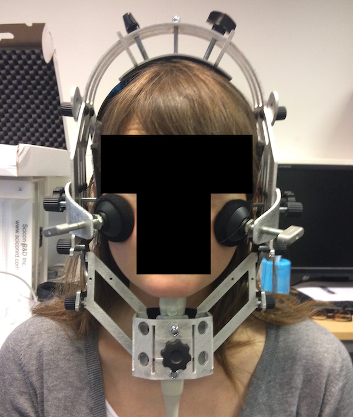

# (PART) Introduction {-}

\begin{adjustwidth}{2cm}{}
\vspace*{4\baselineskip}
There is in all things a pattern that is part of our universe. It has symmetry, elegance, and grace---these qualities you find always in that the true artist captures. You can find it in the turning of the seasons, the way sand trails along a ridge, in the branch clusters of the \textit{creosote} bush or the pattern of its leaves. We try to copy these patterns in our lives and in our society, seeking the rhythms, the dances, the forms that comfort. Yet, it is possible to see peril in the finding of ultimate perfection. It is clear that the ultimate pattern contains its own fixity. In such perfection, all things move towards death.
---\textit{from} The Collected Sayings of Muad'Dib \textit{by the Princess Irulan}

--- Frank Herbert, \textit{Dune} (1965)
\vfill
A careful analysis of the process of observation in atomic physics has shown that the subatomic particles have no meaning as isolated entities, but can only be understood as interconnections between the preparation of an experiment and the subsequent measurement.

---Fritjof Capra, \textit{The Tao of Physics} (1975)
\vfill
\end{adjustwidth}

# The voicing effect and beyond
\label{s:ve}

<!-- TODO: be sure you use the word SOURCE -->
The sounds of a language form an incredibly complex system of relations and dependencies, both at a physical and a more abstract level.
A topic that masterfully exemplifies the complexities of such a system and that has generated great interest over the decades is the somewhat elusive connection between vowel duration and consonant voicing.
According to a robust cross-linguistic tendency, vowels are shorter when followed by a voiceless consonant and longer when the following consonant is voiced \citep{meyer1903, heffner1937, house1953, lisker1957, peterson1960}.
This so-called "voicing effect" interacts with a variety of linguistic factors and scholars have sought its origins in properties of speech production, from aerodynamic mechanisms to gestural timing, and properties of speech perception \citep{belasco1953, zimmerman1958, sharf1962, lindblom1967, halle1967a, javkin1976, kluender1988}.
While much progress has been made in understanding this link, after more than a century there is still disagreement as to what contributes to this phenomenon, as evidenced by the numerous accounts put forward.

Given the plurality of views concerning less understood aspects of the voicing effect, this thesis set out to investigate this phenomenon by employing a diverse set of techniques and sources of data.
To keep this type of enquiry manageable, I decided to undertake this endeavour from a speech production outlook, an area which has fuelled a great part of the debate within the voicing effect literature.
In particular, this thesis poses the question of what aspects of the articulation of vowel-consonant sequences can inform us about the influence of consonant voicing on the duration of vowels.
In answering this question, I collected data from a combination of acoustic, ultrasound tongue imaging, and electroglottographic techniques as part of two studies on Italian, Polish, and English.
These languages make up an appropriate set in that they constitute a methodological window into the complex variation of the voicing effect as seen both across and within languages.

<!-- TODO: check cross-refs make sense -->

The dissertation is organised in three parts: an introduction (Part I), a collection of original manuscripts (Part II), and a conclusion (Part III).

<!-- TODO: maybe include references to sections -->
The three chapters of Part I present in turn a review of the literature on the voicing effect and related issues (\Cref{s:ve}), a rationale for the current research including a discussion of the questions to be addressed (\Cref{s:rationale}), and a description of the methodologies employed in the two studies that make up this research and of principles of Open Science (\Cref{s:methods}).
The following sections of this chapter (\Cref{s:ve}) introduce the phenomenon of the effect of consonant voicing on preceding vowel durations (the voicing effect).
First, I will discuss how the voicing effect is cross-linguistically common (with the typological caveat that most investigated languages are from the Indo-European family), although alleged exceptions to its universality exist, both in terms of presence of the effect and of its magnitude.
This is followed by a discussion of the use of "voicing" as a comparative concept rather than as a phonetically-motivated descriptive category, and by a presentation of other phonological and phonetic factors that are known to interact with the voicing effect, such as manner, prosody, and processes of phonologisation.
The chapter proceeds with a critical review of the explanatory accounts proposed for the voicing effect over the course of more than a century, both from a production and a perception point of view.
Finally, the chapter concludes with a discussion of the effects of aspiration and ejection on vowel duration, and how these can shed light on the voicing effect.

\Cref{s:rationale} provides a rationale for the current research.
The research questions addressed in the dissertation are introduced and contextualised in relation to the topics touched upon in \Cref{s:veintro}.
A justification of the choice of data sources and languages used to answer the research questions is given here.
This chapter also offers an overview of the phonologies of the chosen languages, namely Italian, Polish, and English.
For each language, a brief description of the consonantal and vocalic phonemic systems is given, with a focus on aspects of phonation contrasts, followed by a discussion of stress and rhythm.
\Cref{s:sumresults} offers a prospective overview of the main results, which are presented in full in Part II.

The last chapter of Part I, \Cref{s:methods}, collates the methods employed in the two studies that make up this research, namely an exploratory study of the voicing effect in Italian and Polish (Study I) and a confirmatory study of the compensatory aspects of the voicing effect in English (Study II).
Note that each paper in Part II (\Cref{p:relrel} to \Cref{p:wavegram}) contains targeted methods sections that describe the subset of methods specific to the paper, so that a general overview of the methods is provided in \Cref{s:methods}.
This chapter also introduces ultrasound tongue imaging and electroglottography, two articulatory techniques that allow us to learn in a non-invasive way about properties of tongue movement and vocal fold vibration.
Finally, \Cref{s:openscience} discusses issues related to statistical methods, and introduces principles and practices of Open Science as a remedy to some of these issues and how Open Science has shaped the current research project.

Part II is a collection of original manuscripts in the form of standalone papers (Papers I-IV), which report and discuss the conceptual and methodological contribution of the present work.
The papers are connected in that they investigate related but self-contained aspects of the voicing effect (as detailed in [...]).
A "journal format" was chosen over a "book format" given the strong experimental and methodologically independent nature of the research behind each paper, and thanks to the fact that each paper can be read more or less independently of the others.
Nonetheless, the four papers are laid out according to an order partly based on the chronological sequence of the research but also considering the logical dependence of the hypotheses treated in them (see below [...]).
While Paper I to III have a more conceptual focus, Paper IV centres around a novel technique that enables a holistic analysis of vocal fold vibration data as obtained from electroglottography.

\Cref{p:relrel} (Paper I) describes an exploratory study of acoustic properties of the voicing effect in Italian and Polish disyllabic words, as investigated in Study I (s:studyi).
Durational aspects of the voicing effect as evinced from acoustic data are surveyed in light of compensatory mechanisms between the duration of vowels and that of consonant closures.
This paper also provides a modern description of the voicing effect in Italian and Polish and discusses how the current results match or diverge from previous work.
<!-- It is shown that the temporal organisation of acoustic segments results in a temporally stable acoustic interval that is not affected by the voicing status of the post-vocalic consonant.
It is argued that, as a result of the temporal stability of this interval, the timing of the boundary between the vowel and the consonant closure (which is instead affected by the voicing status of the consonant) determines the duration of both the vowel and the closure, resulting in the known pattern of the voicing effect. -->

The findings of \Cref{p:relrel} motivated a confirmatory study, Study II (\Cref{s:studyii}), which is described and discussed in \Cref{p:en-relrel} (Paper II).
An articulatory account inferred from the acoustic data presented in \Cref{p:relrel} is proposed, which generates hypotheses regarding the durational behaviour of disyllabic vs monosyllabic words.
These hypotheses, formulated in terms of acoustic durational patterns, are tested against acoustic data from English disyllabic and monosyllabic words.
The paper also links differences in magnitude of the voicing effect in disyllabic vs monosyllabic words to the interplay between the articulatory organisation of gestures and perceptual factors.

Two more papers present articulatory aspects of the voicing effect in Italian and Polish, as part of Study I (\Cref{s:studyi}).
This part of the study was carried out to explore voicing-driven differences in articulation during the production of vowel/consonant sequences that could promote the emergence of the voicing effect.
\Cref{p:tra} (Paper III) discusses ultrasound tongue imaging data and focusses on tongue root advancement, a mechanism known to facilitate voicing during closure.
Both the static configuration of tongue root advancement at vowel onset and its dynamic development during the production of vowels followed by voiceless and voiced stops are discussed.
Furthermore, the relation between the static and dynamic properties of tongue root advancement, vowel duration, and consonant voicing is studied.
In \Cref{p:wavegram} (Paper IV) assesses a new technique for the dynamic analysis of electroglottographic data which combines established statistical methods.
The application of this method is illustrated with an electroglottographic analysis of from Italian and Polish, which investigates how vocal fold vibration during the production of vowels differs depending on the voicing status of the following consonant.
Finally, the findings of this analysis are discussed in light of the voicing effect and how glottal spread, characteristic of voiceless consonants, might play a role in the emergence of the effect.

Part III summarises the results of this investigation by providing an overarching synthesis (\Cref{s:gen-disc}), and concludes with a discussion of limitations and future avenues of research (\Cref{s:final}).
<!-- TODO: overview of what is discussed in Part III -->

<!-- maybe leave them here and say that they will be expanded in section Research questions s:resq-->
<!-- * Can the voicing effect be ascribed to mechanisms of temporal compensation and/or articulatory adjustments that result in the observed patters of both vowel and consonant duration?
* Which articulatory properties of voicing directly affect vowel and consonant durations, and in particular what mechanisms influence the timing of the consonantal closure?
* Do voiceless and voiced consonants target different articulatory realisations, or are there some oral and/or laryngeal configurations or processes that are shared between them?
* Do these aspects of production follow universal patterns and constraints, or can different languages modulate their implementation in specific ways?
* Can the mechanisms behind the voicing effect inform us on more general aspects of gestural phasing and articulatory timing within and beyond the traditional syllable?
* Can the study of articulation provide us with insights into the enhancing role of perception?
* What can we learn about other durational effects from the study of the voicing effect?
* Can the magnitudes of the voicing effect reported in previous studies be replicated with new data, and what research aspects could be responsible for differences?
* What level of confidence can we attribute to previous and current results, considering the weight of the evidence provided by the data? -->

## The voicing effect
\label{s:veintro}

Across a wide variety of languages, vowels tend to be shorter when followed by voiceless consonants, and longer when followed by voiced ones.
This phenomenon has been called the 'voicing effect' \citep{mitleb1982} or 'pre-fortis clipping' \citep{wells1990}.
Among the earliest traceable mentions to this phenomenon there are \citet{meyer1903} for English (cited in \citealt{lindblom1967}), \citet{meyer1904} for German, \citet{meyer1909} for Hungarian, and \citet{gregoire1911} for French (all cited in \citealt{maddieson1976}).
After these, a great number of studies further confirmed the existence of the effect in these languages and reported it in an ever increasing list of others.
Remarkably, no known language has been claimed to have the opposite effect, namely longer vowel durations before voiceless than before voiced consonants.\footnote{This does not exclude that there might be or have been a language that shows this pattern.}

English is the language that by far received the most attention in relation to the voicing effect (\citealt{heffner1937, house1953, lisker1957, zimmerman1958, peterson1960, house1961, sharf1962, sharf1964, lindblom1967, halle1967, halle1967a, slis1969, slis1969a, chen1970, klatt1973, lisker1974, raphael1975, umeda1975, javkin1976, port1982, mack1982, luce1985, van-summers1987, kluender1988, de-jong1991, laeufer1992, fowler1992, de-jong2004, warren2005, ko2018, glewwe2018, sanker2019}, among others).
The presence of a voicing effect has been further corroborated in French by \citet{belasco1953}, \citet{chen1970}, and \citet{laeufer1992}, in Hungarian by \citet{soskuthy2013}, and German (in the context of word-final voicing neutralisation, see \citealt{nicenboim2018a} and references therein).
Other known voicing-effect languages are Arabic (\citealt{hussein1994}, but cf. \citealt{mitleb1982}), Assamese and Bengali \citep{maddieson1976a}, Dutch \citep{slis1969a}, Georgian \citep{begus2017}, Hindi \citep{maddieson1976, ohala1992a, lampp2004, durvasula2012, sanker2018}, Italian \citep{caldognetto1979, farnetani1986, esposito2002}, Icelandic \citep{einarsson1927}, Japanese \citep{port1987}, Korean \citep{chen1970}, Lithuanian \citep{campos-astorkiza2007}, Norwegian \citep{fintoft1961}, Swedish \citep{elert1970}, Spanish \citep{navarro1916}, Telugu \citep{sanker2018}, and Russian \citep{chen1970}.\footnote{From a typological perspective, this sample is strongly biased towards Indo-European languages.
Moreover, the five non-Indo-European languages in the list are all thriving and well-studied languages.
This notwithstanding, the voicing effect is generally regarded as a very common and widespread phenomenon.}

While the voicing effect is cross-linguistically common, it is not universal, and some languages lack voicing-induced durational differences.
Czech and Polish are generally reputed to be languages in which the duration of vowels does not significantly differ before voiceless and voiced stops.
In fact, the results concerning the effect in these languages are mixed, and support can be found both for and against an effect of voicing on vowel duration.
\citet{keating1984} examined the duration of vowels in 3 Czech speakers.
Vowels are 193.7 ms long when followed by /t/ and 204.2 ms when followed by /d/.
This corresponds to a raw difference of 10.5 ms, which the author reports not to be significant (*t*(30) = -0.37, p > 0.2).
Given the low number of speakers and the relative high standard error of the effect (about 28 ms, calculated as the mean difference over the *t*-value, \citealt{nicenboim2018a}), it is possible that the null result is due to low statistical power.
\citet{machac2007} analyse 638 VCV sequences recorded from 53 speakers of Czech and found partial evidence for an effect of voicing in the language.

As for Polish, \citet{slowiaczek1985} measured the duration of vowels in word-final syllables from 5 speakers, and vowels followed by an underlyingly voiced stop are 10--15 ms longer.
@nowak2006 investigates several properties of vowel duration in 4 speakers (from different parts of Poland), and finds that vowels followed by voiced stops are 4.5 ms longer (a significant difference).
<!-- I should read about what stats he did -->
@malisz2008 analyse data from 40 speakers of 'Standard Polish', and while they don't report estimates from the whole dataset, the means from 4 speakers suggest a difference in vowel duration before voiceless vs. voiced stops of about 3.5 ms.
On the other hand, an equal number of studies argue that voicing does not significantly affect vowel duration in Polish.
\citet{jassem1989} could not replicate the results in \citet{slowiaczek1985}.
\citet{keating1984} reports a non-significant difference of 2 ms in the word pair /rata/ (167.4) and /rada/ (169.5 ms), based on data from 24 speakers living in Wrocław.
Finally, \citet{strycharczuk2012a} reports a non-significant effect in 6 Warsaw speakers in pre-sonorant word-final position.
To summarise, the evidence concerning the presence or absence of the voicing effect in Czech and Polish is mixed and it is not possible to draw certain conclusions.

A second common stance about the voicing effect is that its magnitude differs across languages, and that the greatest effect is observed in English.
The reported effect of voicing in word-final syllables in English varies between 35 and 150 ms \citep{heffner1937, house1953, zimmerman1958, peterson1960, sharf1962, chen1970, klatt1973, mack1982, luce1985, laeufer1992, ko2018}.
However, the effect is smaller in non-final syllables, with values between 18 and 35 ms \citep{sharf1962, klatt1973, davis1989}.
Taking Italian for comparison, the mean difference in vowel duration before voiceless vs. voiced stops in the first syllable of Italian disyllabic words is 22 in \citet{farnetani1986} and 24 ms in \citet{esposito2002}.
These values are within the range of the reported effect in English non-final syllables.
It is thus possible that, once controlling for contextual factors, the apparent cross-linguistic differences in magnitude are, if not removed, at least reduced.
A similar position is taken by \citet{laeufer1992}, who directly compared French and English using carefully designed experimental materials.
When the duration of a vowel is similar across languages, consonant voicing also has an effect which is comparable in degree.

## Voicing as a comparative concept
\label{s:voi-comp}

All of the literature reviewed here does not explicitly tell what voicing refers to precisely, and the languages listed in them posses quite different phonation systems.
For example languages that belong to the two major categories of aspirating and voicing languages [...] are treated together in the literature.
After reviewing some of the views on how voicing can be defined, I will introduce the concept of "comparative concept" \citep{haspelmath2010} and show that voicing will be used in this sense in this dissertation.

<!-- TODO: aspirating vs. voicing languages? -->

\citet{keating1984a} is an attempt to define "voicing" in such a way that even systems that are very dissimilar at the physical level can be group together.
K's definition is restricted to languages that contrasts only two categories of phonation.
\citet{keating1984a} proposes that three levels of representation are necessary.
One level is purely phonological, and abstracts away from real physical properties of the contrast.
This phonological level of representation corresponds to the traditional [(±)voice] feature (either binary or privative).
The second level of representation pertains to what \citet{keating1984a} calls "modified systematic phonetics".
She proposes three phonetic categories based on Voice Onset Time (VOT): {voiced}, {voiceless unaspirated}, and {voiceless aspirated}.
The last level, "pseudo-physical", assigns a range of VOT values to such categories depending on the language and the phonological context.
The [(±)voice] feature can then be interpreted rather than as presence vs. absence of voicing, as more voiced and less voiced.

\citet{goldstein1986}, within their framework of Articulatory Phonology, take a different stance and ascribe voicing to simply the presence or absence of a glottal opening-and-closing gesture.
Voiceless segments are then characterised by the presence of such a gesture, while voiced segments by its absence.
This definitions abstracts away from the presence/absence of vocal fold vibration, and allows us to group together for example a language like English and one like Italian.

<!-- TODO: Scobbie's work here? It's specific of English though; maybe just mention will be discussed later -->
\citet{gordeeva2011} show that in Scottish English the voicing distinction shows an idiosyncratic mapping between phonological categories and the phonetic correlates of vocal fold vibration, (pre-)aspiration, and glottalisation.
The authors argue that even within the same language or language variety different mappings (which they call phonologisations) might be necessary.

<!-- Jansen 2004 dissertation talks about the same but informally -->
\citet{haspelmath2010} introduces a helpful distinction between comparative concepts and descriptive categories.
Following from what Haspelmath calls a "categorial particularism" approach, it is advocated that individual languages should be described in terms of language-specific categories.
In this light, "voicing" in Italian is different from "voicing" in Spanish for the very fact that Italian and Spanish are two different linguistic systems.
Typological comparison should not be based on (language-specific) these "descriptive categories", but rather on "comparative concepts".
Comparative concepts are created by the linguist who performs language comparison, and are not components of particular languages.
I assume here that traditional phonological categories like "voicing", "vowel height", "place of articulation", can be thought of either as (language-particular) descriptive categories or comparative concepts depending on the scientific enterprise.\footnote{\citet{haspelmath2010} proposes to use capitalised names for descriptive categories (for example, "Italian Voicing"), but since this use is not known among phonologists/phoneticians, I will not adop it here.}
In relation to the voicing effect, the use of "voicing" in this context as adopted in this work will be intended as a comparative concept and not as a descriptive category.

Note that the adoption of the distinction between descriptive categories and comparative concepts is a working assumption and a full fledged argument in support of the distinction will not be pursued here.
Rather, reference to comparative concepts here allows us to compare the "voicing effect" across languages where "voicing" behaves very differently, and allows us to make cross-linguistic generalisations that transcend language-specific descriptive categories.
<!-- TODO: fix cross reference -->
The holistic account expounded in [...] rests on this working assumption, and should be read as applicable independently from language-specific voicing categories.

<!-- TODO: passive vs active voicing and devoicing -->

## The voicing effect and other phonological and phonetic factors
\label{s:ve-phonphon-fact}

In addition to language, the voicing effect is also modulated by other phonological and phonetic factors.
For example, \citet{umeda1975} reports that the difference in vowel duration before voiceless vs. voiced consonants is greater when the test word is pre-pausal.
The effect of voicing also seems to be more robust in stressed than in unstressed vowels \citep{davis1989}.
There is also indication that the effect is modulated by the position of the syllable in the word in English, so that word-final syllables show a greater effect than word-medial syllables (\citealt{sharf1962, klatt1973, davis1989}, although \citealt{abdelli-beruh2004} doesn't find a significant difference across these contexts in French).
\citet{port1981} further argues that the effect in the word-initial stressed vowels is smaller along the hierarchy monosyllabic > disyllabic > trisyllabic words, which also reflects that of decreasing vowel durations.
\citet{laeufer1992} discusses the voicing effect as a function of vowel height, and shows that the effect is greater in low (intrinsically longer) vowels than in high (intrinsically shorter) vowels.
Moreover, \citet{sharf1964} shows that the effect persists even in whispered (unvoiced) speech.

Manner of articulation of the consonant is a further relevant parameter.
While most work seems to focus on stops, voicing of other types of consonants affects preceding vowel duration.
For example, \citet{house1953} report that vowels are longer when followed by a voiced fricative than a voiceless one in English.
They also argue that the durational difference is greater before fricatives than before stops.
On average, vowels in \citet{house1953} are 84 ms longer when followed by a voiced stop (vs. a voiceless stop) and 93 ms longer when followed by a voiced fricative (vs. a voiceless fricative).
\citet{laeufer1992} finds similar patterns in both English and French: vowels followed by voiced fricatives are longer than when followed by voiceless fricatives (the average difference is 93 ms in English, 47 ms in French) and the effect of voicing with fricatives is greater than with stops (the average difference is 60 ms in English stops, 35 ms in French stops).
\citet{zimmerman1958} reports vowel durations before voiceless and voiced stops and fricatives in English and the difference is greater in the latter (95 vs 122 ms).
On the other hand, \citet{tanner2019} rather find the opposite effect in a survey of spontaneous speech from different varieties of English.
Across the English varieties, the effect of voicing is greater with stops than with fricatives by a mean factor of 1.3.
To sum up, it is possible that the degree of the voicing effect is greater in fricatives than in stops, but it is difficult to make generalisation based on such small pool of studies.

The relation between the voicing effect in obstruents and durational effects of sonorant consonants further indicates mixed results.
While only a few systematic investigations on the effect of sonorant voicing on vowel duration have been carried out, nasals have been found to exercise an effect intermediate between that of voiceless and voiced stops but closer to that of voiced stops but intermediate \citep{house1953, zimmerman1958}, to be preceded by vowels that are longer than those followed by voiced stops \citep{peterson1960}, or to be indistinguishable from voiced stops \citep{lisker1974}.
In \citet{house1953}, vowels are on average 245 ms long when followed by a voiced stop, 232 ms long when followed by a nasal, and 161 ms when followed by a voiceless stop.
\citet{zimmerman1958} report English vowel durations of 218 ms before voiced stops and 200 ms before nasals, while vowels are 123 ms long when followed by voiceless stops.
On the other hand, the duration of vowels in \citet{peterson1960} are 273 ms when followed by nasals, 265 ms when followed by voiced stops, and 171 ms when followed by voiceless stops.
\citet{lisker1974} argues that the duration of vowels followed by voiced stops and nasals are virtually the same, but measurements are not provided as evidence.
In sum, nasals seem to behave more like voiced stops than voiceless stops, but it is less clear whether vowels preceding them are longer or shorter than those followed by voiced stops.

## On the phonologisation of the voicing effect (phonetics or phonology?)
\label{s:ve-phonologise}

Finally, the voicing effect can take on a linguistic function resulting in the phonologisation of the durational differences, as argued for English \citep{de-jong1991, de-jong2004, sole2007, sanker2019}.
Some clarification is due here as to what is meant by phonologisation.
The classical or structuralist definition of phonologisation states that phonologisation occurs when a contextual allophone becomes contrastive, or in other words it becomes a phoneme \citep{kiparsky2015}, generally after the disappearance or replacement of the conditioning context.
Sanskrit velar palatalisation is a classical example of phonologisation \citep[149]{hock1991}.
At some point in the history of Sanskrit, the velar stops /k/ and /g/ where palatalised when followed by /i/ and /e/, creating an allophonic distinction between velars proper and palatal consonants of some sort.
The subsequent change of /e/ to /a/ removed the context conditioning palatalisation, thus creating minimal pairs opposing /ka, ga/ and /tʃa, dʒa/.
At this stage, the palatal allophones were phonologised.
This conceptualisation of phonologisation amounts to saying that phonetic features that were previously computed procedurally (during phonological/phonetic derivation) from an underlying lexical representation are now instead already part of the lexical representation (which is, in structural terms, a string of phonemes).

Phonologisation assumes a different meaning within the framework of Lexical Phonology \citep{kiparsky1988}.
Lexical Phonology argues that there exist two types of phonological processes: processes that apply at the lexical (stem and prosodic word) level, and processes that are post-lexical and apply across the board.
According to the view of Lexical Phonology, a process is phonologised when it goes from being post-lexical to being lexical.
To carry on with the Sanskrit example, phonologisation was initially post-lexical, in other words it was applied across the board during derivation after all lexical processes have been applied to the stem and word.
During the course of sound change, the same process of velar palatalisation started being applied also at the lexical level (with the original copy of the process possibly still being applied post-lexically).
Velar palatalisation has been phonologised, creating so called "quasi-phonemes" (categorical, distinctive units, not yet able to create lexical contrast, \citealt{janda1999}).

\citet{kiparsky2000} carries over the definition of phonologisation from Lexical Phonology onto Stratal Optimality Theory \citep{kiparsky2000, bermudez-otero2017}.
Stratal OT assumes that the phonological module of grammar is stratified into three levels (called strata, or domains) as in Lexical Phonology: the stem, the word, and the phrasal level.
OT constraints are independently ordered in each level, so that within each level different orders allow for different outputs to be selected.
Stratal OT also stipulates that phonological constraints apply iteratively (cyclically) from the narrower domain, namely the stem, through the word domain, to the phrasal domain.
Under cyclicity, the input of one domain is passed over to the next, and so on.
For \citet{kiparsky2000}, phonologisation occurs when the constraint ordering of the phrasal domain (the post-lexical level of Lexical Phonology) is carried over to the word and stem domains (the lexical level of Lexical Phonology).

<!-- TODO: add picture from RBO -->

An extension of Stratal OT, the life cycle of phonological processes \citep{bermudez-otero2007, bermudez-otero2015}, offers yet another definition of phonologisation and a more fine-grained terminological set.
\citet{bermudez-otero2015} reserves the term "phonologisation" for when a physico-physiological (phonetic or mechanic) phenomenon comes under the control of the speaker/hearer and it in fact becomes part of her grammar (more specifically, part of the phonetic module of her grammar).
The process, once it has entered the grammar, can further proceed its "ascent" through increasingly deeper grammatical modules.
A (gradient) phonologised process is said to be "stabilised" (and thus categorical) once it is generated by a categorical phonological rule, which applies at the phrase level.
At this stage, a stabilised process has entered the phonological module of the speaker/hearer.
A stabilised process further undergoes "domain narrowing" when it starts being applied at the word level and then at the stem level.
The final step in the ascent through the grammar is...

<!-- TODO: exemplar theory, add pic from Márton -->
A further definition of phonologisation stems from exemplar theories of speech perception and production [...].
A core tenet of these models is that speech tokens are stored in memory as so-called exemplars after having being experienced.
Depending on the specifics of the particular model, exemplars are stored at varying degrees of granularity and richness of details.
Each exemplar consists of a (more or less) faithful representation of the actual token of experience that generate it, and it thus contains information from multiple levels and factors (phonetic, lexical, syntactic, sociolinguistic, contextual, and so on).
In all models, lexical units (and other linguistic units) are represented as sets of exemplars, or exemplar clouds.
The representational space of exemplar clouds is multi-dimensional and can be operationalised as a multivariate distribution.
In modular approaches to grammar as briefly expounded above, sound alternations can be encoded (in terms of derivational rules and/or constraints) either at the phonological level or at the phonetic level of representation.
On the other hand, as \citet[183]{soskuthy2013} illustrates, a consequence of the exemplar mode of representation is that all sound alternations are directly encoded by exemplars within the exemplar cloud, at one single level of representation.
As soon as an exemplar with new phonetic characteristics is experienced and stored, the lexical representation of that lexical item already contains information on the sound alternation.
In this sense, every type of variation is "phonologised" (represented) from the outset as soon as it is experienced by the speaker/hearer.

When the term phonologisation is employed in the phonetic literature of the voicing effect, it is generally not attributed to any specific phonological framework.
This make it less straightforward to interpret the term as the original author might have intended, but, as far as I can tell, most authors would interpret it at least as to mean that the effect is not just mechanical and/or low-level, but that it has assumed higher-level functions of some sort, whatever the specific function might be.
Since the main focus of this work is on the source of the voicing effect rather than on what functions the voicing effect can assume in different languages, the topic of the phonologisation of the voicing effect will only briefly be touched upon in the rest of the dissertation.
Note, however, that the account proposed in [...] is envisioned to be informed by some form of exemplar model of speech perception and production, where everything can be considered "phonologised" as soon as it is part of the lexical representation.
In this sense, the effect is represented in the same way in all languages that have it, independent of its magnitude or function.
A discussion of arguments for or against such position are, however, beyond the scope of this dissertation.

<!-- maybe say a few words of why this it is beyond the scope -->

Going back to the phonologisation (in the general sense) of the voicing effect in English, \citet{de-jong2004} shows that the effect is greater in stressed syllables and under focus in English but not in Arabic \citep{de-jong2002}, and argues that vowel duration is used contrastively as a cue to voicing in the former language.
A further argument for the phonologisation of the durational difference in English is the stability of the effect across speaking tempos.
\citet{port1982} suggest that the ratio of the consonant and vowel durations is stable at faster and slower speaking rates, and that the CV ratio proves to be the primary acoustic correlate of voicing in word-final position.
\citet{luce1985}, however, claim that vowel duration is a more robust cue across tempos than the CV ratio and the duration of the stop closure.
Finally, \citet{ko2018} compares CV ratio values in three speaking styles (normal, faster, and slower) and finds that the ratio changes as a function of speaking style and that the effect of style interacts with consonant voicing.
In sum, there is contrasting evidence as to whether the relative magnitude of the effect is stable across speaking tempos or not, and as to whether this can be taken as evidence for or against the phonologisation of the effect in English.

<!-- TODO: since most work on stops, the rest of the diss will focus on stops -->

## One phenomenon, many explanations
\label{s:accounts}

<!-- TODO: say that the emergence of the effect is independent of its alledged phonologisation and link it to the previous section -->

Over a century of research on the voicing effect has without doubt brought progress in our understanding of this complex phenomenon.
While several proposals were put forward in the period between the 50s and the 70s, subsequent years focussed on testing or extending previous hypotheses and no final consensus has been reached.
A broad distinction can be drawn between accounts that ascribe the voicing effect to articulatory or aerodynamic properties of speech production, and accounts that instead draw on biases of the perceptual system.
No answer has been obtained as to which of the two sides best accounts for all of the aspects of the voicing effect, and rather both views contribute in some respects to the overall picture.
The following paragraphs review the most notable perception and production accounts, paving the way for a discussion of phonation effects related to that of voicing in the following chapter.

<!-- Perception -->

A perceptual-based explanation advocated by \citet{javkin1976} argues that the voicing effect emerges as a consequence of the difficulty in the perceptual identification of the vowel-consonant boundary in the context of voiced stops, and of the misinterpretation of voicing during closure.
According to this account, speakers misperceive the periodic vibration of the vocal folds (voicing) during the closure of a voiced stop as being part of the preceding vowel.
In the absence of contextual correction, this misperception can lead to the creation of a new production norm where the vowel is lengthened \citep{ohala1989}.
Subsequent productions of vowels followed by voiced stops would thus be longer than vowels followed by voiceless stops.
Although \citet{javkin1976} does not directly test the hypothesis that closure voicing is reinterpreted as being part of the preceding vowel, his study indicates that listeners perceive vowels to be longer when followed by voiced than when followed by voiceless stops, other things being equal.
On the other hand, \citet{sanker2019} finds that vowels followed by voiced stops rather elicit fewer 'long' responses, while more 'long' responses are elicited in stimuli where the following consonant was spliced out.
However, listeners were perceiving vowels with falling F0 to be longer than vowels with flat or raising F0, in partial accord with previous work \citep{lehiste1976, alan2010, cumming2011}.

To provide for a rationale of the language-specificity of the voicing effect, \citet{kluender1988} propose that different languages can exploit the perceptual biases behind the effect at different degrees.
As discussed in the previous chapter, the ratio between the duration of the closure and that of the vowel has been identified as one of the perceptual cues to voicing \citep{port1982, lisker1986}.
Listeners associate smaller values of the CV ratio to voiced stops, and, vice versa, greater values to voiceless stops.
\citet{kluender1988} argue that speakers can actively manipulate vowel durations to proportionally increase the difference in ratio between the two voicing categories, so that the ratio would be even smaller in the voiced context and even greater in the voiceless one.
As a consequence, the perceptual distance between the voicing categories would be enhanced, thus facilitating discrimination \citep{stevens1989, kingston1994}.
According to this view, listeners' discrimination of vowel duration should show a contrast effect, by which longer closure durations elicit more 'short vowel' responses and shorter closures more 'long vowel' responses.
However, \citet{fowler1992} shows that listeners judge vowels to be longer when the stop closure duration is increased, and that, similarly, stop closure is perceived to be longer when vowel duration is increased.
These results indicate a mechanism of perceptual assimilation of the respective durations of vowels and stop closures and do not support a contrast effect.

<!-- Production -->
While perceptual biases could be driving some aspects of the voicing effect and be responsible for its enhancement in some languages, production mechanisms are likely to provide the necessary variation that would be exploited by the perceptual system \citep{begus2017, sanker2019}.
Although individual production accounts differ in the details, two broad categories can be identified.
Some accounts ascribe the source of the voicing effect to mechanisms of compensation within a certain property of speech (either duration or articulatory force), while others relate the emergence of the effect to timing aspects of articulatory gestures (either laryngeal or oral).

The *compensatory temporal adjustment* account \citep{lindblom1967, slis1969, slis1969a, lehiste1970a, lehiste1970} states that the relative durations of vowel and consonant in a VC sequence are correlated.
A well-known fact about stop closure is that it is longer in voiceless stops and shorter in voiced stops \citep{lisker1957, van-summers1987, davis1989, de-jong1991}.
As a consequence, vowels are shorter when followed by the longer closure of voiceless stops, and they are longer when followed by the shorter closure of voiced stops.
This compensatory pattern would be the consequence of keeping the duration of a particular speech interval fixed, while the duration of the closure changes depending on the voicing status of the stop.
Proponents of this account have argued that compensation is implemented either at the level of the syllable (or of the VC sequence, \citealt{lindblom1967, farnetani1986}), or at the level of the word \citep{slis1969, slis1969a, lehiste1970a, lehiste1970}.
This formulation of the account, however, faces empirical and logical challenges.
The duration of both the syllable and the word is affected by stop voicing \citep{chen1970, jacewicz2009}, and it is not clear why compensation within a word should necessarily target the pre-consonantal vowel and not other segments (these issues are discussed in more details in Paper I).

A second proposal attributes the voicing-driven duration differences of vowels to *articulatory energy expenditure*, rather than temporal aspects.
\citet{meyer1903} and similarly \citet{belasco1953} propose that the articulatory force required to produce a syllable is constant, and thus it is distributed across segments according to their energy requirements.
According to this hypothesis, voiceless stops are produced with more force than voiced stops, and hence some force is subtracted from the production of the preceding vowel to maintaining the overall force constant.
However, the concept of 'articulatory force' lacks an empirically solid definition, and experimental results mentioned in \citet{zimmerman1958} rather point to the absence of a relation between energy expenditure and vowel duration.

While the compensatory temporal adjustment and the energy expenditure accounts rely on compensatory mechanisms of duration or articulatory force, two other proposals concern aspects of gestural timing of the larynx and the consonant closing gesture.
The *laryngeal adjustment* account \citep{halle1967, halle1967a, chomsky1968} is based on the idea that voicing during stop closure requires precise adjustments of the glottis in order to comply with aerodynamic constraints \citep{ohala2011}.
Such an articulatory precision necessitates greater time to be implemented than the production of closure voicelessness.
Because of these properties of laryngeal articulation, full closure can be achieved relatively faster in the context of voiceless stops (which require less precise control), while a delay of closure onset in voiced stops ensures enough time to produce the suitable glottal configuration.
The preliminary electromyographic study of glottal muscular activity discussed in \citet{chen1970}, however, does not suggest the presence of early laryngeal activity during the production of vowels followed by voiced stops compared to vowels followed by voiceless stops.
Further articulatory evidence shows that there is rather a general increase of activity of certain laryngeal muscles (namely, the posterior crycoarytenoid and the crycothyroid) during the production of voiceless sounds \citep{hirose1972, kagaya1975, hirose1977, lofqvist1989}.
No conclusive evidence can thus be adduced in support of the laryngeal adjustment hypothesis, although other laryngeal mechanisms cannot be ultimately excluded \citep{begus2017}.

<!-- I think I need to read more about this -->

Another production account is based on the *rate of stop closure transition* \citep{ohman1967a, chen1970}.
Voiceless stops are articulated with greater glottal opening relative to voiced stops (and vowels), so that a greater volume of air is admitted into the oral cavity.
@ohman1967a argues that the production of the closure of voiceless stops would then require more muscular effort to counteract the increased intra-oral pressure generated by the greater airflow.
As a consequence, the rate of the closing gesture of voiceless stops is higher than that of voiced stops.
In other words, full closure will be achieved earlier relative to the onset of the closing gesture when the stop is voiceless than when it is voiced.
Hence, vowels will be shorter when followed by voiceless stops than when followed by voiced stops.
\citet{chen1970} observes that the difference in labial closure rate accounted for 20% of the difference in vowel duration.
Subsequent work by \citet{warren2005} further shows that the percentage of the difference which is accounted for rises to 80% when considering the movements of both the lips and the jaw.

In sum, four main production accounts (or variations thereof) can be found in the literature on the voicing effect.
More specifically, two of these accounts posit a mechanism of compensation either between segmental durations (the compensatory temporal adjustment account) or articulatory force (the articulatory energy expenditure account), while two relate durational differences to the timing of laryngeal gestures (the laryngeal adjustment account) or oral gestures (the rate of stop closure transition account).
In the following section I review the effects of two other phonation types (aspiration and ejection) on vowel duration, and how these shed light on the aforementioned accounts of the voicing effect.

## Beyond voicing

Two phonation modes other than voicing are known to affect preceding vowel duration: aspiration and ejection.
While this project focusses on the voicing effect, the closely related aspiration and ejection effects have consequences of theoretical importance.
The results concerning the aspiration effect are mixed.
\citet{maddieson1976}, \citet{durvasula2012}, and \citet{lampp2004} report longer vowels before aspirated than before unaspirated stops in Hindi, and \citet{maddieson1976a} finds a similar trend in Assamese, Bengali, and Marathi.
\citet{ohala1992a}, on the other hand, show that vowels have the same duration before unaspirated and aspirated stops in their sample of Hindi speakers.
\citet{sanker2018} observes an effect of aspiration in Hindi long vowels but not in short vowels, while the effect is reversed in Telugu long vowels (vowels are shorter before aspirated than unaspirated stops), with no appreciable difference in short vowels.
Note that these studies don't easily lend themselves to comparison, since the material and contexts used differ (for instance, vowel type, vowel phonological length, number of syllables, and context following the test word).

The trend of vowels being longer when followed by aspirated stops challenges some of the accounts presented in \Cref{s:accounts}, as noted in \citet{maddieson1976}.
The articulatory force expenditure hypothesis predicts vowels to be shorter before aspirated than before unaspirated stops since it is likely that aspirated stops require greater force than unaspirated ones.
According to the laryngeal adjustment account, the duration of the vowels should not differ in voiceless unaspirated and aspirated stops since they both require glottal opening, rather than the precise adjustments characteristic of voiced stops.
Since closure rate is determined by airflow, the rate of closure account expects vowels followed by aspirated stops to be shorter than or equal to vowels followed by unaspirated stops, since the former should be characterised by greater airflow and higher closure rates due to glottal spreading.
While \citet{maddieson1976} argue against a compensatory effect between vowel and consonant duration, the data in \citet{durvasula2012} are instead compatible with it (see Paper I for details).
The results in \citet{sanker2018} on Hindi, but not Telugu, are also compatible with a compensatory mechanism.
Closure duration is longer in unaspirated stops and shorter in aspirated stops in both languages, but the effect of aspiration on vowel duration has opposite directions depending on language, as discussed above.

An investigation of the effect of ejection in Georgian \citep{begus2017} shows that vowels are shortest when followed by aspirated stops, longer when followed by ejectives, and longest when followed by voiced stops (Georgian contrasts aspirated voiceless, ejective, and voiced unaspirated stops).
The negative correlation between closure and vowel duration has greater magnitude in the context of voiced compared to that of aspirated and ejective stops.
Moreover, the author shows that the closure effect on vowel duration coexists with a 'Laryngeal Features' effect (both closure duration and phonation, when entered in a single regression model, lead to significant *p*-values).
In other words, the variance in vowel duration is account for in part by the duration of the stop closure and in part by the voicing category of the post-vocalic stop.
As discussed in \citet{begus2017}, these patterns are compatible with accounts of compensatory temporal adjustments, laryngeal adjustments, and rate of closure.

In conclusion, our partial understanding of the relation between vowel duration and consonant phonation is based on contrasting or complementary empirical evidence.
This state of affairs can be taken as indication that, while most research (save a few recent exceptions) focussed on finding a unique and unified mechanism behind the voicing effect, we might rather seek multiple mechanisms that cooperate to produce the observed patterns.
In light of this, this dissertation sets out to study the interrelations between different sources of evidence, and their interpretation.
<!-- TODO: be sure the following is a chapter or update name -->
The following chapter presents a more detailed discussion of the rational behind the research of this dissertation and a summary of the main results and conceptual contribution.

# Rationale of the current research
\label{s:rationale}

<!-- TODO: move here research questions? or just give a brief paragraph with summary of this chapter -->
<!-- Better to put the three questions as questions here! -->
This research project had three broad aims (questions).
First, I sought to obtain acoustic and articulatory data using modern methods which would shed light on the production accounts of the voicing effect put forward in the past century.
The second main objective was to enlighten the debate on reported cross-linguistic differences by conducting an analysis which encompasses three related but contrasting languages.
The papers in Part II offer evidence in relation to these goals.
<!-- Question 3 -->
<!-- TODO: say here what this chapter is about -->
<!-- say quesrtions are discussed in more detail in next section-->

<!-- TODO: why part exploratory part confirmatory -->
<!-- TODO: put here the three questions as questions? -->
Another fundamental aspect of this research project is that its development is composed of two stages: an exploratory (hypothesis-generating) stage, and a confirmatory (hypothesis-testing) stage (on the exploratory/confirmatory dichotomy, see \citet{tukey1980} and \Cref{s:stand}).
These stages correspond to Study I and Study II respectively, an overview of which is given in \Cref{s:studyi} and \Cref{s:studyii}.
Research questions at the exploratory stage (Study I) were formulated while being agnostic in regards to specific hypotheses.
Rather, the literature reviewed in [...] formed the basis for a set of general questions about articulatory properties of VC sequences.
This set of general questions justified the experimental design of Study I (\Cref{s:studyi}).
for example...
More specific questions emerged while performing exploratory data analyses.
for example...
confirmatory Study II

<!-- TODO: some questions span across the two stages, exploratory and confirmatory, like for example comparison across languages and replication of previous results -->

The following sections will talk about...

## Research questions
\label{s:resq}

<!-- TODO: make questions into text and link to lit review and individual studies -->
<!--
1. What is the diachronic source of the voicing effect? Or what can synchronic acoustic and articualtory data (production data) tell us about the possible source and the various accounts of the VE? We can do that by compraing two languages that behave differently... Italian and Polish study + English study
2. Cross-ling comparison.
3. Apply OS things.
 -->

<!-- TODO: explain why methods are good for answering these questions and why languages where chosen -->
The first research question concerns the source of the voicing effect, or, in other words, the diachronic pathway that led or can lead to the emergence of the voicing effect in any particular language.
More specifically, the questions asks how languages can develop the voicing effect and which speech aspects play a role in such development.
The long-standing debate about the source of the voicing effect in light of the different proposals discussed in \Cref{s:accounts}, whether articulatory or perceptual, is evidence for the difficulty of selecting a single property of speech that is behind the differential duration of vowels followed by voiceless vs voiced stops.
Moreover, the existence of durational phenomena related to other phonation types than voicing, like aspiration and ejection ([...]), call for an approach to the understanding of the voicing effect that is independent from voicing per se, while still limiting the investigation on the voicing contrast.
Such an approach allows us to formulate an account that future research can generalise and apply to other durational phenomena (related to phonation or not).
Furthermore, note that the focus of the current research is on how the voicing effect emerges in the first place, and not how individual languages exploit or not the effect to enhance cues of phonological contrast.

A window into possible diachronic developments is offered by the investigation of cross-linguistic synchronic data, an approach taken here.
This approach is justified by the idea that diacronic change draws upon synchronic variation and that synchronic variation is the outcome of diachronic change \citep{blevins2004, blevins2006, cristofaro2012, cristofaro2014, bermudez-otero2015}.
Such view of synchrony/diachrony entanglement enables the use of synchronic information to infer possible diachronic changes that might have led to the current synchronic state.

<!-- TODO: in discussion, mention again perceptual factors as factors that enhance the VE and link back to the English paper -->
<!-- TODO: include references for prod vs percept, and for oral vs laryngeal accounts -->
In light of the complexity of the durational effects reviewed in [...], I further decided to limit the scope of the investigation to aspects of production, while keeping an open mind about perceptual factors, as discussed in [... discussion].
This choice was based in part on the relative paucity of recent articulatory data of the voicing effect in relation to, for example, acoustics and perception, and in part on the greater number of production accounts of the voicing effect relative to that of perception accounts.
<!-- TODO: probably need references for the claim that there is not much modern articulatory data and that the are more prod than percept accounts? -->
Furthermore, the production accounts reviewed in \Cref{s:accounts} deal either with oral (tongue) gestures or laryngeal gestures.
In order to potentially identify properties of these two types of gestures it seemed a natural choice to use ultrasound tongue imaging and electroglottography in combination with acoustics as the three sources of data.
In particular, the data collection sought to obtain data on segment durations, timing of the consonantal gestures, and properties of vocal fold vibration, given the focus on these features in the literature reviewed in \Cref{s:ve}.
Given that the voicing effect (and related durational phenomena) has been prevalently if not exclusively defined and dealt with in terms of acoustic segmental durations, the same approach is used here, and analysis of acoustic durations will be at the core of the analyses presented in the Part [...].

<!-- TODO: mention papers? -->
A convenient way to investigate mechanic properties underlying the effect of voicing on vowel durations is to consider languages in which the effect has not been claimed to be phonologised, discussed in \Cref{s:ve-phonologise}.
Moreover, comparing two languages that differ in the presence or degree of vowel durational differences can uncover variation motivating cross-linguistic differences.
Italian and Polish are two good candidates in that they satisfy both of these requirements.
Moreover, their phonological systems allow for a somewhat direct comparison.
For these reasons, an exploratory study of Italian and Polish (Study I) was carried out to examine the influence of voiceless and voiced stops on vowel duration.
\Cref{s:studyi} contains a description of the methods employed in Study I, while \Cref{p:relrel}, \Cref{p:tra}, and \Cref{p:wavegram} report the results.
Note that, with the terms "voiceless" and "voiced", I refer to the phonemic (lexical) contrast defined at an abstract level, rather than to the actual phonetic implementation of such contrast, as detailed in \Cref{s:voi-comp}.
This approach is generally helpful in light of the distinction between aspirating vs. true-voicing languages \citep{beckman2013}, and in the case of English in particular \citep{docherty1992}, which is the subject of Study II.

<!-- TODO: Why English? -->
<!-- Question 1bis. -->
As a follow up of Study I, Study II set out to investigate in English the patterns observed in Study I in Italian and Polish.
English was chosen as a further test language given the abundance of previous work dealing with different aspects of the English voicing effect.
Moreover, virtually all the accounts reviewed in \Cref{s:accounts} were originally posited based on English data.
A second reason behind this choice is that English allows us to look into differences between word-medial and word-final contexts.\footnote{Note that Polish would not be a good candidate because of word-final neutralisation of voicing \citep{gussmann2007}.}
This is warranted based on the reported difference in magnitude of the voicing effect in word-medial and word-final position, as mentioned in \Cref{s:ve-phonphon-fact}.
Finally, ...
An overview of the methods of Study II is given in \Cref{s:studyii}, while \Cref{p:en-relrel} presents and discusses the study and its results in details.

<!-- Question number 2 -->
The second question this dissertation set out to answer is concerned with a cross-linguistic comparison of the voicing effect.
Building on the results discussed in the chapters of Part II, \Cref{s:pluralist} and \Cref{s:gestural-phasing} offer a synthesis of the main topics touched upon in Part II.
In turn, \Cref{s:pluralist} and \Cref{s:gestural-phasing} form the basis of the cross-linguistic comparison of Italian, Polish, and English in \Cref{s:cross-ling-diff}.

<!-- Question number 3 -->
Lastly, the third objective is related to research practices and the Open Science movement.
In light of the concepts and issues reviewed in \Cref{s:openscience}, the research described in this dissertation has been carried out according to principles of openness of data, transparency of analysis, and reproducibility and replicability of results.
\Cref{s:repro} in particular discusses how these principles were applied.

<!-- TODO: say that next section describes the languages sample -->
The following section gives a description of the main phonological features of Italian, Polish, and English, paving the way to the preview of the results in \Cref{s:sumresults} and the discussion of the methods in \Cref{s:methods}.

## Language sample

This section gives an overview of the phonological systems of Italian, Polish, and English, which will set the stage for the preview of the results in the following section and the discussion of these in the second part of the dissertation.
Note that when referring to languages, the languoid model is implicitly assumed \citep{cysouw2013}.
A languoid is the pairing of a glossonym (a name that refers to a languoid or doculect) with a collection of doculects.
In turn, a doculect is the pairing of a glossonym with a specific publication (in any form, for example a book with the grammatical description of the doculect, or an article focussing on a linguistic specific aspect).
Languoids can be hierarchical, so that a languoid can be composed of other languoids, and so on.
The doculects in this dissertation are referred to by the glossonyms *Italian*, *Polish*, and *Manchester English*.
The Italian doculect can be included in the languoid Italian [glottocode: ital1282], the Polish doculect in the languoid Polish [glottocode: poli1260], and the Manchester English doculect (*English* for short in this dissertation) in Western Central English [glottocode: west2900].\footnote{Languoid classification is controversial, as much as traditional language classification, so that classification decisions are taken here without fully committing to them. The classification adopted here does not directly bear on the research results. Future work is warranted for a more thorough classification.}

<!-- TODO: say that you use vowel categories as comparative concepts here too! since each phoneme makes sense only within the system it is from (Haspelmath cites Trubetskoj). -->

<!-- TODO: Say consonant and vowel phonemes are discussed, then syllabic structure and stress patterns, then briefly explain rythmic classes. -->

### Italian

\ctable[caption = Italian consonant phonemes (adapted from \citealt[50]{kramer2009}).,
label = t:itacons,
]{llllll}{}{
FL
            & labial & dental & alveolar & palatal & velar \ML
stop        & p, b   & t, d   & ts, dz   & tʃ, dʒ  & k, g  \NN
fricative   & f, v   &        & s, z     & ʃ, (ʒ)  &       \NN
nasal       & m      &        & n        & ɲ       &       \NN
lateral     &        &        & l        & ʎ       &       \NN
rhotic      &        &        & r        &         &       \NN
approximant & w      &        &          & j       &       \LL
}

\ctable[caption = Italian vocalic phonemes (adapted from \citealt[51]{kramer2009}).,
label = t:itavow,
]{llll}{}{
\FL
         & front & central & back \ML
high     & i     &         & u    \NN
mid-high & e     &         & o    \NN
mid-low  & ɛ     &         & ɔ    \NN
low      &       & a       &      \LL
}

<!--
\begin{vowel}
    \putcvowel{i}{1}
    \putcvowel{e}{2}
    \putcvowel{ɛ}{3}
    \putvowel{a}{3\vowelhunit}{3\vowelvunit}
    \putcvowel{ɔ}{6}
    \putcvowel{o}{7}
    \putcvowel{u}{8}
\end{vowel}
-->

Although the exact phonemic inventory of Italian is still debated, especially for consonants \citep[44]{kramer2009}, a generally agreed upon phonemic set is given in \Cref{t:itacons} for consonants and \Cref{t:itavow} for vowels.

Italian contrasts consonants along five (phonological) places of articulation: labial (phonetically either bilabial or labiodental), dental, alveolar, palatal (palatal and post-alveolar), and velar.
Stops (true stops and affricates) and fricatives contrast for voicing, although note that /z/ has limited functional load \citep{bertinetto2005} and /ʒ/ is relegated to loan words.
<!-- add what? -->
The Italian voicing contrast is usually described to be between voiceless unaspirated consonants and fully voiced consonants \citep{vagges1978, bortolini1995, pape2014, kirby2016}.
<!-- TODO: VOT -->
\citet{pape2014} shows that Italian speakers tend to perceive stops without a burst following the release as voiced consonants, independent of the duration of voicing during closure.
While it is not clear which acoustic cue is employed by Italian speakers to discriminate voiceless and voiced consonants, \citet{pape2014} find in their production study that Italian consistently articulate (velar) stops with full voicing during closure.

The vocalic system in \Cref{t:itavow} is found in stressed syllables, although the status of the mid-high and mid-low contrast is not straightforward (especially for the back vowels), and the mid vowels show a high degree of geographical and idiosyncratic variation \citep{renwick2016}.
In unstressed syllables, there is no contrast between mid-high and mid-low vowels, and these vowels are articulated as either mid-high or mid-low depending on the variety of Italian \citep{rogers2004, renwick2016}.
Although vowel duration is not contrastive \citep{rogers2004, kramer2009, renwick2016}, vowels are longer when they appear in a stressed open syllable (/fa.to/ [faːto] 'fate') and shorter when the syllable is closed (/fat.to/ [fatto] 'fact').

Stress in Italian is contrastive (non-predicable), and main lexical stress is generally placed on one of the last three syllables \citep{imperio1999, kramer2009}.
The basic foot is a maximally bimoraic trochee \citep{kramer2009}.
Italian is traditionally ascribed to the syllable-timed class of rhythmic typology \citep{pike1945}.
However, properties of stress-timed languages (like vowel reduction) can also be observed in Italian, depending on the regional variety \citep{white2009, giordano2010, pamies-bertran1999}.

### Polish

\ctable[caption = Polish consonant phonemes (adapted from \citealt{jassem2003}).,
label = t:polcons,
]{lllllll}{}{
\FL
            & labial & dental & alveolar & alveopalatal & palatal & velar \ML
plosive     & p, b   & t, d   &          &              & c, ɟ    & k, g  \NN
fricative   & f, v   & s, z   & ʃ, ʒ     & ɕ, ʑ         &         & x     \NN
affricate   &        & ts, dz & tʃ, dʒ   & tɕ, dʑ       &         &       \NN
nasal       & m      & n      &          &              &         & ŋ     \NN
lateral     &        & l      &          &              &         &       \NN
rhotic      &        &        & r        &              &         &       \NN
approximant & w      &        &          &              &         &       \LL

\ctable[caption = Polish vocalic phonemes (adapted from \citealt{jassem2003}).,
label = t:polvow,
]{llll}{}{
\FL
         & front & central & back \ML
high     & i     &         & u    \NN
mid-high &       & ɨ       &      \NN
mid-low  & ɛ ɛ̃   &         & ɔ ɔ̃  \NN
low      &       & a       &      \LL
}

<!--
\begin{vowel}
    \putcvowel{i}{1}
    \putcvowel[l]{ɛ}{3}
    \putcvowel[r]{ɛ̃}{3}
    \putvowel{a}{3\vowelhunit}{3\vowelvunit}
    \putcvowel[l]{ɔ}{6}
    \putcvowel[r]{ɔ̃}{6}
    \putcvowel{u}{8}
    \putvowel{ɨ}{1.9\vowelhunit}{0.8\vowelvunit}
\end{vowel}
-->

<!-- /ɨ/ is front retracted rather than proper central -->

Polish consonants contrast six places of articulation \citep{jassem2003}: labial (bilabial and labiodental), dental, (post-)alveolar, alveopalatal, palatal, and velar.
Similarly to Italian, Polish stops, fricatives, and affricates can either be voiceless or voiced.
\citet{keating1984} argues that the Polish voicing contrast is between fully voiced consonants and voiceless (short-lag VOT) consonants.
<!-- TODO: report VOT values -->
\citet{waniek2011}, on the other hand, suggest a possible change in progress by which the duration of VOT in Polish voiceless stops before stressed vowels is increasing.
\citet{moslin1977} also suggest that the VOT values tend to be longer under certain prosodic conditions.
In relation to this finding, \citet{schwartz2018} report that the perception of the voicing contrast by Polish speakers is not hindered by the absence of pre-voicing.
Finally, the voicing contrast is neutralised in absolute word-final position \citep{gussmann2007}, but it is maintained syllable-finally word-medially \citep{strycharczuk2012a}.
The Polish vocalic system is made of eight vowel phonemes, six oral and two nasalised: /i, ɛ, ɨ, a, ɔ, u/, /ɛ̃, ɔ̃/ \citep{jassem2003, gussmann2007}.

Polish lexical stress is fixed on the penultimate syllable, with exceptions having ante-penultimate stress being loan words \citep{gussmann2007}.
The phonological nature of Polish lexical stress is still debated (see review in \citealt{lukaszewicz2018}).
As for the class of rythmic typology, Polish exhibits features from both stressed-timed and syllable-timed languages \citep{dauer1987, nespor1990, grabe2002, arvaniti2009}.

### English

\ctable[caption = English consonant phonemes ().,
label = t:engcons,
]{llllllll}{}{
\FL
            & labial & dental & alveolar & post-alveolar & palatal & velar & glottal \ML
plosive     & p, b   &        & t, d     &               &         & k, g  &         \NN
fricative   & f, v   & θ, ð   & s, z     & ʃ, ʒ          &         &       & h       \NN
affricate   &        &        &          & tʃ, dʒ        &         &       &         \NN
nasal       & m      &        & n        &               &         & ŋ     &         \NN
lateral     &        &        & l        &               &         &       &         \NN
rhotic      &        &        &          & r             &         &       &         \NN
approximant & w      &        &          &               & j       &       &        \LL

In order to avoid influences of regional differences in English, especially in the vowel system, Study II (\Cref{s:studyii}) was restricted to Manchester English.\footnote{Due to the difficulty of recruiting speakers of Italian and Polish in Manchester and in the field in Italy, such approach was not possible for these languages.}

The consonant system of Manchester English minimally diverges from the general Southern British English system (\Cref{t:engcons}), which is non-rhotic, with the notable exceptions of the so-called "T-glottaling" (realisation of /t/ in non-foot-initial position as [ʔ]), "TH-fronting" (realisation of /θ, ð/ and [f, v]), "H-dropping", and "velar nasal plus" (realisation of /ŋ/ as [ŋg/]) \citep{baranowski2015, baranowski2016, bermudez-otero2016, coretta2018i, bailey2019, bailey2019a}.
The Manchester English consonantal phonemes belong to one of seven places of articulation (labial, dental, alveolar, post-alveolar, palatal, velar, glottal) and seven manner of articulation (plosive, fricative, affricate, nasal, lateral, rhotic, approximant).

While voicing in Manchester English has not been systematically investigated, the literature on voicing in English in general is vast [...].
English obstruents (plosives, fricatives, affricates) contrast for what has been traditionally described as voicing (...), which is also reflected in the standard use of IPA voiceless and voiced symbols.
However, the actual articulatory implementation of the contrast is constituted by a complex set of features and it is affected by other phonological factors, like syllabic structure and stress \citep{lisker1986}.
Generally speaking, while the voicing contrast in word-medial position especially after stressed vowels is between a category with voicing during closure (voiced category) and one without it (voiceless category), in pre-stressed position and especially in word-initial position the contrast is between two voiceless categories that differ in voice onset time (short VOT vs long VOT, with no vibration of the vocal folds during closure in the former).

<!-- TODO: sociophonetic work on voicing -->
Another relevant dimension is the type of phonation used by speakers to encode the voicing contrast in English.
For example, \citet{gordeeva2007, gordeeva2010, gordeeva2011} show that preaspiration, glottalisation, and ejection can be used by speakers as cues to the voicing contrast in fricatives and stops in Scottish English.
Moreover, no evidence was found for a correlation between the type of phonation employed by each speaker and their general voice quality \citep{gordeeva2011}.
The authors interpret this finding to mean that the speaker's voice quality settings and the use of one phonation type over another are decoupled, and that preaspiration, glottalisation, and ejection play an important role in the speaker-specific phonologisation of the contrast.
The sociolinguistic aspects of voicing investigated in these studies stress the multidimentional nature of the English voicing contrast.

\ctable[caption = Northern British English vowel monophthong phonemes \citep{orton1962, wells1892}.,
label = t:engvows,
]{llll}{}{
\FL
     & front & central & back \ML
high & ɪ iː  &         & ʊ uː \NN
mid  & ɛ     & ə ɜː    & ɔː   \NN
low  & æ     &         & ɒ ɑː \LL
}

Manchester English distinguishes short and long vowels (\Cref{t:engvows}), which differ in duration and quality.
The split between /ʊ/ and /ʌ/ (respectively \textsc{foot} and \textsc{strut} in Well's lexical set, \citealt{wells1892}) present in many varieties of English is not in Manchester English (as in Northern English more generally), so that there is a single vowel category realised as [ʊ] \citep{baranowski2015}.
Other features of Manchester English vocalic system are the fronting of /uː/, and the laxing of the *happ*\textsc{y} vowel (the final vowel in words like *happy*, *city*, *duty*) to [ɛ] in word-final position.

English is more or less uncontroversially regarded as a stress-timing language \citep{classe1939, pike1946, abercrombie1967, grabe2002}.

<!--
\begin{vowel}
    \putvowel{iː}{0.3\vowelhunit}{0\vowelvunit}
    \putcvowel{ɪ}{13}
    \putvowel{e}{1.1\vowelhunit}{1.7\vowelvunit}
    \putcvowel{æ}{16}
    \putcvowel[l]{ə}{11}
    \putcvowel[r]{ɜː}{11}
    \putcvowel{ʌ}{15}
    \putvowel{uː}{3.5\vowelhunit}{0\vowelvunit}
    \putcvowel{ʊ}{14}
    \putvowel{ɔː}{4\vowelhunit}{1.25\vowelvunit}
    \putvowel{ɒ}{4\vowelhunit}{2.5\vowelvunit}
    \putvowel{ɑː}{3.7\vowelhunit}{3\vowelvunit}
\end{vowel}
-->

## Preview of results
\label{s:sumresults}
<!-- TODO: maybe call it preview? -->
<!-- TODO: maybe mention questions again here -->
<!-- TODO: maybe move to end of PART I? NO, the examiners what it here. Maybe make a chapter on its own in PART I rather than section of Rationale chapter -->

The results of the investigation of acoustic segment durations, tongue root position, and glottal adjustments suggest a composite production account of the voicing effect which synthesises previous independent and seemingly contrasting proposals.
Papers I deals with compensatory aspects of the voicing effect in Italian and Polish acoustic data, and provides evidence for the durational stability of a speech interval across voicing contexts.
This paper discusses the mechanisms of compensation between vowel and closure duration within such interval.
Paper II extends the findings from Paper I to English, by comparing the durational aspects of monosyllabic and disyllabic words.
More specifically, I discuss how differences in the gestural organisation of mono- vs disyllabic words illuminates us on diachronic pathways and perceptual biases behind the voicing effect in these two contexts.
Moreover, I relate the current results with those from previous work, by means of a meta-analytical study of the voicing effect in English.

Based on data from disyllabic words of Italian, Polish, and English, it is demonstrated that the duration of the speech interval between the releases of two stops flanking a stressed vowel is not affected by the voicing status of the post-vocalic consonant.
By capitalising on known articulatory properties of vocalic and consonantal sequences \citep{ohman1967a, fowler1983, odell2008, saltzman2008}, the temporal stability of the release-to-release interval is proposed to be a consequence of the isochrony of the vocalic gestures of the word and of the phasing of the consonantal gestures relative to vowels.
As a side effect of the release-to-release temporal stability, the timing of the VC boundary within such interval determines the respective durations of the vowel and the following consonant closure, the latter of which is known to be longer for voiceless than for voiced stops \citep{lisker1957, van-summers1987, davis1989, de-jong1991}.
As a consequence, shorter vowels are followed by the longer closures of voiceless stops, while longer vowels are followed by the shorter closure of voiced stops.

The results of English monosyllabic words, on the other hand, show that in this context the release-to-release interval is longer when the post-vocalic consonant is voiced.
The absence of release-to-release temporal stability in monosyllabic words is argued in Paper II to be related to the absence of vowel-to-vowel isochrony, which in turn is a consequence of the lack of a second vowel functioning as a temporal anchor.
The respective durations of vowel and closure can thus be modified independently, fact that speakers can exploit to enhance the voicing contrast. Contrast enhancement can be obtained by manipulating the ratio between the duration of the vowel and that of the closure without the constraint of keeping the release-to-release duration stable, as in disyllabic words.
The presence of the voicing effect in monosyllabic words is conjectured to have been emerged either because of inheritance from earlier diachronic stages or as a consequence of mechanisms affecting the timing of the consonant closure onset.

The time of the boundary between a vowel and the following consonant (i.e. the stop closure onset) is shown to be modulated, among other known factors, by the position of the tongue root, as evidenced by tongue imaging data, and by the interaction of glottal spreading and the tongue closing gesture, as suggested by an electroglottographic study of vocal folds activity.
Paper III deals with voicing-related gestures that modulate the position of the tongue root in Italian and Polish, using ultrasound tongue imaging data.
In particular, I explore the link between vowel duration, closure duration and tongue root advancement, and discuss how the timing of consonant closure affects all three aspects.
Tongue root advancement was observed during the closure of voiced stops in some but not all speakers of both Italian and Polish.
Moreover, it was found that tongue root advancement is initiated during the production of the vowel preceding the target consonant and that the degree of advancement at stop closure onset is positively correlated with preceding vowel duration, such that longer vowels correspond to greater tongue root advancement.
Together with the shorter duration of the closure of voiced stops, this pattern fits with the known role of tongue root advancement in the maintenance of voicing during stop closure \citep{kent1969, perkell1969, westbury1983}.

Furthermore, in Paper V, the analysis of vocal fold activity during the production of vowels showed that the latter portion of vowels followed by voiceless stops is produced with greater glottal spread in Italian than in Polish.
This difference is taken as evidence for a language-specific implementation of the timing of glottal spreading.
Increased glottal spread before voiceless stops is understood as the precursor of pre-aspiration, the presence of which has been reported in Italian \citep{ni-chasaide1993, stevens2004a, stevens2004, stevens2010, stevens2010b, stevens2014a}.
By combining previous work on pre-aspiration \citep{lisker1974, nichasaide1985, stevens2014}, two alternative pathways of sound change development are proposed: either pre-aspiration is enhanced by shortening the closure of the stop, or it is reduced or prevented altogether by producing an earlier stop closure. The latter solution would mask the acoustic effects of glottal spreading and result in a longer closure duration, other things being equal.

Finally, Paper IV and V introduce two methods for the analysis of tongue contours and electroglottographic data using generalised additive modelling, and discuss cross-linguistic and speaker-level similarities and differences concerning tongue root advancement and glottal spreading in Italian and Polish.

# Methods
\label{s:methods}

Each of the proposals regarding the origin of the voicing effect, reviewed in \Cref{s:ve}, stresses one particular aspect of the mechanisms that could lie behind this phenomenon.
Whereas some of the hypotheses concern biases of the perceptual system, others depend on articulatory and aerodynamic properties of speech production.
Crucially, all accounts have found only partial support in the literature.
Over the years, evidence has accumulated for the articulatory accounts based on compensatory temporal adjustments, laryngeal adjustments, and rate of consonant closure.
Given the complex nature that characterises the production accounts, this thesis sets out to investigate durational and dynamic aspects of the articulation of vowel-consonant sequences.
The outcomes of a time-synchronised analysis of acoustic and articulatory data from Italian and Polish indicate that components of temporal compensation and gestural phasing are the likely source of the differences in vowel and closure durations.
A follow-up acoustic study of English further confirms these results, and offers new insights on the possible development of the voicing effect from the word-level structuring of vocalic and consonantal gestures.

An overview of these studies, with information on experimental materials, procedures, and data processing, is given in this chapter.
The following sections constitute a synopsis of the methodologies presented in more specific details in the relevant papers.
The data and code referred to here can be found in the dissertation repositories on the Open Science Framework and GitHub (see \Cref{s:repro}).
Ethics clearance to undertake this work was obtained from the University Research Ethics Committee (UREC) of the University of Manchester (REF 2016-009976).

## Exploratory study of the voicing effect in Italian and Polish (Study I)
\label{s:studyi}
<!-- three aspects: exploratory, acoustics + articulatory, and Italian Polish -->

Since the accounts this dissertation focusses on cover aspects of segmental duration, consonantal articulatory gestures, and voicing, data was obtained from three sources: (1) acoustics, (2) ultrasound tongue imaging, a non-invasive technique to image the tongue using ultrasonic equipment, and (3) electroglottography, an indirect and safe method to gather information on vocal fold activity.
In the following sections, I offer an outline of the methodologies employed in Study I, while referring the reader to specific papers for a more in-depth description.

### Participants

A total of 17 participants were recruited in Manchester (UK) and in Verbania (Italy).
Eleven were native speakers of Italian (IT01-IT05, IT07, IT09, IT11-IT14), and six of Polish (PL02-PL07).
Missing speaker codes refer to test participants or participants that produced unusable data because of individual anatomy or recording issues.
Recordings were made in a sound-attenuated room at the Phonetics Laboratory of the University of Manchester, or in a quiet room at a field location in Verbania (IT03-IT07).
Due to technical issues or poor signal quality, ultrasonic data of /u/ from two speakers (IT07, PL05) and electroglottographic data from two others (IT04, IT05) are missing.
Basic participants' sociolinguistic data is given in Paper I.
The participants were given an information sheet prior to the experiment and signed a consent form.

### Ultrasound tongue imaging and electroglottography

2D Ultrasound tongue imaging (UTI) uses ultrasonography for charting the movements of the tongue into a two-dimensional image \citep{gick2002, stone2005, lulich2018}.
In medical sonography, ultrasonic waves (sound waves at high frequencies, ranging between 2 and 14 MHz) are emitted from piezoelectric components in a transducer.
The surface of the transducer is placed in contact with the subject's skin, and the waves irradiate from the transducer in a fan-like manner, travelling through the subject's soft tissue.
When the surface of a material with different density is hit by the ultrasonic waves, some of the waves are partially reflected, and such 'echo' is registered by the probe.
The information interpolated from these echoes can be plotted on a two-dimensional graph, where different material densities are represented by different shades (higher densities are brighter, while lower densities are darker).
The graph, or ultrasound image, shows high density surfaces as very bright lines, surrounded by darker areas.
By positioning the ultrasound probe in contact with the sub-mental triangle (the surface below the chin), sagittally oriented, it is possible to infer the cross-sectional profile of the tongue, which appears as a bright line in the resulting ultrasound image.

Electroglottography \citep{fabre1957, childers1985, scherer1987, rothenberg1988} is a technique that measures the size of contact between the vocal folds (the Vocal Folds Contact Area, VFCA).
A high frequency low voltage electrical current is sent through two electrodes which are in contact with the surface of the neck, one on each side of the thyroid cartilage.
The impedance of the current is directly correlated with VFCA, while its amplitude is inversely correlated with it \citep{titze1990}.
Impedance increases with lower VFCA and decreases with higher VFCA.
Conversely, amplitude decreases when the VFCA increases and it increases when the VFCA decreases.
The EGG unit registers changes in impedance and converts it into amplitude values.
The unit outputs a synchronised stereo recording which contains the EGG signal from the electrodes in one channel and the audio signal from the microphone in the other.

### Equipment set-up

{ width=80% }

\Cref{fig:setup} shows a schematics of the equipment set-up used in this study.
The left part of the figure shows the ultrasonic components \citep{articulate2011}, while the EGG components (Glottal Enterprises) are shown on the right.
Two separate Hewlett-Packard ProBook 6750b laptops with Microsoft Windows 7 were used for the acquisition of the UTI and EGG recordings.
The main ultrasonic component was a TELEMED Echo Blaster 128 unit with a TELEMED C3.5/20/128Z-3 ultrasonic transducer (20mm radius, 2-4 MHz), plugged into one laptop via a USB cable.
A P-Stretch unit (used for signal synchronisation) was connected to the ultrasound unit via a custom modification \citep{articulate2011}.
The P-Stretch unit and a Movo LV4-O2 Lavalier microphone fed into a FocusRight Scarlett Solo pre-amplifier, which was plugged into the ultrasound laptop via USB.
A second Movo microphone and the electrodes were connected to a Glottal Enterprises EG2-PCX2 unit, which was plugged into the second laptop (the audio signals from the UTI and the EGG units were used for synchronisation, see below).

The subject wore a metallic headset produced by \citet{articulate2008} (\Cref{fig:headset}), which stabilises the position of the ultrasound probe (allowing free head movement), and the velcro strap with the EGG electrodes around their neck.
The electrodes were located on each side of the thyroid cartilage, at the level of the glottis.
The microphones were clipped to the headset on either side, at identical heights.
Before the reading task, the participant’s occlusal plane was obtained using a bite plate \citep{scobbie2011}.
This procedure allows data to be rotated along the occlusal plane and provides us with a reference plane.

{ width=50% }

### Procedure and data processing

The participants read sentence stimuli containing test words presented on the screen via the software Articulate Assistant Advanced™ (AAA v2.17.2, \citealt{articulate2011}).
The test words were C\textsubscript{1}V\textsubscript{1}C\textsubscript{2}V\textsubscript{2} words, where C\textsubscript{1} = /p/, V\textsubscript{1} = /a, o, u/, C\textsubscript{2} = /t, d, k, g/, and V\textsubscript{2} = V\textsubscript{1}.
<!-- TODO: check that it is true :D -->
Note that in both languages C2 is the onset of the second syllable.
The choice of the segmental make-up of the test words was constrained by the use of ultrasound tongue imaging.
The words were embedded in the frame sentence *Dico X lentamente* 'I say X slowly', and *Mówię X teraz* 'Say X now' for Italian and Polish respectively.
Paper I provides more details on the rationale behind the material design.

The UTI+audio and EGG+audio signals were acquired and recorded by means of AAA and Praat \citep{boersma2018} respectively.
Since the signals from the ultrasonic machine and the electroglottograph are recorded simultaneously but separately, data from both sources were synchronised after acquisition.
Synchronisation was achieved using the cross-correlation of the audio signals obtained from the separate sources \citep{grimaldi2008}.
The interval between the start of the cross-correlated signal and the time of the signal maximum amplitude is equal to the lag between the two original sounds (\Cref{fig:cross-correlation}).
Synchronisation of the original sound files was achieved by trimming the beginning of the longer sound by the lag obtained from cross-correlation.
A Praat script was written to automate the synchronisation process (`sync-egg.praat` in \citealt{coretta2018m}).

{ width=80% }

A time-aligned transcript of the recordings was obtained with a force-alignment procedure using the SPeech Phonetisation Alignment and Syllabification (SPPAS) software \citep{bigi2015}.
SPPAS is a language-agnostic system which comes with pre-packaged models for a variety of languages, among which Italian, Polish, and English.
Since the audio recorded with the EGG system was nosier than that recorded with the UTI system, the latter was used in all subsequent acoustic-based analyses.
The output of the force-alignment is a Praat TextGrid with time-aligned interval tiers containing the annotations of intonational phrase units (utterances), words, and phones.
The automatic annotation was then manually checked by the author and corrected if necessary.
The placement of segment boundaries followed the suggestions in \citet{machac2009}.
See Paper I for details.

Detection of the release of C1 and C2 was accomplished through the algorithmic procedure described in \citet{ananthapadmanabha2014}.
I have written a custom implementation of the procedure in Praat for this study (`release-detection-c1.praat` and `burst-detection.praat` in \citealt{coretta2018m}).
The output of the automatic detection was manually checked and corrected.
The times of the following landmarks were extracted via a custom Praat script (`get-duration.praat` in \citealt{coretta2018m}): sentence onset and offset, target word onset and offset, C1 release, V1 onset, V1 offset/C2 closure onset, C2 release, V2 onset.

UTI data processing was performed in AAA.
Spline curves were fitted to the tongue surface images using a built-in automatic batch procedure, within a search area defined by the interval between the onset of the CV sequence preceding the target word and the offset of the that following it (*Di[co X le]natamente*, *Mów[ię X te]raz*).
The search area was created via Praat scripting (with `search-area.praat` in \citealt{coretta2018m}) and imported in AAA for the batch procedure.
The automatic fitting procedure was monitored by the author and manual correction of the fitted splines was applied if necessary.
Splines were fitted to the tongue contours at the original frame rate, which varied between 43 and 68 frames per second depending on the participant.
The ranges of other UTI settings were: 88-114 scan lines, 980--988 pixels per scan line, field of view 71--93°, pixel offset 109--263, scan depth 75--180 mm.
After fitting, the splines are then interpolated from the original frame rate to a sampling rate of 100 kHz.
<!-- TODO: what is the interpolation method? -->

Subsequent data processing followed the method described in \citet{strycharczuk2015} (see also \Cref{p:tra} and \Cref{a:polar-gams}).
Tongue displacement was obtained with a built-in procedure by tracking the time-varying displacement of the interpolated tongue splines along fan-lines from a fan-like coordinate system \citep{scobbie2011}.
Tongue displacement was measured for (1) the tongue tip, (2) the tongue dorsum, and (3) the tongue root, broadly defined as the regions of the tongue that produce (1) the closure for coronal stops and (2) velar stops for respectively tongue tip and dorsum, and (3) the region between the hyoid bone shadow and the tongue dorsum region for the tongue root.
Within each tongue region, the fan-line with the highest standard deviation was chosen as the vector for calculating tongue displacement (these fan-lines were manually chosen for each speaker individually).
A Savitzky--Golay smoothing filter (second-order, frame length 75 ms) was applied to raw tongue displacement along the chosen fan-line to generate smoothed displacement values.
Tangential velocity was calculated from the smoothed displacement signal of the tongue tip and tongue dorsum (down-sampled to 1 kHz) with a Savitzky--Golay filter (second-order, frame length 75 ms), as implemented in AAA.
After calculation, the velocity signal is interpolated back to 100 kHz and all subsequent analyses are based on this interpolated velocity signal.

The absolute values of the tangential velocity were used for the identification of gestural landmarks using a built-in algorithm.
The times of the following gestural landmarks were obtained for the tongue tip and the tongue dorsum (\Cref{fig:kine}): (a) maximum tongue displacement (MAX), (b) peak velocity before MAX (PEAK_1), (c) peak velocity after MAX (PEAK_2), (d) gesture onset (GONS), corresponding to the time when absolute velocity of tongue displacement reaches 20% of the peak absolute velocity before PEAK_1, (e) gesture nucleus (plateau) onset (NONS), when velocity is at 20% of the peak velocity between PEAK_1 and MAX, (f) nucleus offset (NOFF), when velocity is at 20% of the peak velocity between MAX and PEAK_2, and (g) gesture offset (GOFF), when velocty is at 20% of peak velocity after PEAK_2 \citep{kroos1997, gafos2010a}.

{ width=80% }

The Cartesian coordinates of the fitted splines, together with tongue displacement, tangential velocity, and absolute velocity of the tongue root, dorsum and tip, were obtained at the times corresponding to the following gestural landmarks: C2 closure onset, tongue maximum displacement during C2 closure (MAX), peak absolute velocity before and after tongue maximum displacement (PEAK_1 and PEAK_2), tongue closing gesture onset (GONS), closing gesture nucleus onset (NONS) and offset (NOFF).
Tongue displacement, and the tangential and absolute velocities of the tongue root, dorsum, and tip were also extracted as time-series along the entire duration of V1.
<!-- TODO: why not velocity analysis? -->
As discussed in \Cref{s:resq}, Study II set out to gather data on acoustic segmental durations, the timing of the consonantal gestures, and properties of vocal fold vibration.
For this reason, tongue movement velocity was not analysed as part of the current investigation, and future work on this aspect is warranted.
<!-- Moreover, while the smoothing of the AAA built-in procedure ensures the robust detection of the times of gestural landmarks, it can have a strong impact on the actual velocity values, so that future work is warranted to assess the magnitde of such influence. -->

Finally, wavegram data was extracted from the EGG data, following the method proposed by \citet{herbst2010}.
In brief, a wavegram is a spectrogram-like representation of the EGG signal, where individual glottal cycles are sequentially placed on the *x*-axis, the normalised time of the samples taken from within each glottal cycle is the *y*-axis, and the third dimension, represented by colours of different shading, is the normalised amplitude of the EGG signal.
Wavegram data was obtained from the entire duration of V1.
See Paper V for the detailed procedure.

## Compensatory aspects of the effect of voicing on vowel duration in English (Study II)
\label{s:studyii}

The results from Study I indicated that the temporal distance between two consecutive stop releases in disyllabic words of Italian and Polish is not affected by the voicing of the second stop.
Within this temporally stable interval, differences in the timing of oral closure determines the respective durations of the vowel and the consonant closure.
Thus, a second study was carried out to assess whether the durational pattern found in Study I would generalise to English, and to investigate differences between disyllabic and monosyllabic words as predicted by a word-holistic account of gestural phasing.
It was expected that, while the duration of the release-to-release interval would be insensitive to the voicing status of the second consonant, the interval would be longer in monosyllabic words with a voiced consonant.
Paper II discusses the empirical and theoretical foundation of the research hypotheses and methods of Study II more in detail.
A brief synthesis of the methodologies of the study is reported here.

Fifteen university students were recorded in a sound attenuated room in the Phonetics Laboratory of the University of Manchester while reading sentence stimuli containing test words, presented on a computer screen with PsychoPy \citep{peirce2009}.
The participants were native speakers of British English, aged between 20 and 29, born and raised within Greater Manchester.\footnote{No sociolinguistic information was collected for this study, given that sociolinguistic considerations were not part of the study aims and given the sensitivity of the data.}
The test words were built according to the following structure: C\textsubscript{1}V́\textsubscript{1}C\textsubscript{2}(VC), where C\textsubscript{1} = /t/, V\textsubscript{1} = /iː, ɜː, ɑː/, C\textsubscript{2} = /p, b, k, g/, and (VC) = /əs/.
<!-- TODO: syllable structure -->
These words were embedded within five different frame sentences, so that each speaker would read a total of 120 stimuli (24 words × 5 frames).
The audio recordings were force-aligned and the times of acoustic landmarks were extracted according to the same procedure as in Study I (with `make-textgrid.praat` and `get-measurements.praat` in \citealt{coretta2019g}).

## Open Science
\label{s:openscience}

<!-- In the academic world, great emphasis is given to the theoretical content of original research, whereas the scientific process that leads to the findings is relegated to a subordinate position.
However, as brilliantly put by Prof. Chris Chambers\footnote{From a keynote speech given at the Leibniz Institute for Psychology Information (\url{https://youtu.be/d2nVPhVacFk}).}, the methods section traditionally included in papers was originally meant to be a 'recipe' that would allow future researchers to follow and reproduce the steps used by the authors to go from a set of ideas to a set of results.
Through the years, though, this paper section has become a place where the authors can give a statement that confirms they have followed accepted analytical procedures.
More recently, on the other hand, scholars have developed a greater preoccupation towards methodological accountability.
The consideration of these issues in phonetics and phonology is evidenced by the publication of a recent special issue on data analysis in the Journal of Phonetics and by the ongoing adoption of a new method-oriented form of publication by the Journal of the Association for Laboratory Phonology.
Matters of research transparency are part of a broader collection of problems, which have fuelled the birth of an international campaign which falls under the umbrella term of 'Open Science'. -->

Open Science is a movement that stresses the importance of a more honest and transparent scientific attitude by promoting a series of research principles and by warning from common, although not necessarily intentional, questionable practices and misconceptions.
The term Open Science as a whole refers to the fundamental concepts of 'openness, transparency, rigour, reproducibility, replicability, and accumulation of knowledge' \citep[3]{cruwell2018}.
The goodness of the latter depends in great part on the reproducibility and replicability of the studies that contribute to knowledge accumulation.
While reproducibility and replicability are generally used interchangeably, they refer to two different ideas.
A study is *replicable* when researchers can independently run the study on new subjects/data and obtain the same results (in brief, same analysis, different data/researchers).
The *reproducibility* of a study is, instead, related to the ability of independent researchers to run the original analysis on the original data and obtain the same results as those presented by the original authors, pending enough information on the analysis procedures is given (in brief, same analysis, same data).

A sense of need for Open Science, now increasingly spreading to different disciplines and enterprises, arose primarily from the ongoing so-called 'replication crisis' \citep{pashler2012, schooler2014}, which has attracted the most attention within the circles of medical and psychological sciences.
Recent attempts to replicate results from high-impact studies in psychology have demonstrated an alarmingly high rate of failure to replicate.
For example, in a replication attempt of 100 psychology studies, only 39% of the original results were rated by annotators as successfully replicated \citep{open-science-collaboration2015}.
Failure to replicate previous results have been claimed to be a consequence of low statistical power \citep{button2013}, and of so-called questionable research and measurement practices \citep{simmons2011, morin2015, flake2019}.
The following sections discuss these problems in turn.

### ``With great power comes great replicability''

One of the issues that can affect statistical analysis is related to errors in rejecting the null hypothesis.\footnote{The quote in the title is from a 2016 twitter status by Nathan C. Hall (\url{https://twitter.com/prof_nch/status/790744443313852417?s=20}).}
A researcher could falsely reject the null hypothesis when in fact is correct (Type I errors, an effect is found when there is none), or they could falsely fail to reject the null hypothesis when in fact it should have been (Type II errors, an effect is not found when there is one).
Type I and Type II errors do occur and cannot be totally prevented.
Rather, the aim is to keep their rate of occurrence as low as possible.
The generally accepted rates of Type I and Type II arrors are 0.05 and 0.2 respectively (usually referred to as the $\alpha$ and  $\beta$ levels).
This means that, in a series of imaginary multiple replications of a study, 5% of the times the null hypothesis will be falsely rejected, and 20% of the times will falsely be not rejected.
A concept closely related to Type II errors is statistical power, which is the probability of correctly rejecting the null hypothesis when it is false (calculated as $B = 1 - \beta$).
In other words, power is the probability of detecting an effect equal or greater than a specified effect size.
Given the standard $\beta = 0.2$, an accepted (minimum) power threshold is 80% (which means that an effect equal or greater than a chosen size will be detected 80% of the times).
<!-- NHST vs Bayesian power? -->

Two other types of statistical errors are the Type S (sign) and Type M (magnitude) errors \citep{gelman2000, gelman2014}.
Type S errors refer to the probability of the estimated effect having the wrong sign (for example, finding a positive effect when in reality the effect is negative), while Type M errors correspond to the exaggeration ratio (the ratio between the estimated and the real effect).
When the statistical power of a study is low (below 50%), \citet{gelman2014} show that the exaggeration ratio (Type M error) is particularly high (from 2.5 up to 10 times the true effect size).
Type S errors (wrong sign) are more common at lower power levels (below 10%), although these can easily arise due to small sample sizes and high variance.

Several researchers have shown that the average statistical power of studies in different disciplines is very low (35% or below) and that the last 50 years did not witness an improvement.
\citet{bakker2012} show that the median statistical power in psychology is 35%, while \citet{button2013} reports a median of 21% obtained from 48 neuroscience meta-analyses.
In \citet{dumas-mallet2017}, half of the surveyed biomedical studies (N = 660) have power below 20%, while the median ranges between 9% and 30% depending on the subfield.
\citet{rossi1990} and \citet{marszalek2011} show that from the 70s to date there hasn't been an increase in power and sample sizes.
\citet{tressoldi2015} also find that only 2.9% of 853 studies in psychology report a prospective power analysis for sample size determination, i.e. the estimation of the smallest sample size necessary to obtain a certain power level before the experiment is run.
In sum, low statistical power (well below the recommended 80% threshold) seems to be the norm.

### The dark side of research

Questionable research and measurement practices are practices that negatively affect the scientific enterprise, but that are employed (most of the time unintentionally) by a surprisingly high number of researchers \citep{john2012}.
\citet{silberzahn2018} asked 29 teams (61 analysts) to answer the same research question given the same data set, and showed that data analysis can be highly subjective.
A total of 21 unique combinations of predictors were used across the 29 teams, leading to diverging results (20 teams obtained a significant result, while 9 did not).
At various stages of the study timeline, a researcher can exploit the so-called 'researchers' degrees of freedom' to obtain a significant result \citep{simmons2011}.
The researchers' degrees of freedom create a 'garden of forking paths' \citep{gelman2013}, that the researcher can explore until the results are satisfactory (i.e., they lead to high-impact or expected findings).

*P*-hacking is a general term that refers to the process of choosing and reporting those analyses that change a non-significant *p*-value to a significant one \citep{simmons2011, wagenmakers2007, motulsky2014}.
*P*-hacking can be achieved by several means, for example by trying different dependent variables, including and/or excluding predictors, selective inclusion/exclusion of subjects and observations, or sequential testing (collecting data until the results are significant).
Another common practice is to back-engineer a hypothesis after obtaining unexpected results, also known as Hypothesising After the Results are Known (HARKing, \citealt{kerr1998}).
\citet{lieber2009} warns against 'double dipping', or the use of the same data to generate a hypothesis and test it.
\citet{morin2015} and \citet{flake2019} more specifically discuss questionable practices related to how research variables are measured and operationalised.
The literature reviewed in \citet{flake2019} suggests that a very high percentage of published papers contains measures that are created on the fly but lack any reference to reliability tests.
Researchers have also been found to manipulate validated scales to obtain desired results.

Cognitive biases and statistical misconceptions can also have a negative impact on research conduct.
\citet{wagenmakers2012} discuss the effects of congnitive biases like the confirmation bias (the tendency to look for facts and interpretations that confirm one's prior conviction, \citealt{nickerson1998}) and the hindsight bias (the tendency to find an event less surprising after it has occurred, \citealt{roese2012}).
\citet{greenland2017} defines further common distortions pertaining to methodological approaches, like statistical reification (interpreting statistical results as reflections of an actual physical reality).
Finally, \citet{wagenmakers2007} and \citet{motulsky2014} examine mistaken beliefs about the meaning of *p*-values and statistical significance (like interpreting *p*-values as an index to statistical evidence or the idea that *p*-values inform us about the likelihood of the null-hypothesis given the data).

A bias in the observed effects can also arise at the stage of publication.
A publication bias has been observed in that significant and novel results are generally favoured over null results or replications \citep{easterbrook1991, ioannidis2005, song2010, kicinski2013, nissen2016}.
\citet{rosenthal1979} called the bias agains publishing null results the 'file drawer' problem.
Studies that don't lead to a significant result are stored in a metaphorical file drawer and forgotten.
This practice not only can bias meta-analytical effect sizes, but also allows for waste of resources when studies with undisclosed null results are repeatedly performed.
The questionable research and measurement practices described above, together with publication bias, conspire to unduly increase confidence in our research outcomes.
A final exculpatory note is due, though, in that these practices are not necessarily intentional or fraudulent, and in some cases lie within a 'grey area' of accepted standard procedures.

### Where we stand and where we are heading
\label{s:stand}

Given the similarities in methods between the psychological sciences and phonetics/phonology, it is reasonable to assume that the situation does not fare better in the latter.
As mentioned above, sample size, coupled with the effects of increased variance due to between-subject designs, can have a big impact on statistical power.
\citet{kirby2018} suggest that the number of participants in phonetic studies is generally low, and that, even with nominally high-powered sample sizes, estimation of small effect sizes is subject to the power-related issues discussed above (especially Type S/M errors).
\citet{nicenboim2018a} further show how low statistical power has adverse effects on the investigation of phonetic phenomena characterised by small effect sizes, like incomplete neutralisation.
\citet{winter2015} further argues that the common practice of using few items (e.g. word types) and a high number of repetitions increases statistical certainty of the estimates of idiosyncratic differences between items rather than those of the sought effects.
\citet{roettger2019} discusses how the inherently multidimensional nature of speech favours exploration of the researcher's degrees of freedom, by allowing the researcher to navigate through a variety of choices of phonetic correlates and their operationalisation.

In a review of 113 studies of acoustic correlates of word stress in a variety of languages, published between 1955 and 2017, \citet{roettger2017} show that the majority of studies include 1 to 10 speakers (mode = 1), 1 to 40 lexical items, and 1 to 6 repetitions.
A follow-up analysis conducted on the same data indicates that the median number of participants per study is 5 (see \Cref{a:speakers}).
A few recent studies (2010 onwards) constitute a clear exception by having more than 30 participants.
However, no apparent trend of increasing average number of speakers can be observed and the situation has been fairly stable over the years.
Finally, the language endangerment status has a small but negligible negative effect on participants' number in vulnerable and definitely endangered languages, but not so much in severely and critically endangered ones.
It is reasonable to assume that, based on this cursory analysis, sample size in phonetic studies is generally very low, independent from publication year and endangerment status.

As a partial remedy to the issues discussed so far, researchers have proposed two solutions: pre-registrations and Registered Reports.
Pre-registration of a study consists in the researchers' commitment to an experimental and analytical protocol before collecting and seeing the data \citep{wagenmakers2012, veer2016}.
Pre-registering a study establishes a clear separation between confirmatory (hypothesis-testing) analyses and exploratory (hypothesis-generating) research.
While both types of research are essential to scientific progress \citep{tukey1980}, presenting exploratory analyses as confirmatory is detrimental to it.
Pre-registrations ensure researchers comply to such demarcation, while leaving space to generate new hypotheses via exploratory research.
A more recent initiative proposes Registered Reports as a publication format that can counteract questionable research practices and the exploitation of the researcher's degrees of freedom \citep{chambers2015}.
At the time of writing, no journal specialised in phonetics/phonology offers this article format, although it is currently under implementation at the Journal of the Association for Laboratory Phonology and a few other journals focussed on other linguistic fields.\footnote{See the spreadsheet at this link for a curated list: \url{https://docs.google.com/spreadsheets/d/17dLaqKXcjyWk1thG8y5C3_fHXXNEqQMcGWDY62BOc0Q/edit?usp=sharing}.}

Another incentive to developing a transparent research attitude comes from aspects of reproducibility.
As discussed above, a research analysis is reproducible when different researchers obtain the same results as in the published study by running the same analysis on the same data.
Ensuring full reproducibility also means ensuring computational reproducibility, or in other words enabling researchers to perform the original analysis in an identical computational environment \citep{schwab2000, fomel2009}.
\citet{peng2009} mentions exposed cases of fraudulent data manipulation and unintentional analysis errors that call for policies of reproducibility to ensure accountability of published results.
<!-- Ho Chunk case from Donald -->
Our field is not immune from these issues (see for example the 'Yokuts vowels' case, \citealt{weigel2002, weigel2005, blevins2004}), and the idea of reproducibility is not new to linguistics in general \citep{bird2003, thieberger2004, maxwell2005, maxwell2013, cysouw2015,  gawne2017} nor to phonetics/phonology specifically \citep{abari2012, roettger2019}.

The objective of making research accountable can be achieved by publicly sharing data (subject to ethical restrictions), analysis code, and detailed information on the software that produced the results \citep{sandve2013}.
Sharing data is also fundamental for the accumulation of knowledge, for example in the context of meta-analytical studies.
Several services are now available which offer free online data storage and versioning, like the Open Science Framework, GitHub, and DataHub.
Extensive documentation of code takes on an important role, and the paradigm of literate programming offers a practical solution \citep{knuth1984}.
Within the literate programming framework, code and documentation coexist within a single source file, and code snippets are interweaved with their documentation.
Reproducible reporting further implements this concept \citep{peng2015} by automating the generation and inclusion of summary tables, statistics, and figures in a paper using statistical software like R \citep{r-core-team2019}.
In a reproducible report, data and results are computationally linked via the statistical software, and changes in data or analyses are reflected in changes in the results appearing in the text.
This workflow reduces chances of reporting errors and facilitates validation of the data analyses by other researchers.

### Putting this into practice
\label{s:repro}

<!-- maybe refer here to the Papers so don't need other section? -->

The research project behind this dissertation has been carried out with principles of Open Science in mind.
The reader might notice, however, a certain arc of development in putting these concepts into practice, since my understanding of Open Science practices evolved during the realisation of the project.
This last section of the Introduction discusses how the principles and methods expounded in the above sections were applied in this project.

Study I was not pre-registered, since the absence of a specific hypothesis did not allow for the formulation of a corresponding analysis.
Sample size was determined on the basis of practical considerations concerning the time required for processing ultrasound tongue imaging data.
Several different parameters and models have been explored in search of relevant patterns, while only a few of these have been reported in the papers of this study.
The models of Study I were conducted within a Neyman-Pearson (frequentist) framework of statistical inference \citep{perezgonzalez2015}, while a Bayes factor analysis \citep{kass1995} was performed in those cases that demanded it (Paper I).
To compensate for the asymmetry between the number of models run and those reported, less attention has been given to *p*-values, while greater focus was placed on effect sizes and their hypothesis-generating value.
The design and analyses of Study II have been pre-registered on the Open Science Framework (\url{https://osf.io/2m39u/}).
Sample size determination followed the method of the Region Of Practical Equivalence \citep{vasishth2018a}.
Data from Study II was subject to a full Bayesian analysis, and greater emphasis was given on the posterior probability distributions of the effect estimates rather than on their means (see Paper II for details).

<!-- TODO: talk about datasets -->

Data, code, and information about software can be found in the research compendium of this project on the Open Science Framework (\url{https://osf.io/w92me/}).
<!-- TODO: use public link -->
This OSF repository acts as a hub for the research compendia of the project and of the individual papers.
The data has been packaged and documented using R \citep{marwick2017}.
The data packages (coretta2018itapol and coretta2019eng) are available on GitHub and links to them are given in the OSF repository (see the Data components in the repository).\footnote{The raw ultrasound tongue imaging AAA files were not uploaded given their size (almost 40 GB) and can be obtained from the author.}
Following the recommendations in \citet{berez-kroeker2018}, each data component is given a standard bibliographical citation \citep{coretta2018m, coretta2019g}.

Data processing using Praat scripting followed the principles of literate programming, i.e. code and documentation coexist in a single source file.
The source files were written in literate markdown, a flavour of markdown that allows extracting code from markdown text to build the scripts from the source file.
The scripts were extracted from the literate source file using the Literate Markdown Tangle software\footnote{\url{https://github.com/driusan/lmt}} and were run with a custom R package, speakr \citep{coretta2019h}.
The documentation of the scripts was generated with Pandoc\footnote{\url{https://pandoc.org}} and a custom Praat syntax highlighting extension (available in speakr).
All analyses and derived figures in this dissertation can be reproduced in R \citep{r-core-team2019} with the scripts found in the papers' respective compendia.

The following software and packages were used: tidyverse \citep{wickham2017}, lme4 \citep{bates2015}, lmerTest \citep{kuznetsova2017}, effects \citep{fox2019}, broom.mixed \citep{bolker2019}, mgcv \citep{wood2017}, itsadug \citep{van-rij2017}, Stan \citep{stan-development-team2017}, brms \citep{burkner2017}, tidybayes \citep{kay2019}.
I developed two R packages for the visualisation of generalised additive models using tidyverse software (tidymv, \citealt{coretta2019i}) and the analysis of ultrasound tongue imaging data with mgcv (rticulate, \citealt{coretta2018}).
This dissertation was written in R Markdown, and typeset with knitr and bookdown \citep{xie2014, xie2016, xie2018, xie2019}.

# (PART) Original publications {-}
