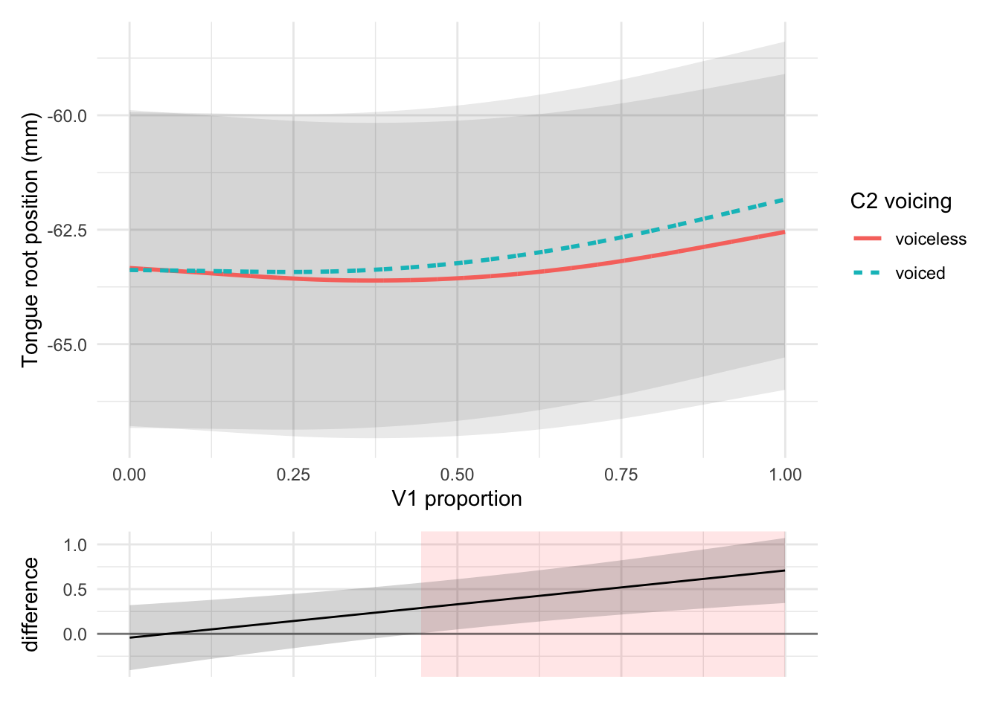
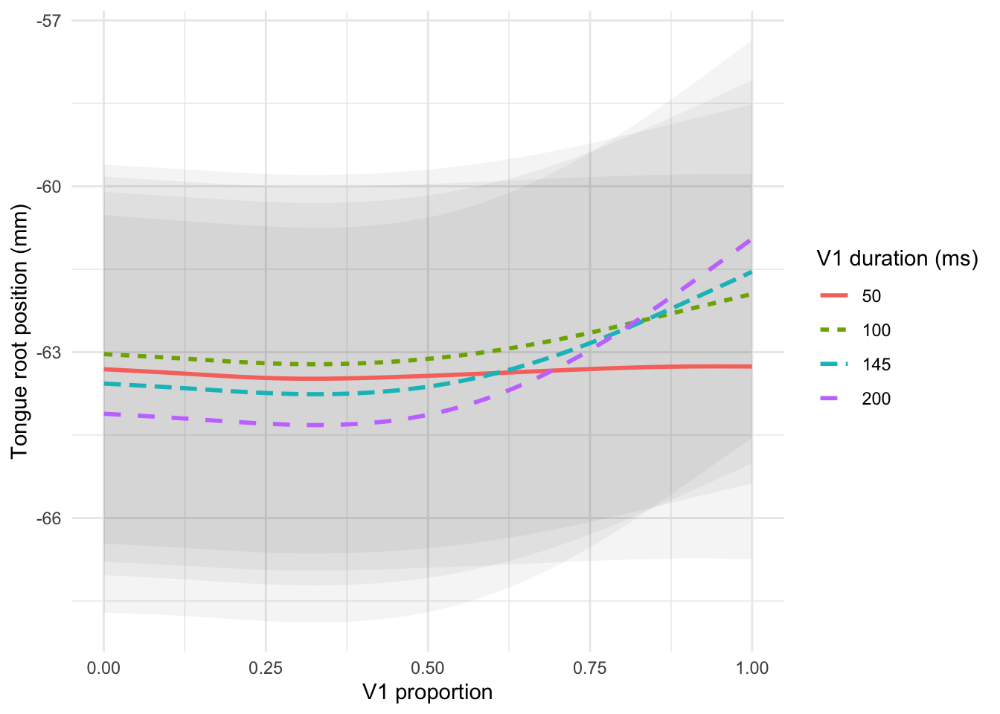
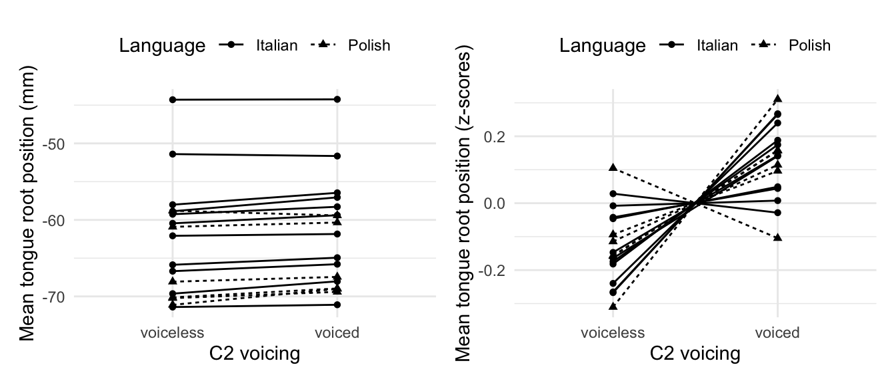
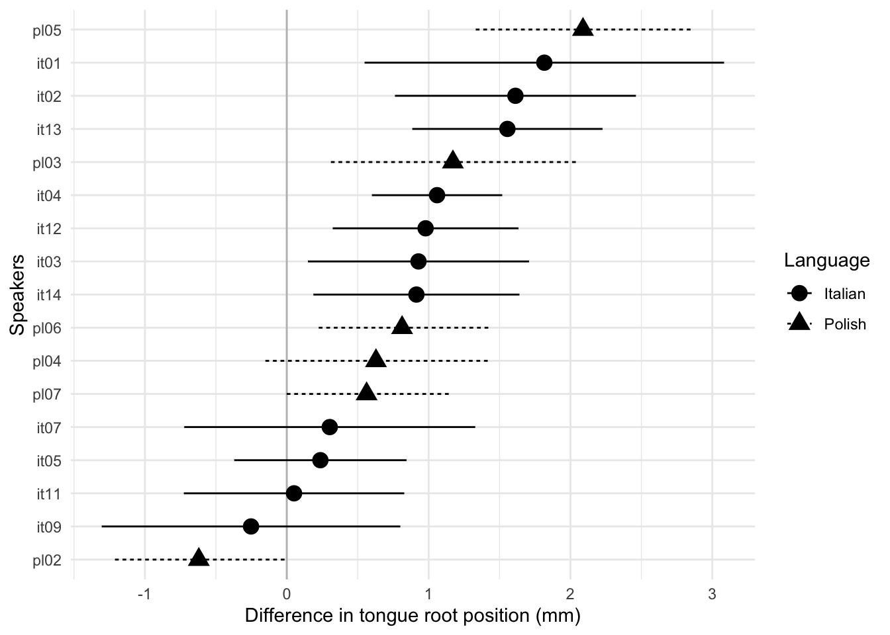
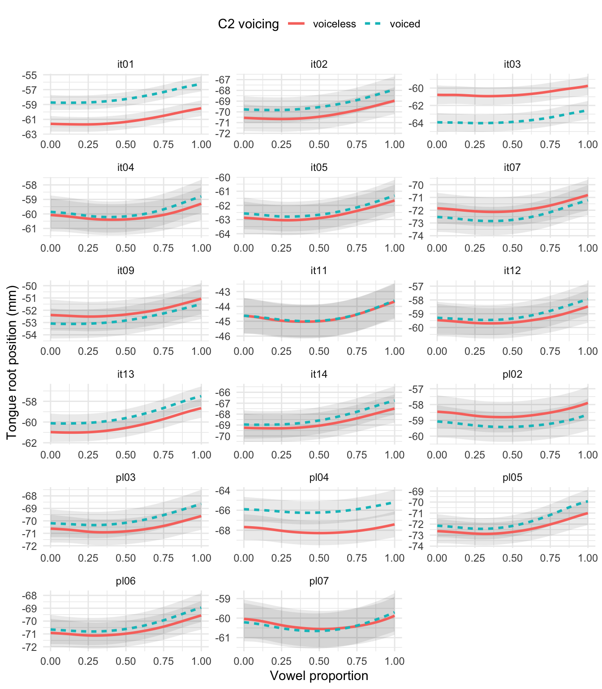

---
params:
  version: 3.1
  version-date: 2019/12/06
---

# Longer vowel duration correlates with greater tongue root displacement: Acoustic and articulatory data from Italian and Polish [Paper III] {#p:tra}

This paper has been published in the Journal of the Acoustical Society of America as:

Coretta, Stefano. 2020. Longer vowel duration correlates with greater tongue root displacement: Acoustic and articulatory data from Italian and Polish. *The Journal of the Acoustical Society of America*(147). 245--259. DOI: <https://doi.org/10.1121/10.0000556>.

When citing, please refer to the published version.

## Abstract {-}

Voiced stops tend to be preceded by longer vowels and produced with a more advanced tongue root than voiceless stops.
The duration of a vowel is modulated by the voicing of the stop that follows and in many languages vowels are longer when followed by voiced stops.
Tongue root advancement is known to be an articulatory mechanism which ensures the right pressure conditions for the maintenance of voicing during closure as dictated by the Aerodynamic Voicing Constraint.
In this paper, it is argued that vowel duration and tongue root advancement enter in a direct statistical relation.
Drawing from acoustic and ultrasound tongue imaging data from 17 speakers of Italian and Polish, it is shown that tongue root advancement is initiated during the vowel, and that vowel duration and tongue root position at vowel offset are positively correlated.
Longer vowel durations correspond to greater tongue root advancement.
It is further proposed that the later closure onset of voiced stops within a temporally stable interval is responsible for both greater root advancement and shorter closure durations in the context of voiced stops.

## Introduction

It is well known that voiced stops are almost universally characterised by two phonetic correlates: advanced tongue root and increased duration of the preceding vowel [@westbury1983; @lisker1974; @fowler1992].
While a lot of work has been done on each of these aspects separately, less is known about their relation.
In this paper, I propose a link between the position of the tongue root at the onset of a post-vocalic stop and the duration of the vowel preceding that stop.
In an exploratory study of the articulatory correlates of stop voicing, it was found that tongue root advancement---a mechanism known to facilitate voicing during stop closure---is initiated during the production of the vowel preceding the stop.
This replicates previous work on tongue root position.
Furthermore, the results of this study indicate that the acoustic duration of the vowel is positively correlated with tongue root position, such that longer vowel durations correspond to greater tongue root advancement.
Such correlation is shown to derive from the timing of the consonantal closure relative to the preceding vowel.

### Tongue root position and voicing

One of the differences in supra-glottal articulation between voiced and voiceless stops concerns the position of the tongue root relative to the front-back dimension of the oral tract.
It has been repeatedly observed that the tongue root is in a more front position in voiced stops compared to voiceless stops [@kent1969; @perkell1969; @westbury1983].
<!-- note that the actual movement is more forward and down, given it is pulled by the genioglossus -->
This has been attributed to the fact that the initiation and maintenance of vocal fold vibration (i.e. voicing) requires a difference in air pressure between the cavities below and above the glottis.
Specifically, the sub-glottal pressure needs to be higher than the supra-glottal pressure.
In other words, there must be a positive trans-glottal air pressure differential [@berg1958; @rothenberg1967].
This property of voicing is formally known as the Aerodynamic Voicing Constraint [@ohala2011].
When the oral tract is completely occluded during the production of a stop closure, the supra-glottal pressure quickly increases, due to the incoming airstream from the lungs.
Such pressure increase can hinder the ability to sustain vocal fold vibration during closure, to the point voicing ceases.

An articulatory solution to counterbalance the increased pressure is to enlarge the supra-glottal cavity by advancing the root of the tongue.
In the context of articulatory adjustments, a distinction between passive and active gestures is generally drawn [see for example @rothenberg1967].
A passive enlargement of the oral cavity is the product of the incoming airflow, the pressure of which expands the pliable soft tissues of the cavity walls.
On the other hand, active expansion is achieved by muscular activity, which can in turn be purposive (produced with the goal of cavity expansion) or non-purposive.
While @rothenberg1967 recognises that the distinction between purposive and non-purposive active gestures can be at times blurry, it is nonetheless important to note that the qualification of a gesture as active does not automatically implies a speaker's intention to produce the obtained result.

@rothenberg1967 further calculates that the walls of the oral tract can absorb the incoming airflow for 20 to 30 ms by passive expansion, after which the sub- and supra-glottal pressures would equalise and voicing cease.
Based on these estimates, a passive expansion of the pharyngeal walls is thus not generally sufficient to maintain voicing during the closure of a stop.
Reaching a complete ballistic forward gesture would require the tongue root about 70 to 90 ms [@rothenberg1967].
Given that voiced stop closures are on average shorter than that [the mean duration is about 64 ms in @luce1985], it is expected that the movement could be initiated during the production of the vowel, so that an appreciable amount of advancement is obtained when closure is achieved.
Furthermore, @westbury1983 finds that tongue root advancement is initiated before the achievement of full closure and that there is a forward movement even in some cases of voiceless stops, although the rate and magnitude of the advancement are consistently higher in voiced stops.
Finally, tongue root adjustments seem to target more specifically lingual consonants, while the tongue body is more involved in labials [@perkell1969; @westbury1983].

However, the relation between tongue root advancement and voicing is a complex one.
First, tongue root advancement is not the only mechanism for sustaining voicing during a stop [@rothenberg1967; @westbury1983; @ohala2011] and it has a certain degree of idiosyncrasy [@ahn2018].
For example, a cross-linguistically common difference between voiceless and voiced stops concerns their respective closure durations.
The closure of voiced stops is generally longer than that of voiceless stops [@lisker1957; @umeda1977; @van-summers1987; @davis1989; @de-jong1991].
A shorter closure favours maintenance of vocal fold vibration by ensuring that the pressure build-up in the oral cavity does not equalise the sub-glottal and supra-glottal pressures (at which point voicing would stop).
Other solutions which can help sustaining voicing during closure include larynx lowering [@riordan1980], slackening of the vocal folds [@halle1967], opening of the velopharyngeal port [@yanagihara1966], and producing a retroflex occlusion [@sprouse2008].
Moreover, [@ahn2018] finds that not all the speakers she surveyed did show tongue root advancement, and a few had rather the reverse pattern.

Second, implementation of tongue root advancement can be decoupled from the actual presence of vocal fold vibration.
In @westbury1983, advancement of the tongue root is found in some productions of voiceless stops.
This is counterintuitive, since tongue root advancement is generally considered to be a feature of voiced stops which require voicing-related pressure adjustments.
Moreover, @ahn2015, @ahn2018 and @ahn2016 looked at utterance-initial stops and found that the tongue root is more advanced in the phonologically voiced stops independent of whether they are implemented with vocal fold vibration or not.

To summarise, tongue root advancement is a common articulatory solution employed to counterbalance the increase in supra-glottal pressure and maintaining voicing during the production of at least lingual voiced stops.
While this gesture is not exclusive of voiced stops and it can be implemented even in the absence of vocal fold vibration, tongue root advancement seems to be a robust correlate of voicing.

### Vowel duration and voicing

The results discussed here are part of a larger study which focusses on the effect of consonant voicing on preceding vowel durations.
A great number of studies shows that, cross-linguistically, vowels tend to be longer when followed by voiced obstruents than when they are followed by voiceless ones [@house1953; @peterson1960; @chen1970; @klatt1973; @lisker1974; @farnetani1986; @fowler1992; @hussein1994; @esposito2002; @lampp2004; @durvasula2012].
This so-called "voicing effect" has been reported in a variety of languages,
including (but not limited to) English, German, Hindi, Russian, Arabic, Korean, Italian, and Polish [see @maddieson1976; and @begus2017 for a more comprehensive list].

Italian and Polish offer an opportunity to study the articulatory aspects of the voicing effect, given their reported differences in magnitude/presence of the effect and the relative ease of comparison.
While Italian has been consistently reported as a voicing-effect language [@caldognetto1979; @farnetani1986; @esposito2002], some studies found an effect in Polish [@slowiaczek1985; @nowak2006; @malisz2008; @coretta2018j] while others did not [@keating1984; @jassem1989].

@coretta2018j argues, based on the acoustics of the same data reported here, that the stressed vowels of disyllabic (CV́CV) words in Italian and Polish are 16 ms longer (SE = 4.4) when followed by a voiced stop.
The high degree of intra-speaker variation, backed up by statistical modelling, also indicates that these languages possibly behave similarly in regards to the voicing effect.
Finally, the temporal distance between two consecutive stop releases in CV́CV words is not affected by the voicing of the second consonant.
The duration of the release-to-release interval is stable across voicing contexts.
Within this interval, the timing of VC boundary (the vowel offset/onset of stop closure) produces differences in the respective durations of vowel and closure, following a mechanism of temporal compensation [@lindblom1967, @slis1969a; @slis1969b; @lehiste1970a; @lehiste1970b].
A later closure onset results in a long vowel and a short closure, while an earlier closure onset corresponds to a short vowel and a long closure.
Since the closure of voiceless stops is longer than that of voiced stops, it follows that vowels are shorter when followed by the former than when followed by the latter.

### This study

Previous research has established that tongue root advancement and longer vowel durations are two common correlates of voicing.
In particular, voicing during closure can be maintained by advancing the tongue root during the production of voiced stops (which is possibly initiated earlier than the closure onset) and vowels followed by voiced stops tend to be longer than vowels followed by voiceless stops.
The acoustic data further revealed that the duration of the stop closure bears on the duration of the preceding vowel, by means of a kind of compensatory mechanism.

The results from the articulatory data of this study, which will be discussed in the following sections, offer new insights on the link between closure and vowel duration.
We will see that the relative timing of the closure also modulates the degree of tongue root advancement found at closure onset, thus creating a three-way network of relations with vowel duration and tongue root position.
More specifically, the timing of the closure onset within the release-to-release interval determines the duration of the vowel, the duration of the closure, and the degree of tongue root advancement.
Finally, it will be argued that a later closure onset as in the case of voiced stops has the double advantage of producing both a short closure duration and greater tongue root advancement, features both known to comply with the Aerodynamic Voicing Constraint.

## Methodology

Following recent practices which encourage scientific transparency and data attribution [@cruwell2018; @berez-kroeker2018; @roettger2019], data [@coretta2018m] and analysis code (<https://osf.io/d245b/>) are available on the Open Science Framework.

### Participants

Participants were recruited in Manchester (UK), and Verbania (Italy).
Eleven native speakers of Italian (5 females, 6 males) and 6 native speakers of Polish (3 females, 3 males) participated in this study.
Most speakers of Italian are originally from the North of Italy, while 3 are from Central Italy.
The Polish speakers came from different parts of Poland (2 from the west, 3 from the centre, and 1 from the east).
This study has been approved by the School of Arts, Languages, and Culture Ethics committee of the University of Manchester (REF 2016-0099-76).
The participants signed a written consent and received a monetary compensation of £10.

### Equipment {#s:equipment}

Simultaneous recordings of audio and ultrasound tongue imaging were obtained in the Phonetics Laboratory at the University of Manchester (UK) or in a quiet room in Verbania (Italy).
An Articulate Instruments Ltd™ system was used for this study.
The system is made of a TELEMED Echo Blaster 128 unit, an Articulate Instruments Ltd™ P-Stretch synchronisation unit, and a FocusRight Scarlett Solo pre-amplifier.
A TELEMED C3.5/20/128Z-3 ultrasonic transducer (20mm radius, 2-4 MHz) and a Movo LV4-O2 Lavalier microphone were used respectively for the acquisition of ultrasonic and audio data.
The ultrasonic probe was placed in contact with the sub-mental triangle, aligned with the mid-sagittal plane.
A metallic headset designed by Articulate Instruments Ltd™ [-@articulate2008] was used to hold the probe in a fixed position and inclination relative to the head.
<!-- add figure -->
The acquisition of the mid-sagittal ultrasonic and audio signals was achieved with the software Articulate Assistant Advanced (AAA, v2.17.2) running on a Hewlett-Packard ProBook 6750b laptop with Microsoft Windows 7.
The synchronisation of the ultrasonic and audio signals was performed by AAA after recording by means of a synchronisation signal produced by the P-Stretch unit.
The ranges of the ultrasonic settings were: 43-68 frames per second, 88-114 number of scan lines, 980-988 pixel per scan line, field of view 71-93°, pixel offset 109-263, depth 75-180 mm.
The audio signal was sampled at 22050 Hz (16-bit).

### Materials

Table: (\#tab:targetstra) Target words. Asterisks indicate real words.

| Italian |       |      |   | Polish |      |      |
|---------|-------|------|---|--------|------|------|
| pata    | poto* | putu |   | pata   | poto | putu |
| pada    | podo  | pudu |   | pada*  | podo | pudu |
| paca*   | poco* | pucu |   | paka*  | poko | puku |
| paga*   | pogo  | pugu |   | paga   | pogo | pugu |

Disyllabic words of the form C\textsubscript{1}V\textsubscript{1}C\textsubscript{2}V\textsubscript{2} were used as targets, where C\textsubscript{1} = /p/, V\textsubscript{1} = /a, o, u/, C\textsubscript{2} = /t, d, k, g/, and V\textsubscript{2} = V\textsubscript{1} (e.g. *pata*, *pada*, *poto*, etc.), giving a total of 12 target words, used both for Italian and Polish.^[Note that stressed vowels in open syllables in Italian are long [@renwick2016]. Moreover, /o/ is used here for typographical simplicity to indicate the mid-back vowels of Italian and Polish, although they do differ in quality. See @kramer2009, @renwick2016, and @gussmann2007.]
The resulting words are nonce words, with a few exceptions, and they were presented in the languages' respective writing conventions (see \@ref(tab:targetstra)).
A labial stop was chosen as the first consonant to reduce possible coarticulation with the following vowel.^[However, note that @westbury1983 and @vazquez-alvarez2007 report tongue body lowering in the context of labial stops.]
Central/back vowels only were included in the target words for two reasons.
First, high and mid front vowels tend to be difficult to image with ultrasound, given their greater distance from the ultrasonic probe when compared with back vowels.
Second, high and mid front vowels usually produce less tongue displacement from and to a stop consonant.
This characteristic can make it more difficult to identify gestural landmarks using the methodology discussed in \@ref(s:process).
Since the focus of the study was to explore differences in the closing gesture of voiceless and voiced stops, only lingual consonants have been included (the closure of labial stops cannot of course be imaged with ultrasound).
The sentence *Dico X lentamente* 'I say X slowly' in Italian, and *Mówię X teraz* 'I say X now' for Polish functioned as frames for the test words.
Speakers were instructed to read the sentences without pauses and to speak at a comfortable pace.

### Procedure

The participants familiarised themselves with the sentence stimuli at the beginning of the session.
Headset and probe were then fitted on the participant's head.
<!-- A reference for the coordinate system was obtained by imaging the occlusal plane with a metallic bite plate inserted in the participant's mouth [@scobbie2011}.
The participant gently bites on the bite plate while pressing the tongue against it to keep it still.
The trace of the metallic plate visible in the ultrasonic image was then used to rotate the tongue data (see \@ref(s:process)). -->
<!-- add image -->
The participant read the sentence stimuli, which were presented on the computer screen in a random order, while the audio and ultrasonic signals were acquired simultaneously.
The random list of sentences was read 6 times consecutively (with the exception of IT02, who repeated the sentences 5 times only).
Due to software constraints, the order of the sentences within participant was kept the same for each of the six repetitions.
The participant could optionally take breaks between one repetition and the other.
Sentences with hesitations or speech errors were immediately discarded and re-recorded.
A total of 1212 tokens (792 from Italian, 420 from Polish) were obtained.

### Data processing and statistical analysis {#s:process}

The audio data was subject to forced alignment using the SPeech Phonetisation Alignment and Syllabification software [SPPAS; @bigi2015].
The outcome of the automatic alignment was then manually corrected, according to the recommendations in @machac2009.
The onset and offset of V1 in the C\textsubscript{1}V\textsubscript{1}C\textsubscript{2}V\textsubscript{2} test words were respectively placed in correspondence of the appearance and disappearance of higher formant structure in the spectrogram.
Vowel duration was calculated as the duration of the V1 onset to V1 offset interval.
Speech rate was measured as the number of syllables in the sentence (8 in Italian and 6 in Polish) divided by the duration of the sentence in seconds.
<!-- add image -->

The displacement of the tongue root was obtained from the ultrasonic data according to the procedure used in @kirkham2017.
Smoothing splines were automatically fitted to the visible tongue contours in AAA.
Manual correction was then applied in cases of clear tracking errors.
A fan-like frame consisting of 42 equidistant radial lines superimposed on the ultrasonic image was used as the coordinate system.
The origin of the 42 fan-lines coincides with the (virtual) origin of the ultrasonic beams, such that each fan-line is parallel to the direction of the nearest ultrasonic scan lines.
Tongue root displacement was thus calculated as the displacement of the fitted spline along a selected vector [@strycharczuk2015, see \@ref(fig:trp)].
For each participant, the fan-line with the highest standard deviation of displacement within the area corresponding to the speaker's tongue root was chosen as the tongue root displacement vector.
A Savitzky--Golay smoothing filter (second-order, frame length 75 ms) was applied to the raw displacement.
Displacement values for analysis are taken from the smoothed displacement signal.
Tongue root displacement was obtained from a static time point (the onset of the closure of C2) and along the duration of the vowel.
The displacement values along the vowel duration were extracted at time points corresponding to real ultrasonic video frames.
Given the average frame rate is 55 frames per second, values are sampled about every 20 ms.

(\#fig:trp)Schematics of the operationalisation of tongue root position, based on @kirkham2017. The tongue root surface corresponds to the lower edge of the white band in the image. The tongue tip is on the right side. The outline of the fan-like coordinate systems is shown. The yellow line starting from the probe origin is the selected fan-line from which tongue root position is calculated (see text for the method of fan-line selection). Tongue root position thus corresponds to the distance (in millimetres) between the probe origin and the intersecting point of the tongue surface with the selected fan-line.

Statistical analysis was performed in R v3.5.2 [@r-core-team2018].
Linear mixed-effects models were fitted with lme4 v1.1-19 [@bates2015].
Factor terms were coded with treatment contrasts (the reference level is the first listed for each factor): C2 voicing (voiceless, voiced), vowel (/a/, /o/, /u/).
Speech rate was centred for inclusion in the statistical models, by subtracting the mean speech rate across all speakers from the calculated speech rate values.
Centring ensures the intercepts are interpretable.
*t*-tests with Satterthwaite's approximation to degrees of freedom on the individual terms were used to obtain *p*-values using lmerTest v3.0-1 [@kuznetsova2017; @luke2017].
An effect is considered significant if the *p*-value is below the alpha level ($\alpha = 0.05$).
Generalised additive mixed models were fitted with mgcv v1.8-26 [@wood2011; @wood2017].
The smooths used thin plate regression splines as basis [@wood2003].
The ordered factor difference smooths method described in @soskuthy2017 and @wieling2018 was used to model the effect of factor terms in GAMs.
The models were fitted by maximum likelihood (ML) and autoregression in the residuals was controlled with a first-order autoregressive model.

Significance testing of the relevant predictors was achieved by comparing the ML score of the full model with the score of a null model (in which the relevant predictor is dropped), using the `compareML()` function of the itsadug package [@van-rij2017].
A preliminary analysis indicated that including either language or C2 place of articulation as predictors produced respective *p*-values above the alpha level, without affecting the estimates of the other terms.
\@ref(s:idio) further discusses the idiosyncratic behaviour of the tongue root observed between speakers, which does not seem to pattern in any way with their native language.
For these reasons, these variables were not included in the models reported here and will not be discussed.
Future research is warranted to ascertain language-related differences and possible effects of place of articulation.

## Results {#s:results}

### Tongue root position at C2 closure onset {#s:tra-lm}

(\#fig:Figure2)Raw data and boxplots of tongue root position in voiceless and voiced stops at closure onset. Higher values indicate advancement.

\@ref(fig:Figure2) shows raw data points and boxplots of the position of the tongue root at C2 closure onset when C2 is voiceless (left) and voiced (right).
Since the position of the tongue root in millimetres depends on the speaker's anatomy and on the probe location, scaled tongue root position is used in this plot (note though that the unscaled data is used in statistical modelling).
As a trend, the position of the tongue root is more advanced if C2 is voiced compared to its position when C2 is voiceless.

A linear mixed-effects model with tongue root position as the outcome variable was fitted with the following predictors (\@ref(tab:tra-lm-table)): fixed effects for C2 voicing (voiceless, voiced), centred speech rate (as number of syllables per second, centred), vowel (/a/, /o/, /u/); by-speaker and by-word random intercepts (a by-speaker random coefficient for C2 voicing led to singular fit, so it was not included in the final model).
The effects of C2 voicing and vowel are significant according to *t*-tests with Satterthwaite's approximation to degrees of freedom.
The tongue root at C2 closure onset is 0.77 mm (SE = 0.35) more front when C2 is voiced, and it is 1.87 mm (SE = 0.42) more retracted if V1 is /o/.

<table class="table" style="font-size: 10px; margin-left: auto; margin-right: auto;">
<caption style="font-size: initial !important;">(\#tab:tra-lm-table)Summary of the linear mixed-effects model fitted to tongue root position at vowel offset (see \@ref(s:tra-lm))</caption>
 <thead>
  <tr>
   <th style="text-align:left;"> Predictor </th>
   <th style="text-align:right;"> Estimate </th>
   <th style="text-align:right;"> SE </th>
   <th style="text-align:right;"> CI low </th>
   <th style="text-align:right;"> CI up </th>
   <th style="text-align:right;"> df </th>
   <th style="text-align:right;"> t-value </th>
   <th style="text-align:right;"> p-value </th>
   <th style="text-align:left;"> &lt; α </th>
  </tr>
 </thead>
<tbody>
  <tr>
   <td style="text-align:left;"> Intercept </td>
   <td style="text-align:right;"> -62.1396 </td>
   <td style="text-align:right;"> 1.8113 </td>
   <td style="text-align:right;"> -65.6898 </td>
   <td style="text-align:right;"> -58.5895 </td>
   <td style="text-align:right;"> 17.1190 </td>
   <td style="text-align:right;"> -34.3059 </td>
   <td style="text-align:right;"> 0.0000 </td>
   <td style="text-align:left;"> * </td>
  </tr>
  <tr>
   <td style="text-align:left;"> Voicing = voiced </td>
   <td style="text-align:right;"> 0.7689 </td>
   <td style="text-align:right;"> 0.3473 </td>
   <td style="text-align:right;"> 0.0881 </td>
   <td style="text-align:right;"> 1.4497 </td>
   <td style="text-align:right;"> 19.3942 </td>
   <td style="text-align:right;"> 2.2137 </td>
   <td style="text-align:right;"> 0.0390 </td>
   <td style="text-align:left;"> * </td>
  </tr>
  <tr>
   <td style="text-align:left;"> Speech rate (centr.) </td>
   <td style="text-align:right;"> 0.4114 </td>
   <td style="text-align:right;"> 0.2793 </td>
   <td style="text-align:right;"> -0.1360 </td>
   <td style="text-align:right;"> 0.9588 </td>
   <td style="text-align:right;"> 1168.1101 </td>
   <td style="text-align:right;"> 1.4732 </td>
   <td style="text-align:right;"> 0.1410 </td>
   <td style="text-align:left;">  </td>
  </tr>
  <tr>
   <td style="text-align:left;"> Vowel = /o/ </td>
   <td style="text-align:right;"> -1.8742 </td>
   <td style="text-align:right;"> 0.4249 </td>
   <td style="text-align:right;"> -2.7069 </td>
   <td style="text-align:right;"> -1.0414 </td>
   <td style="text-align:right;"> 19.2868 </td>
   <td style="text-align:right;"> -4.4112 </td>
   <td style="text-align:right;"> 0.0003 </td>
   <td style="text-align:left;"> * </td>
  </tr>
  <tr>
   <td style="text-align:left;"> Vowel = /u/ </td>
   <td style="text-align:right;"> 0.0865 </td>
   <td style="text-align:right;"> 0.4270 </td>
   <td style="text-align:right;"> -0.7503 </td>
   <td style="text-align:right;"> 0.9234 </td>
   <td style="text-align:right;"> 19.6968 </td>
   <td style="text-align:right;"> 0.2027 </td>
   <td style="text-align:right;"> 0.8415 </td>
   <td style="text-align:left;">  </td>
  </tr>
</tbody>
</table>

### Tongue root position during V1 {#s:trp-v1}

The position of the tongue root during the articulation of V1 was assessed with generalised additive mixed models (GAMM).
A GAMM was fitted to tongue root position with the following terms (\@ref(tab:tra-gam-ar-table)): C2 voicing as a parametric term; a smooth term over centred speech rate, a smooth term over V1 proportion with a by-C2 voicing difference smooth, a tensor product interaction over V1 proportion and centred speech rate; a factor random smooth over V1 proportion by speaker (penalty order = 1).
A chi-squared test on the ML scores of the full model and a model excluding C2 voicing indicates that C2 voicing significantly improves fit ($\chi$(3) = 7.758, *p* = 0.001).
\@ref(fig:Figure3) shows that the root advances during the production of the vowel, relative to its position at V1 onset.
This forward movement is observed both in the context of a following voiced stop and in that of a following voiceless stop.
However, the magnitude of the movement is greater in the former.
At V1 offset (= C2 closure onset), the graph suggests a difference in tongue root position of about 1 mm.

<table class="table" style="font-size: 10px; margin-left: auto; margin-right: auto;">
<caption style="font-size: initial !important;">(\#tab:tra-gam-ar-table)Summary of the GAM model fitted to tongue root position during V1 (see \@ref(s:trp-v1))</caption>
 <thead>
  <tr>
   <th style="text-align:left;"> Predictor </th>
   <th style="text-align:right;"> Estimate </th>
   <th style="text-align:right;"> SE </th>
   <th style="text-align:right;"> EDF </th>
   <th style="text-align:right;"> Ref.DF </th>
   <th style="text-align:right;"> Statistic </th>
   <th style="text-align:right;"> p-value </th>
   <th style="text-align:left;"> &lt; α </th>
  </tr>
 </thead>
<tbody>
  <tr>
   <td style="text-align:left;"> Intercept </td>
   <td style="text-align:right;"> -63.3328 </td>
   <td style="text-align:right;"> 1.7562 </td>
   <td style="text-align:right;">  </td>
   <td style="text-align:right;">  </td>
   <td style="text-align:right;"> -36.0623 </td>
   <td style="text-align:right;"> 0.0000 </td>
   <td style="text-align:left;"> * </td>
  </tr>
  <tr>
   <td style="text-align:left;"> Voicing = voiced </td>
   <td style="text-align:right;"> 0.3311 </td>
   <td style="text-align:right;"> 0.1432 </td>
   <td style="text-align:right;">  </td>
   <td style="text-align:right;">  </td>
   <td style="text-align:right;"> 2.3122 </td>
   <td style="text-align:right;"> 0.0208 </td>
   <td style="text-align:left;"> * </td>
  </tr>
  <tr>
   <td style="text-align:left;"> s(Speech rate (centr.)) </td>
   <td style="text-align:right;">  </td>
   <td style="text-align:right;">  </td>
   <td style="text-align:right;"> 7.5310 </td>
   <td style="text-align:right;"> 8.5159 </td>
   <td style="text-align:right;"> 4.4781 </td>
   <td style="text-align:right;"> 0.0000 </td>
   <td style="text-align:left;"> * </td>
  </tr>
  <tr>
   <td style="text-align:left;"> s(Proportion) </td>
   <td style="text-align:right;">  </td>
   <td style="text-align:right;">  </td>
   <td style="text-align:right;"> 3.6906 </td>
   <td style="text-align:right;"> 4.3631 </td>
   <td style="text-align:right;"> 10.4450 </td>
   <td style="text-align:right;"> 0.0000 </td>
   <td style="text-align:left;"> * </td>
  </tr>
  <tr>
   <td style="text-align:left;"> s(Proportion): voiced </td>
   <td style="text-align:right;">  </td>
   <td style="text-align:right;">  </td>
   <td style="text-align:right;"> 1.0121 </td>
   <td style="text-align:right;"> 1.0233 </td>
   <td style="text-align:right;"> 9.8423 </td>
   <td style="text-align:right;"> 0.0015 </td>
   <td style="text-align:left;"> * </td>
  </tr>
  <tr>
   <td style="text-align:left;"> ti(Proportion, Speech Rate (c.)) </td>
   <td style="text-align:right;">  </td>
   <td style="text-align:right;">  </td>
   <td style="text-align:right;"> 2.1298 </td>
   <td style="text-align:right;"> 2.7632 </td>
   <td style="text-align:right;"> 2.9030 </td>
   <td style="text-align:right;"> 0.0422 </td>
   <td style="text-align:left;"> * </td>
  </tr>
  <tr>
   <td style="text-align:left;"> s(Proportion, Speaker) </td>
   <td style="text-align:right;">  </td>
   <td style="text-align:right;">  </td>
   <td style="text-align:right;"> 62.2802 </td>
   <td style="text-align:right;"> 152.0000 </td>
   <td style="text-align:right;"> 57.3447 </td>
   <td style="text-align:right;"> 0.0000 </td>
   <td style="text-align:left;"> * </td>
  </tr>
</tbody>
</table>

(\#fig:Figure3)Predicted tongue root position (top figure) during vowels preceding voiceless and voiced stops, with 95\% confidence intervals, and difference smooth (bottom figure). Higher values of tongue root position indicate a more advanced root. The shaded red area in the difference smooth indicates where the two curves are different. Predictions from a GAMM (see \@ref(s:trp-v1)).

### Correlation between tongue root position and V1 duration {#s:trp-vdur}

(\#fig:Figure4)Raw data, regression lines, and 95\% confidence intervals of the correlation between vowel duration and tongue root position for each vowel (/a/, /o/, and /u/). The regression line and confidence intervals are from a mixed-effects model (see \@ref(s:trp-vdur)).

A second linear mixed regression was fitted to tongue root position to assess the effect of V1 duration on root position (\@ref(tab:tra-lm-2-table)).
The following terms were included: centred V1 duration (in milliseconds), centred speech rate (as number of syllables per second), vowel (/a/, /o/, /u/), C2 place of articulation (coronal, velar); an interaction between centred V1 duration and vowel; by-speaker and by-word random intercept (a by-speaker random coefficient for V1 duration led to non-convergence, so it was not included in the final model).
All predictors and the V1 duration/vowel interaction are significant.
V1 duration and tongue root position are positively correlated: The longer the vowel, the more advanced the tongue root is at V1 offset ($\hat{\beta}$ = 0.065 mm, SE = 0.007).
The effect is stronger with /a/ than with /o/ and /u/ (see \@ref(fig:Figure4)).

<table class="table" style="font-size: 10px; margin-left: auto; margin-right: auto;">
<caption style="font-size: initial !important;">(\#tab:tra-lm-2-table)Summary of the linear mixed-effects model for testing the correlation between tongue root position and V1 duration  (see \@ref(s:trp-vdur))</caption>
 <thead>
  <tr>
   <th style="text-align:left;"> Predictor </th>
   <th style="text-align:right;"> Estimate </th>
   <th style="text-align:right;"> SE </th>
   <th style="text-align:right;"> CI low </th>
   <th style="text-align:right;"> CI up </th>
   <th style="text-align:right;"> df </th>
   <th style="text-align:right;"> t-value </th>
   <th style="text-align:right;"> p-value </th>
   <th style="text-align:left;"> &lt; α </th>
  </tr>
 </thead>
<tbody>
  <tr>
   <td style="text-align:left;"> Intercept </td>
   <td style="text-align:right;"> -62.5793 </td>
   <td style="text-align:right;"> 1.7818 </td>
   <td style="text-align:right;"> -66.0716 </td>
   <td style="text-align:right;"> -59.0870 </td>
   <td style="text-align:right;"> 17.0876 </td>
   <td style="text-align:right;"> -35.1213 </td>
   <td style="text-align:right;"> 0.0000 </td>
   <td style="text-align:left;"> * </td>
  </tr>
  <tr>
   <td style="text-align:left;"> V1 duration (centr.) </td>
   <td style="text-align:right;"> 0.0651 </td>
   <td style="text-align:right;"> 0.0073 </td>
   <td style="text-align:right;"> 0.0507 </td>
   <td style="text-align:right;"> 0.0795 </td>
   <td style="text-align:right;"> 955.6437 </td>
   <td style="text-align:right;"> 8.8558 </td>
   <td style="text-align:right;"> 0.0000 </td>
   <td style="text-align:left;"> * </td>
  </tr>
  <tr>
   <td style="text-align:left;"> Speech rate (centr.) </td>
   <td style="text-align:right;"> 1.2412 </td>
   <td style="text-align:right;"> 0.2903 </td>
   <td style="text-align:right;"> 0.6722 </td>
   <td style="text-align:right;"> 1.8102 </td>
   <td style="text-align:right;"> 1169.6885 </td>
   <td style="text-align:right;"> 4.2755 </td>
   <td style="text-align:right;"> 0.0000 </td>
   <td style="text-align:left;"> * </td>
  </tr>
  <tr>
   <td style="text-align:left;"> Vowel = /o/ </td>
   <td style="text-align:right;"> -1.3031 </td>
   <td style="text-align:right;"> 0.4597 </td>
   <td style="text-align:right;"> -2.2040 </td>
   <td style="text-align:right;"> -0.4021 </td>
   <td style="text-align:right;"> 18.3761 </td>
   <td style="text-align:right;"> -2.8348 </td>
   <td style="text-align:right;"> 0.0108 </td>
   <td style="text-align:left;"> * </td>
  </tr>
  <tr>
   <td style="text-align:left;"> Vowel = /u/ </td>
   <td style="text-align:right;"> 1.5863 </td>
   <td style="text-align:right;"> 0.5049 </td>
   <td style="text-align:right;"> 0.5967 </td>
   <td style="text-align:right;"> 2.5759 </td>
   <td style="text-align:right;"> 25.8254 </td>
   <td style="text-align:right;"> 3.1419 </td>
   <td style="text-align:right;"> 0.0042 </td>
   <td style="text-align:left;"> * </td>
  </tr>
  <tr>
   <td style="text-align:left;"> V1 duration × /o/ </td>
   <td style="text-align:right;"> -0.0303 </td>
   <td style="text-align:right;"> 0.0079 </td>
   <td style="text-align:right;"> -0.0457 </td>
   <td style="text-align:right;"> -0.0149 </td>
   <td style="text-align:right;"> 736.2316 </td>
   <td style="text-align:right;"> -3.8504 </td>
   <td style="text-align:right;"> 0.0001 </td>
   <td style="text-align:left;"> * </td>
  </tr>
  <tr>
   <td style="text-align:left;"> V1 duration × /u/ </td>
   <td style="text-align:right;"> -0.0227 </td>
   <td style="text-align:right;"> 0.0090 </td>
   <td style="text-align:right;"> -0.0403 </td>
   <td style="text-align:right;"> -0.0052 </td>
   <td style="text-align:right;"> 751.2495 </td>
   <td style="text-align:right;"> -2.5345 </td>
   <td style="text-align:right;"> 0.0115 </td>
   <td style="text-align:left;"> * </td>
  </tr>
</tbody>
</table>

### Tongue root position during V1 as a function of V1 duration {#s:trp-v1-dur}

The effect of V1 duration on tongue root position during V1 was modelled by fitting a GAMM with the following terms (\@ref(tab:tra-gam-ar-2-table)): tongue root position as the outcome variable, smooth terms over V1 duration and V1 proportion, a tensor product interaction over V1 proportion and V1 duration; a factor random smooth over V1 proportion by speaker (penalty order = 1).
The full model with the tensor product interaction over V1 proportion and V1 duration has better fit according to model comparison with a model without the interaction ($\chi$(3) = 12.559, *p* < 0.001).
\@ref(fig:Figure5) shows the estimated root trajectories at four values of vowel duration.
The general trend is that the forward movement of the root during the vowel is greater the longer the duration of the vowel (\@ref(fig:Figure5)).
Moreover, the trajectory curvature increases with vowel duration: Shorter vowels have a flatter trajectory of tongue root advancement.

<table class="table" style="font-size: 10px; margin-left: auto; margin-right: auto;">
<caption style="font-size: initial !important;">(\#tab:tra-gam-ar-2-table)Summary of the GAM model fitted to tongue root position during V1 as a function of V1 duration (see \@ref(s:trp-v1-dur))</caption>
 <thead>
  <tr>
   <th style="text-align:left;"> Predictor </th>
   <th style="text-align:right;"> Estimate </th>
   <th style="text-align:right;"> SE </th>
   <th style="text-align:right;"> EDF </th>
   <th style="text-align:right;"> Ref.DF </th>
   <th style="text-align:right;"> Statistic </th>
   <th style="text-align:right;"> p-value </th>
   <th style="text-align:left;"> &lt; α </th>
  </tr>
 </thead>
<tbody>
  <tr>
   <td style="text-align:left;"> Intercept </td>
   <td style="text-align:right;"> -63.0629 </td>
   <td style="text-align:right;"> 1.7397 </td>
   <td style="text-align:right;">  </td>
   <td style="text-align:right;">  </td>
   <td style="text-align:right;"> -36.2484 </td>
   <td style="text-align:right;"> 0 </td>
   <td style="text-align:left;"> * </td>
  </tr>
  <tr>
   <td style="text-align:left;"> s(V1 duration) </td>
   <td style="text-align:right;">  </td>
   <td style="text-align:right;">  </td>
   <td style="text-align:right;"> 8.2418 </td>
   <td style="text-align:right;"> 8.8459 </td>
   <td style="text-align:right;"> 7.7096 </td>
   <td style="text-align:right;"> 0 </td>
   <td style="text-align:left;"> * </td>
  </tr>
  <tr>
   <td style="text-align:left;"> s(Proportion) </td>
   <td style="text-align:right;">  </td>
   <td style="text-align:right;">  </td>
   <td style="text-align:right;"> 3.9629 </td>
   <td style="text-align:right;"> 4.7052 </td>
   <td style="text-align:right;"> 17.9985 </td>
   <td style="text-align:right;"> 0 </td>
   <td style="text-align:left;"> * </td>
  </tr>
  <tr>
   <td style="text-align:left;"> ti(Proportion, V1 duration) </td>
   <td style="text-align:right;">  </td>
   <td style="text-align:right;">  </td>
   <td style="text-align:right;"> 2.8556 </td>
   <td style="text-align:right;"> 3.3236 </td>
   <td style="text-align:right;"> 8.9782 </td>
   <td style="text-align:right;"> 0 </td>
   <td style="text-align:left;"> * </td>
  </tr>
  <tr>
   <td style="text-align:left;"> s(Proportion, Speaker) </td>
   <td style="text-align:right;">  </td>
   <td style="text-align:right;">  </td>
   <td style="text-align:right;"> 59.9508 </td>
   <td style="text-align:right;"> 152.0000 </td>
   <td style="text-align:right;"> 65.7394 </td>
   <td style="text-align:right;"> 0 </td>
   <td style="text-align:left;"> * </td>
  </tr>
</tbody>
</table>

(\#fig:Figure5)Predicted tongue root position during vowels at 4 exemplifying values of vowel duration, with 95\% confidence intervals. Predictions from a GAMM (see \@ref(s:trp-v1-dur)).

## Discussion {#s:discussion}

### Voicing, tongue root position and vowel duration

The results of this study of voicing and vowel duration in Italian and Polish revealed a few patterns in the relation between consonant voicing, tongue root position, and vowel duration.
Unsurprisingly, the position of the tongue root at vowel offset is more front when the following stop is voiced than when the following stop is voiceless in both surveyed languages.
This finding aligns with the results of previous work on English [@kent1969; @perkell1969; @westbury1983; @ahn2018].
When looking at the position of the tongue root during the vowel, it was found that the root starts advancing during the articulation of the vowel.
@westbury1983} found the same pattern in English.
Moreover, similarly to the results in @westbury1983, some tongue root advancement during the production of the vowel is found even when C2 is voiceless.

A possible reason for the presence of such a small degree of advancement in voiceless lingual stops is offered by arguments in relation to the absence of advancement in labials (voiced or voiceless).
@westbury1983 proposes that the articulation of the closure of lingual stops mechanically involves movements of the tongue root, so that, in order to keep a constant oral cavity volume, the root moves forward while the tongue body moves upward.
On the other hand, the tongue can move freely in labial stops since their closure involves the lips.
This idea is supported by the "trough effect" [@vazquez-alvarez2007], i.e. VCV sequences involving a labial stop show tongue body lowering, and by the fact that voiced labials tend to resort to tongue body lowering rather than tongue root advancement as a mechanism for voicing maintenance [@perkell1969; @westbury1983; @ahn2018].
The small degree of advancement in voiceless lingual stops could then as well be a mechanic consequence of the tongue moving upward for producing the stop closure.

The data discussed here also suggest that tongue root position is positively correlated with vowel duration, such that longer vowels show a more advanced tongue root at vowel offset (= closure onset) than shorter vowels.
Said correlation exists independent of the voicing status of the consonant following the vowel (compatible with the finding that even voiceless stops have some degree of advancement).
The correlation between tongue root and vowel duration could be interpreted as to indicate that the onset of the forward gesture of the root is timed relative to a landmark preceding the closure, independent of the duration of the vowel.
The timing of the stop closure along the advancement movement would sanction the degree of advancement found at closure onset.

<!-- there is still the possibility that the velocity profiles are different in voiceless vs voiced, or they could derive from the curvature differences? -->

The dynamic data of tongue root advancement during the articulation of the vowel indicates that vowels followed by voiced stops have greater tongue root advancement at vowel offset than vowels followed by voiceless stops, in accordance with the results from the static analysis at vowel offset.
Moreover, a significant interaction between vowel duration and the trajectory shape was found.
Shorter vowels have a flatter trajectory, while the curvature of the trajectory in longer vowels is greater.

When comparing the effects of vowel duration and speech rate on tongue root position, though, we are faced with a paradox.
Both variables have a positive effect on tongue root position, so that longer vowels and higher speech rates imply a more advanced root.
However, speech rate has a negative effect on vowel duration (and segments duration in general), such that higher speech rates are correlated with shorter vowel durations (this holds for this data).
If higher speech rates mean shorter vowels and shorter vowels imply a less advanced root, we should also find less advancement with higher speech rates.
However, the results indicate the opposite, and higher speech rates are correlated with more root advancement.
A regression model on the position of the tongue root at *vowel onset* suggests that speech rate is positively correlated with tongue root position at vowel onset.
The tongue root is already in a more advanced position at vowel onset when the speech rate is high, so that, if vowel duration is held constant, more advancement is expected at vowel offset with higher speech rates even when higher speech rate has a negative effect on vowel duration.

The articulatory patterns observed in this paper contribute to the understanding of the acoustic patterns discussed in previous work.
If we take the release of the consonant preceding the vowel as a reference point, a delayed consonant closure could ensure that, by the time closure is made, an appreciable amount of tongue root advancement is achieved.
Other things being equal, an increase in cavity volume increases the time required to reach trans-glottal pressure equalisation, which would cause cessation of voicing.
This mechanism thus contributes to the maintenance of voicing during the stop closure.

The closure of voiced stops is achieved later (relative to the preceding consonant release) compared to the closure of voiceless stops.
Moreover, the temporal distance between the releases of the two consecutive stops in CV́CV words is not affected by the voicing category of the second stop.
Given the stability of the release-to-release interval duration, the delay in producing a full closure seen in the context of voiced stops has thus a double advantage: (1) A greater degree of tongue root advancement is achieved at vowel offset/closure onset, and (2) the stop closure is shorter.
Both of these articulatory features are compliant with the requirements dictated by the Aerodynamic Voicing Constraint.
A more advanced tongue root ensures that the trans-glottal pressure differential is sufficient for voicing to be sustained, and a shorter closure reduces the pressure build-up during the stop closure.
To conclude, it is proposed that the combined action of a temporally stable release-to-release interval and the differential timing of the VC boundary in the context of voiceless vs voiced stops contribute to both the acoustic patterns of vowel and closure duration and the articulatory patterns of tongue root position.

### Estimates of tongue root displacement

It is worth to briefly discuss the estimated difference in tongue root position between voiceless and voiced stops and its significance.
The estimated magnitude of such difference is 0.77 mm (SE = 0.35).
The 95% confidence interval for the difference is approximately within the range 0-1.5 mm.
@rothenberg1967 argues that the anterior wall of the lower pharynx (corresponding to the tongue root) can move by 5 mm along the antero-posterior axis.
Figure 1 in @kirkham2017 suggests that the tongue root of one of the Twi speakers recorded is about 4 mm more front in /e/ (a +ATR vowel) than in /ɛ/ (a -ATR vowel).
Given that a difference of 4 mm in root position can produce a substantially distinct acoustic output in vowels (like the two different phonemes of Twi), it makes sense to expect that differences in tongue root position as driven by consonantal factors should be of some magnitude smaller, like the ones found in this study.
<!-- \footnote{Thanks to Sam Kirkham for bringing this point to my attention.} -->
Moreover, the data presented here indicates that for every millisecond increase in vowel duration there is a 0.065 mm increase in tongue root advancement (see \@ref(s:trp-vdur)).
If a maximal ballistic forward movement of the tongue root takes between 70 and 90 ms [@rothenberg1967], we can calculate the maximum plausible displacement to be between 4.55 to 5.85 mm (0.065 mm times 70–90 ms).
These values are in agreement with the maximum root displacement of 5 mm estimated by Rothenberg.

The results of this study also shed some light on timing aspects of tongue root advancement.
As mentioned in the previous section, the correlation between tongue root position and vowel duration could be a consequence of the timing of the advancement gesture.
In order to obtain such correlation, the onset of the gesture (during the articulation of the vowel) should be at a fixed distance from an earlier reference point (like the vowel onset or the preceding consonant offset) such that the timing of consonant closure will create the correlation seen in the data.
Although ideally the timing of the onset of the advancing gesture should be fixed, the velocity of the gesture itself could be different depending on the voicing of the following consonant.
It is possible that the velocity will be greater in the context of voiced stops, especially if the advancing gesture in this context is executed with greater muscular force.
Unfortunately, a preliminary screening of the current data was inconclusive as to whether timing and velocity are similar or differ in the voiceless and voiced contexts, due to the difficulty in identifying the onset of the advancing gesture.
Further data should be collected with the aim of testing the hypothesis that the timing of the gesture onset is the same in voiceless and voiced contexts, while the velocity of the gesture should differ.

Although the results of this study are in agreement with previous work, the correlation between tongue root position and vowel duration needs to be replicated by expanding the enquired contexts to other types of consonants and vowels, and with other languages.
Investigating the relative phasing of tongue root and body gestures in lingual and labial consonants is also necessary to clarify the mechanisms that could underlie the gestural timing of stop closure and tongue root advancement.
Moreover, while the paper so far has focussed on group-level trends, it should be noted that, as found in other studies on the tongue root, individual speakers show a somewhat high degree of variability.
The following section discusses this point.

### Individual differences {#s:idio}

(\#fig:Figure6)Slope plots of mean torngue root position in voiceless and voiced stops at closure onset, by-speaker. The plot on the left has raw position values in millimetres, while the plot on the right shows standardised values (z-scores) by speaker. See text for details.

The results presented in \@ref(s:results) and discussed in \@ref(s:discussion) are group-level patterns of the population sampled in the present study.
However, the data is characterised by a certain degree of individual-level differences.
\@ref(fig:Figure6) shows two slope plots of mean tongue root position depending on C2 voicing for each speaker.
In each plot, the two means of each speaker are linked by a line that shows the difference (or lack thereof) in means.
Solid lines are Italian speakers, while dashed lines are Polish speakers.
The *y*-axis of the left plot is the raw mean position in millimetres, while that of the right plot is the standardised values (z-scores) of the mean position.
An upward-slanted slope line indicates that the mean tongue root position in the voiced condition is higher, while a downward-slanted slope is interpreted as a decrease in mean root position.
A flat slope suggests there is no difference in means between the voiceless and voiced condition.

This plot shows that all three possibilities of slope direction are found in the data.
The mean value of tongue root position of a voiced C2 relative to that of a voiceless stop is greater in some speakers, smaller in others, and similar in yet other speakers.
Moreover, no discernible pattern can be found between speakers of Italian and Polish.
Speakers of both languages show more or less the same range of variation.
However, as we have seen in \@ref(s:results), the estimated overall effect of C2 voicing is robust and it implies a more advanced tongue root in voiced stops.
The right plot of \@ref(fig:Figure6) confirms this point visually.
Two speakers show a declining slope (one is Italian and the other Polish), one speaker has a virtually flat slope, while all the others have a slope increasing at varying degrees.
Note that the individual variation across speakers found in this data is qualitatively comparable to that in @ahn2018.

(\#fig:Figure7)By-speaker raw mean difference in tongue root position between voiceless and voiced stops at closure onset (in millimetres). The horizontal segments are the standard errors of the mean differences.

The mean difference in tongue root position in voiceless vs voiced stops has been calculated for each speaker from the raw data.
\@ref(fig:Figure7) plots the speakers' mean differences, with the respective standard error bars.
The bottom 7 speakers (3 Polish, 4 Italian) show either a weak negative difference (the tongue root is slightly more advanced in voiceless stops) or a weak positive difference with wide standard errors which include 0.
The remaining 11 speakers have a more robust positive difference (the tongue root is more advanced in voiced stops).
Finally, speakers of each language do not cluster together, reiterating the observation made above that language does not seem to be an informative parameter.

Finally, interesting individual patterns can also be seen in the trajectories of tongue root position.
\@ref(fig:Figure8) shows these trajectories for all the speakers (note that the *y*-axis of each plot is on a different scale, so magnitude comparisons should not be made visually).
Speakers IT01, IT03, and PL04 in particular have a somewhat categorical distinction in tongue root position during vowels followed by voiceless vs voiced stops.
Such tongue root distinction is implemented across the total duration of the vowel, rather than towards the end (as suggested by the results from the aggregated data, see \@ref(s:trp-v1)).
The phonological literature reports cases in which the difference in tongue root position in vowels is enhanced, leading to phonological alternations or diachronic loss of the voicing distinction with maintenance of the tongue root distinction [see @vaux1996, and references therein].
The ultrasound data from this study offers articulatory evidence for a possible precursor of said phonological patterns.^[All the examples in @vaux1996 are on vowels *following* voiceless vs voiced stops, rather than preceding, as in the current study. While beyond the scope of this paper, whether this is a systematic gap or not and how this relates to the present findings should be examined in future work.]

(\#fig:Figure8)Predicted tongue root position during vowels followed by voiceless and voiced stops for each speaker. Predicted from a GAMM (see text). Note the different scales on the y-axis.

## Conclusion

The maintenance of voicing during the closure of stops can achieved through a variety of articulatory mechanisms.
Among these, shorter closure durations and cavity expansion by tongue root advancement are commonly observed solutions.
Another robust correlate of consonant voicing is longer preceding vowel duration.
This paper discussed articulatory data from an exploratory study of the effect of voicing on vowel duration first introduced in @coretta2018j.
Similarly to what previously found for English, the tongue root at stop closure onset is more advanced in voiced than in voiceless stops in Italian and Polish.
The average difference in tongue root position is 0.77 mm (SE = 0.35).
By modelling the trajectory of the tongue root during the production of vowels preceding stops, it was found that the root starts advancing during the vowel, both preceding voiceless and voiced stops.
The magnitude of the advancing gesture was however greater in the voiced context.
Moreover, tongue root position and vowel duration were found to be positively correlated.
Longer vowel durations correspond to greater tongue root advancement.

It was argued that the combined action of two factors contribute to the patterns observed: (1) The duration of the interval between two consecutive releases, and (2) the timing of the C2 closure onset within such interval.
The release-to-release interval duration has been found not to be affected by the voicing of the second consonant.
The later closure onset of voiced stops within the release-to-release interval (compared to voiceless stops) has the double advantage of producing a shorter closure duration and ensuring that enough tongue root advancement is reached by the time the stop closure is achieved.
Both of these aspects comply with the Aerodynamic Voicing Constraint [@ohala2011] by delaying trans-glottal pressure equalisation (which would prevent vocal fold vibration).
Future studies will need to test whether these findings replicate in Italian and Polish, and if they extend to other languages and contexts.
In particular, further work on the relative differences in timing and velocity of the closing gesture and the root advancement gesture will be necessary to obtain a more in-depth understanding of the relation between consonant voicing, tongue root position, and vowel duration.
