---
params:
  version: 1.1
  version-date: "2020/05/15"
---

# (APPENDIX) Appendices {-}

# Assessing mid-sagittal tongue contours in polar coordinates using generalised additive (mixed) models {#a:polar-gams}


Coretta, Stefano. 2020. Assessing mid-sagittal tongue contours in polar coordinates using generalised additive (mixed) models. OSF Preprints. DOI: <https://doi.org/10.31219/osf.io/q6vzb>.


## Abstract {-}

Statistical modelling of whole tongue contours has been mostly dominated by the use of Smoothing Splines Analysis of Variance (SSANOVA), although the quantitative analysis of UTI data remains a challenge.
Recently, a variety of research disciplines witnessed an increased use of Generalised Additive Models (GAMs) and their mixed-effects counterpart.
This family of models is a highly flexible solution which extends standard generalised linear mixed regressions to model non-linear effects.
This paper offers a review of GAMs fitted to tongue contours in polar coordinates, as an alternative to polar SSANOVA, given the increasing popularity of these models among linguists.
Polar GAMs fitting, significance testing, and model plotting are illustrated by means of an example study that compares tongue contours of voiceless and voiced stops of 12 speakers of Italian and Polish.
A brief tutorial illustrates fitting and plotting of polar GAMs with the R package rticulate.
The series of polar GAMs indicates a high degree of idiosyncrasy in tongue root position in voiceless and voiced stops, within and across speakers.
Limitations of the current implementation of polar GAMs (such as across-speaker normalisation) and future directions are also briefly discussed.

## Introduction

<!-- need to say that tongue comes from UTI -->
Since the publication of the seminal paper by @davidson2006, statistical modelling of whole tongue contours obtained with ultrasound imaging has been dominated by the use of Smoothing Splines Analysis of Variance [SSANOVA, @gu2013].
These models have greatly advanced our understanding of tongue articulation and speech modelling.
<!-- Some of the limitations of modelling tongue contours with SSANOVA is that separate models are needed for different phonetic contexts even within a single speaker, and that SSANOVA as implemented in most studies does not include random effects (for the importance of random effects in ).
The general difficulty felt with SSANOVA and tongue contours has favoured alternative methods like Principal Component Analysis. -->
On the other hand, Generalised Additive Models (GAMs) and their mixed-effects counterpart [GAMMs, @wood2006] are increasingly adopted in linguistics as a means to model complex data.
This paper introduces an implementation of GAMs fitted to tongue contours using a polar coordinate system.
The implementation of polar GAMs is illustrated with ultrasound tongue imaging data of an example study that compares voiceless and voiced stops.
A brief tutorial shows how to fit polar GAMs with the R package rticulate, developed to facilitate the fitting procedure.
Among the advantages of polar GAMs over the current implementation of polar tongue SSANOVA is the possibility of modelling the effect of multiple predictors and that of controlling for autocorrelation in the residuals with the inclusion of autoregressive models.

### Ultrasound tongue imaging

Ultrasound imaging is a non-invasive technique for obtaining an image of internal organs and other body tissues.
2D ultrasound imaging has been successfully used for imaging sections of the tongue surface [for a review, see @gick2002; and @lulich2018].
An image of the (2D) tongue surface can be obtained by placing the transducer in contact with the sub-mental triangle (the area under the chin), aligned either with the mid-sagittal or the coronal plane.
The ultrasonic waves propagate from the transducer in a radial fashion through the aperture of the mandible and get reflected when they hit the air above the tongue surface.
This "echo" is captured by the transducer and translated into an image like the one shown in \@ref(fig:uti) [for a technical description, see @stone2005].

<div class="figure" style="text-align: center">

<p class="caption">(\#fig:uti)An ultrasound image showing a mid-sagittal view of the tongue. The white curved stripe in the image indicates where the ultrasonic waves have been reflected by the air above the tongue. The tongue surface corresponds to the lower edge of the white stripe. In this image, the tongue tip is located on the right. The green curve approximates the location of the palate.</p>
</div>

### Generalised Additive models

Generalised additive models, or GAMs, are a more general form of non-parametric modelling that allows fitting non-linear as well as linear effects, and combine properties of linear and additive modelling [@hastie1986].
GAMs are built with smoothing splines [like SSANOVA, see @helwig2016], which are defined piecewise with a set (the *basis*) of polynomial functions (the *basis functions*).
When fitting GAMs, the smoothing splines try to maximise the fit to the data while being constrained by a smoothing penalty (usually estimated from the data itself).
Such penalisation constitutes a guard against overfitting.
GAMs are thus powerful and flexible models that can deal with non-linear data efficiently.

Moreover, GAMs have a mixed-effect counterpart, Generalised Additive Mixed Models (GAMMs), in which random effects can be included [for a technical introduction to GAM(M)s, see @zuur2012; and @wood2017].
GAMs can offer relief from issues of autocorrelation between points of a tongue contour (given that points close to each other are not independent from one another).
For example, GAMs can fit separate smooths to individual contours, or a first-order autoregression model can be included which tries to account for the autocorrelation between each point in the contour and the one following it.
Tongue contours obtained from ultrasound imaging lend themselves to be efficiently modelled using GAM(M)s.

### Polar coordinates

@mielke2015 and @heyne2015, @heyne2015a have shown that using polar coordinates of tongue contours rather than Cartesian coordinates brings several benefits, among which reduced variance at the edges of the tongue contour.
Points in a polar coordinate system are defined by pairs of radial and angular values.
A point is described by a radius, which corresponds to the radial distance from the origin, and by the angle from a reference radius.
Tongue contours, due to their shape, tend to have increasing slope at the left and right edges, in certain cases tending to become almost completely vertical.
The verticality of the contours has the effect of increasing the variance of the fitted contours (and hence the confidence intervals), and in some cases it can even generate uninterpretable curves.

This issue is illustrated in \@ref(fig:Figure02).
The *x* and *y* axes are the *x* and *y* Cartesian coordinates in millimetres.
The plot shows LOESS smooths superimposed on the points of the individual tongue contours of an Italian speaker (IT01, see \@ref(s:data)).
These contours refer to the mid-sagittal shape of the tongue during the closure of four consonants (/t, d, k, g/) preceded by one of three vowels (/a, o, u/).
The tip of the tongue is on the right-end side of each panel.
Focussing on the smooths, it can be noticed that the smooths in the contexts of the vowel /u/ diverge substantially from the true contours (as inferred by the points).
In the contexts of velar consonants and the other two vowels, the back/root of the tongue is somewhat flattened out relative to the actual contours.
These smoothing artefacts arise because, especially at the left-edge of these particular contours, the slope of the curve increases in such a way that the curve bends under itself (see for example the context /ug/, when *x* is between -30 and -20).
Since those points on the bend share the same *x* value, the smooth just averages across the *y* values of those points.
\@ref(fig:Figure03) shows a more appropriate (artefact-free) way of representing individual tongue contours.
In these plots, the points of each contour are connected sequentially by a line, rather than smoothed over.
The parts in which the contours bend over themselves are kept as such and visualised correctly.


```
## `geom_smooth()` using formula 'y ~ x'
```

<div class="figure" style="text-align: center">

<p class="caption">(\#fig:Figure02)Estimated tongue contours of IT01 depending on C2 place, vowel and C2 voicing.</p>
</div>

<div class="figure" style="text-align: center">
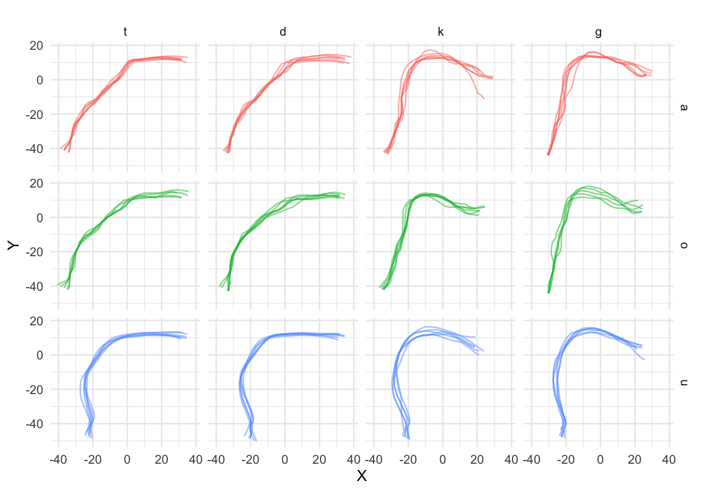
<p class="caption">(\#fig:Figure03)Estimated tongue contours of IT01 depending on C2 place, vowel and C2 voicing.</p>
</div>
These figures illustrate that using Cartesian coordinates for modelling tongue contours can introduce smoothing artefacts which can in turn negatively affect the model output.
When tongue contours are expressed with polar coordinates, on the other hand, the variance is reduced and the fitted contours generally reflect more closely the underlying tongue shape.
Mielke has implemented a series of R [@r-core-team2018] functions for fitting polar SSANOVAs to tongue contours (<http://phon.chass.ncsu.edu/manual/tongue_ssanova.r>).
While model fitting is achieved using polar coordinates, plotting is done by reconverting the coordinates to a Cartesian system.
This same procedure is used in the polar GAM modelling presented here.

## Polar GAM(M)s

GAMs fitted to tongue contours in polar coordinates are introduced here.
A polar GAM is constructed as follows.
The outcome variable of the model are the radial coordinates, while a smooth term over the angular coordinates is the predictor which takes care of modelling the curved shape of the contour.
Other predictors, such as consonant or vowel type, speech rate, or random effects, can also be included.
The model returns fitted smooths in polar coordinates.
The predicted polar coordinates of the smooths can be derived from the model and converted into a Cartesian coordinate system (centred on the origin of the polar system) for plotting.
A simple example with data from one speaker will illustrate how to fit polar GAMs with the R package rticulate.
The following section gives information on the ultrasonic system used for data collection and on how the data has been processed, before moving onto model fitting itself.

<!-- The function `polar_gam()` accepts Cartesian coordinates, which are converted into polar using a user specified origin or the origin estimated from the data.
The polar origin is either known or estimated from the data, depending on the ultrasonic system used.
The GAM is fitted on the polar coordinates and the predicted values are converted back to Cartesian using the same origin for plotting. -->

### Data collection and processing {#s:data}

Synchronised audio and ultrasound tongue imaging data have been recorded from 11 speakers of Italian and 6 speakers of Polish while reading a series of controlled sentences (only 6 of the 11 Italian speakers are analysed here, see \@ref(s:comptrp)).
An Articulate Instruments Ltd™ set-up was used for this study.
The ultrasonic data was collected through a TELEMED Echo Blaster 128 unit with a TELEMED C3.5/20/128Z-3 ultrasonic transducer (20mm radius, 2-4 MHz).
A synchronisation unit (P-Stretch) was plugged into the Echo Blaster unit and used for automatic audio/ultrasound synchronisation.
A FocusRight Scarlett Solo pre-amplifier and a Movo LV4-O2 Lavalier microphone were used for audio recording.
The acquisition of the ultrasonic and audio signals was achieved with the software Articulate Assistant Advanced (AAA, v2.17.2) running on a Hawlett-Packard ProBook 6750b laptop with Microsoft Windows 7.
Stabilisation of the ultrasonic transducer was ensured by using the metallic headset produced by Articulate Instruments Ltd™ [-@articulate2008].

Before the reading task, the participant's occlusal plane was obtained using a bite plate [@scobbie2011].
The participants read nonce words embedded in the frame sentence *Dico \_\_ lentamente* 'I say \_\_ slowly' (Italian) and *Mówię \_\_ teraz* 'I say \_\_ now' (Polish).
The words follow the structure C\textsubscript{1}V́\textsubscript{1}C\textsubscript{2}V\textsubscript{2}, where C\textsubscript{1} = /p/, V\textsubscript{1} = /a, o, u/, C\textsubscript{2} = /t, d, k, g/, and V\textsubscript{2} = V\textsubscript{1}.
Each speaker repeated the stimuli six times.

Spline curves were fitted to the visible tongue contours using the AAA automatic tracking function.
Manual correction was applied in those cases that showed clear tracking errors.
The time of maximum tongue displacement within consonant closure was then calculated in AAA following the method in @strycharczuk2015.
A fan-like frame consisting of 42 equidistant radial lines was used as the coordinate system.
The origin of the 42 fan-lines coincides with the centre of the ultrasonic probe, such that each fan-line is parallel to the direction of the ultrasonic signal.
Tongue displacement was thus calculated as the displacement of the fitted splines along the fan-line vectors.
The time of maximum tongue displacement was the time of greater displacement along the fan-line vector with the greatest standard deviation.
The vector standard deviation search area was restricted to the portion of the contour corresponding to the tongue tip for coronal consonants, and to the portion corresponding to the tongue dorsum for velar consonants.

The Cartesian coordinates of the tongue contours were extracted from the ultrasonic data at the time of maximum tongue displacement (always within C2 closure).
The contours were subsequently normalised within speaker by applying offsetting and rotation relative to the participant’s occlusal plane [@scobbie2011].
Each participants' dataset is thus constituted by *x* and *y* coordinates of the tongue contours that define respectively the horizontal and vertical axes.
The horizontal plane is parallel to the speaker's occlusal plane.

### Fitting a polar GAM

GAMs can be fitted in R with the `gam()` function from package mgcv [@wood2011; @wood2017].
`bam()` is a more efficient function when the dataset has several hundreds observations.
The package rticulate has been developed as a wrapper of the `bam()` function to be used with tongue contours.
The special function `polar_gam()` can fit a variety of GAM models to tongue contours coordinates, using the same syntax of mgcv.
The function accepts tongue contours either in Cartesian or polar coordinates.
In the first case, the coordinates can be transformed into polar before fitting.
If the data is in the AAA fan-like coordinate system, the origin is automatically estimated with the method in @heyne2015a.
If the data is not exported from AAA, the user can specify the known coordinates of the probe origin.
The function `plot_polar_smooths()`, used for plotting the estimated contours, converts the coordinates back into Cartesian using the same origin as with GAM fitting.

A GAM in R can be specified with a formula that uses the same syntax of lme4, a commonly used package for linear mixed-effects models [@bates2015].
The mgcv package allows to specify smoothing spline terms with the function `s()`.
This function takes the term along which a spline is created (for example, time in a time series, or *x*-coordinates in a Cartesian system).
Among the arguments of `s()`, the user can select the type of spline (the `bs` argument) and the grouping factor used for comparison (the `by` argument).
For a more in-depth introduction to GAMs in R for linguistics, see @soskuthy2017 and @wieling2017.

As means of illustration, the following paragraphs will show how to fit a polar GAM with data from one of the Italian speakers.
<!-- show the problem -->
Due to differences in the placement of the probe and in the speakers' anatomy, different portions of the tongue are likely to be imaged across speakers, so that scaling might not be possible (or wise).
For this reason, it is recommended to fit separate models for each participant, rather than aggregate all of the data in a single model.

We can start from a simple model in which we test the effect of C2 place, vowel, and voicing on tongue contours.
`vc_voicing` is an ordered factor that specifies the combination of C2 place, vowel, and voicing.
Modelling different contours for each combination of the three predictors can be achieved by using `vc_voicing` with the `by` argument of the difference smooth, and by including `vc_voicing` as a parametric term.
The following code fits the specified model to the contour data of IT01.
When running the code, the coordinates of the estimated origin used for the conversion to polar coordinates are returned.
The model is fitted by Maximum Likelihood (ML) here to allow model comparison below.


```
## The origin is x = 14.3901068810439, y = -65.2314851170583.
```


```r
it01_gam <- polar_gam(
  Y ~
    vc_voicing +            # parametric term
    s(X) +                  # reference smooth
    s(X, by = vc_voicing),  # difference smooth
  data = tongue_it01,
  method = "ML"
)
```

The function `plot_polar_smooths()` can be used to plot the estimated contours.
The shaded areas around the estimated contours are 95\% confidence intervals.
Note that, differently from SSANOVA, statistical significance can't be assessed from the overlapping (or lack thereof) of the confidence intervals.
The output of `plot_polar_smooths()` is shown in \@ref(fig:Figure04).
For more details on fitting and plotting more complex models (for example models with multiple predictors or tensor product smooths), see the package vignette `polar-gams` (accessible with `vignette("polar-gams", package = "rticulate")`).


```r
plot_polar_smooths(
  it01_gam,
  X,
  voicing,
  facet_terms = c2_place + vowel,
  # the following splits the factor interaction into the individual terms,
  # so that they can be called in the plotting arguments
  split = list(vc_voicing = c("vowel", "c2_place", "voicing"))
) +
  coord_fixed() +
  theme(legend.position = "top")
```


<div class="figure" style="text-align: center">

<p class="caption">(\#fig:Figure04)Estimated tongue contours of IT01 depending on C2 place, vowel and C2 voicing.</p>
</div>

One way to assess significance of model terms is to compare the ML score of the full model against one without the relevant predictor, using the function `compareML()` from the itsadug package [@van-rij2017].
Both the parametric term and the difference smooth need to be removed in the null model.


```
## The origin is x = 14.3901068810439, y = -65.2314851170583.
```


```r
it01_gam_0 <- polar_gam(
  Y ~
    # vc_voicing +            # remove parametric term
    s(X),                     # keep reference smooth
    # s(X, by = vc_voicing),  # remove difference smooth
  data = tongue_it01,
  method = "ML"
)
```


```r
compareML(it01_gam_0, it01_gam)
```

```
## it01_gam_0: Y ~ s(X)
## 
## it01_gam: Y ~ vc_voicing + s(X) + s(X, by = vc_voicing)
## 
## Chi-square test of ML scores
## -----
##        Model    Score Edf Difference     Df  p.value Sig.
## 1 it01_gam_0 7085.633   3                                
## 2   it01_gam 4417.563  36   2668.070 33.000  < 2e-16  ***
## 
## AIC difference: 5602.30, model it01_gam has lower AIC.
```

To check which part of the contour differs among conditions, the method recommended in @soskuthy2017] is to plot the difference smooth and check the confidence interval.
The parts of the confidence interval that don't include 0 indicate that the difference between contours in that part is significant.
Figures \@ref(fig:Figure05-1) and \@ref(fig:Figure05-2) illustrate the use of difference smooths with the difference smooths of voiceless vs voiced coronal stops when the vocalic context is /a/ or /u/.
As per usual, the tongue tip is on the right-end side of each plot.
The difference smooths indicate that there is a significant difference along the posterior part of the tongue (the root and dorsum).
Based on the predicted smooths sown in \@ref(fig:Figure04), we can argue that, in the context of coronal consonants, the root is more advanced in voiced relative to voiceless stops (when the vowel is either /a/ or /u/), and that the dorsum is also somewhat retracted in voiced stops if the vowel is /u/.

<div class="figure" style="text-align: center">
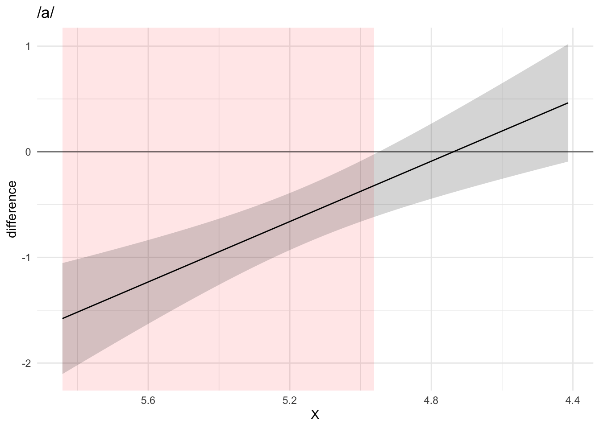
<p class="caption">(\#fig:Figure05-1)Difference smooth of voiceless vs voiced stops in the context of /a/ (top) and /u/ (bottom).</p>
</div><div class="figure" style="text-align: center">
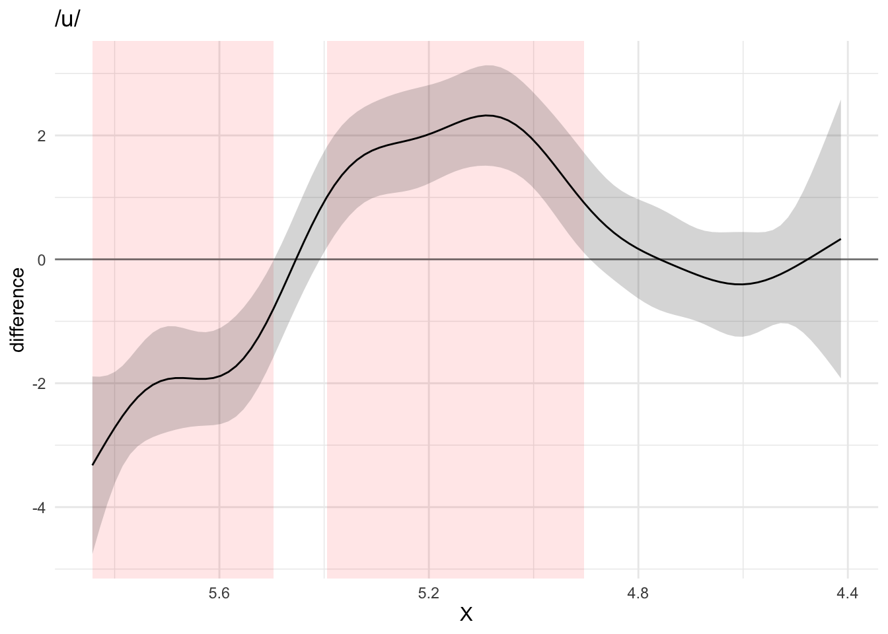
<p class="caption">(\#fig:Figure05-2)Difference smooth of voiceless vs voiced stops in the context of /a/ (top) and /u/ (bottom).</p>
</div>

As mentioned in the introduction, autocorrelation in the data can produce unwanted patterns in the residuals, which in turn can affect the estimated smooths (and falsely increase certainty about them).
A first-order autoregressive (AR1) model can be included to reduce autocorrelation at lag 1.
\@ref(fig:Figure06-1) and \@ref(fig:Figure06-2) show the autocorrelations in the residuals without (top) and with (bottom) an AR1 model.
The GAM model with the AR1 correction has lower autocorrelation values.
In this case, it is thus advisable to perform ML comparison and smooths plotting with models in which an AR1 model has been included.
For a more in-depth treatment of issues related to autocorrelation, see @soskuthy2017.


<div class="figure" style="text-align: center">
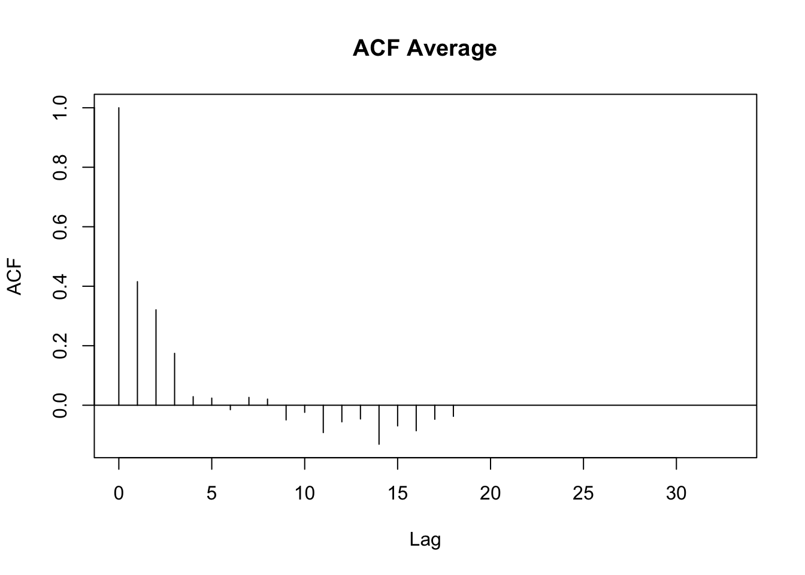
<p class="caption">(\#fig:Figure06-1)Autocorrelation plots of a model fitted without (top) and with (bottom) a first-order autoregressive model (AR1).</p>
</div><div class="figure" style="text-align: center">
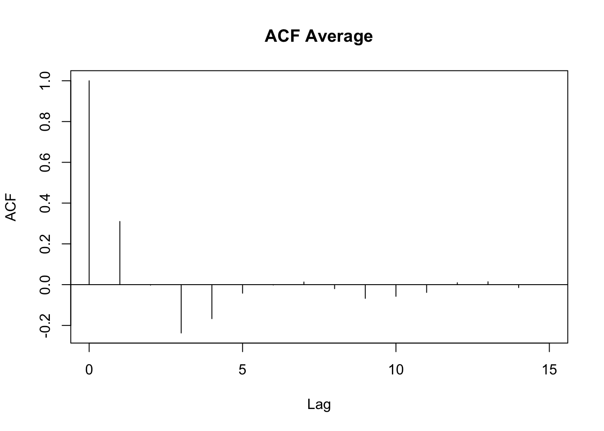
<p class="caption">(\#fig:Figure06-2)Autocorrelation plots of a model fitted without (top) and with (bottom) a first-order autoregressive model (AR1).</p>
</div>

## Comparing tongue root position in voiceless and voiced stops {#s:comptrp}

Tongue root advancement is a well-known mechanism employed to keep intra-oral pressure below the threshold required for voicing [@ohala2011; @kent1969; @perkell1969; @westbury1983; @ahn2018].
Among the languages reported to show tongue root position differences between phonation categories in stops there are English [@westbury1983; @ahn2018], Brazilian Portuguese [@ahn2018], and Hindi [@ahn2016a].
Tongue root advancement is one of several mechanisms employed by speakers to enlarge the oral cavity during the production of a stop closure.
The decrease in pressure that follows from such expansion ensures that voicing can be maintained during the closure.

Mid-sagittal tongue contours at maximum tongue displacement of voiceless and voiced stops have been compared using polar GAMs.
To exemplify how polar GAMs can be used to model articulatory differences within and between speakers, data from 6 speakers of Italian and 6 speakers of Polish will be discussed.
Note that the 6 Italian speakers are representative of the general trends found in the entire sample of 11 speakers.
\@ref(fig:Figure07) to \@ref(fig:Figure18) show an appreciable degree of variation across speakers and phonological contexts in relation to the differences in tongue shapes between voiceless and voiced stops (IT07 and Pl05 both miss data from /u/ due to the poor quality of the ultrasonic image for this vowel).
In some speakers and contexts, the tongue root (the left part of the tongue contours) is more advanced in voiced stops than in voiceless stops.

In particular, IT01, IT02, PL05, and PL06 show a robust pattern in which the tongue root in voiced stops is more advanced than in voiceless stops in most vowel/place contexts.
The other speakers, however, either don't have any tongue root advancement (like Pl03), or they have advancement in only some of the phonological contexts (like PL07).
Moreover, IT11 has the opposite pattern, especially with velar stops, such that voiced stops have a retracted tongue root compared to voiceless stops.
IT04 is a clear example of tongue body lowering (another cavity expansion mechanism), as it can be seen in coronal stops.
This level of idiosyncrasy (both within and between speakers) is not surprising, and it qualitatively resembles the degree of variability found, for example, in @ahn2018 for English and Brasilian Portuguese.
Finally, no clear patterns can be discerned between speakers of Italian and Polish that could point to cross-linguistic differences.

As for the magnitude of the difference in tongue root position, such difference is about 2 mm in the data reported here.
@kirkham2017 find that the tongue root in +ATR vowels is on average 4 mm more advanced than the respective −ATR vowels.
@rothenberg1967 argues, based on modelling, that the tongue root can move forward by a maximum of about 5 mm mid-sagittally.
This movement corresponds to an average volume increase of 18 cm\textsuperscript{2}.
Given these estimates, it can be argued that a 2 mm change in root position along the mid-sagittal plane contributes to an appreciable oral cavity volume increase.
Considering that other volume expansion mechanisms can operate along with the advancement of the tongue root (like larynx lowering, tongue body lowering, etc.), the tongue root driven volume increase found here, although at first sight small, seems to be sufficient to allow for voicing to be maintained during the closure of voiced stops.


## Conclusions

Generalised additive (mixed) models (GAMs) can be efficiently used to statistically assess differences in tongue contour shapes as obtained from ultrasound tongue imaging.
This paper showed how GAMs can be fitted to tongue contours in polar coordinates in R with the specialised package rticulate.
An example of how GAMs can help modelling differences in tongue contours has been illustrated with data from 12 speakers of Italian and Polish in which the mid-sagittal tongue contours of voiceless and voiced stops where compared.
The advantages of polar GAMs over the current implementation of polar tongue SSANOVA include: the ability to specify multiple predictors and random effects; control over the autocorrelation in the residuals which could otherwise make the model overconfident; separate methods for assessing statistical significance at the level of the predictor (with model comparison) and for identifying which part of the tongue differs significantly (by visualising the difference smooths).
The same general issues noted in @davidson2006 for SSANOVA apply to polar GAMs.
In particular, while within-speaker normalisation can be achieved by rotation and offsetting of the data relative to a bite plate (as done here), across-speaker normalisation represents a bigger challenge.
Since we can't deduced with sufficient certainty from the ultrasonic image which part of the tongue is being actually imaged, it is not possible to define fixed anatomical landmarks across speakers that can be used in normalisation.
For this reason it has been recommended here to fit separate models for each speaker.
Future work will explore ways of allowing the user to use data aggregated from multiple speakers while accounting for the uncertainty in which parts of the tongue are imaged.
Finally, polar GAMs can also be readily extended to model 3D tongue surfaces and whole tongue contours differences over time (in other words, how the sectional shape of the tongue changes over time).

## Data Accessibility Statement

The data and code used in this paper can be viewed and downloaded at the Open Science Framework <https://osf.io/j79uw/>.

<div class="figure" style="text-align: center">
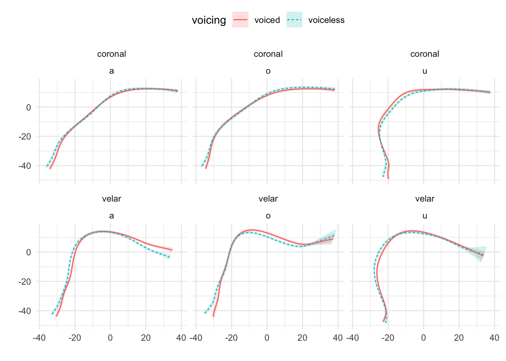
<p class="caption">(\#fig:Figure07)Tongue contours of voiceless and voiced stops in IT01.</p>
</div>

<div class="figure" style="text-align: center">
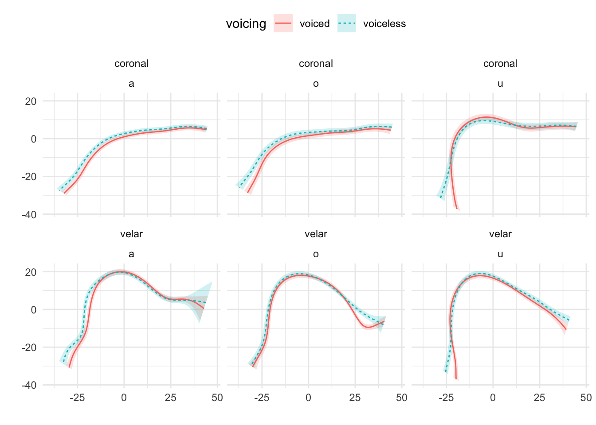
<p class="caption">(\#fig:Figure08)Tongue contours of voiceless and voiced stops in IT02.</p>
</div>

<div class="figure" style="text-align: center">
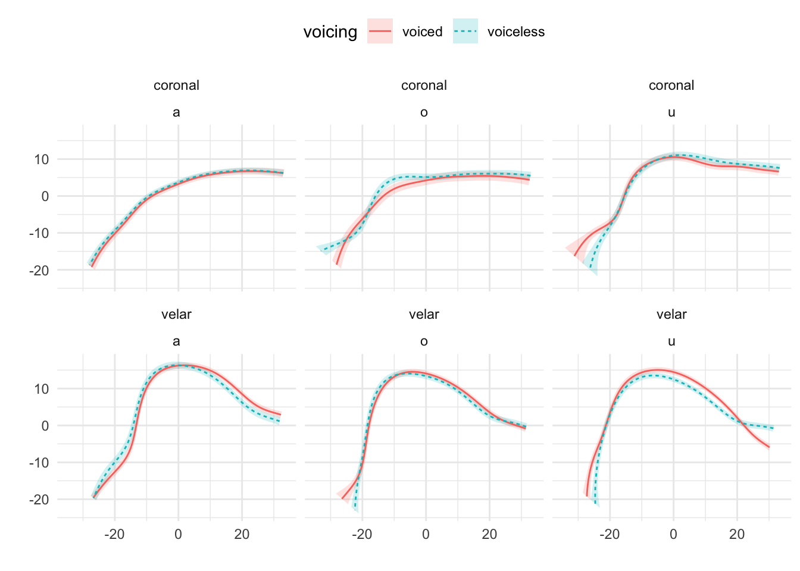
<p class="caption">(\#fig:Figure09)Tongue contours of voiceless and voiced stops in IT03.</p>
</div>

<div class="figure" style="text-align: center">

<p class="caption">(\#fig:Figure10)Tongue contours of voiceless and voiced stops in IT04.</p>
</div>

<div class="figure" style="text-align: center">

<p class="caption">(\#fig:Figure11)Tongue contours of voiceless and voiced stops in IT07.</p>
</div>

<div class="figure" style="text-align: center">
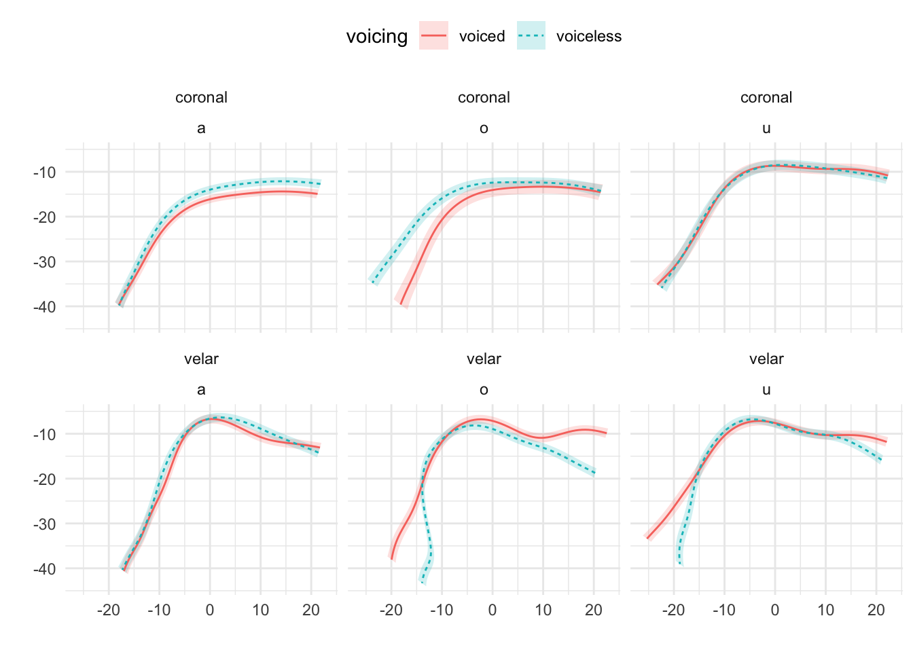
<p class="caption">(\#fig:Figure12)Tongue contours of voiceless and voiced stops in IT11.</p>
</div>

<div class="figure" style="text-align: center">
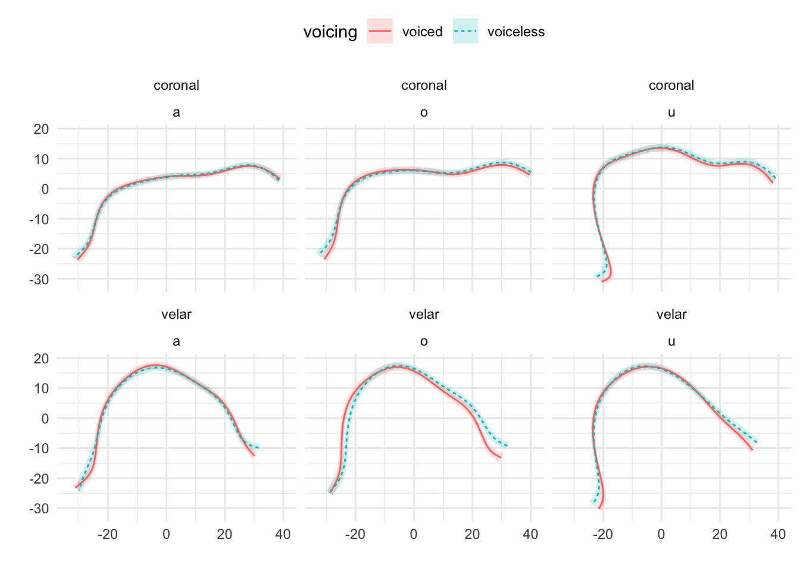
<p class="caption">(\#fig:Figure13)Tongue contours of voiceless and voiced stops in PL02.</p>
</div>

<div class="figure" style="text-align: center">
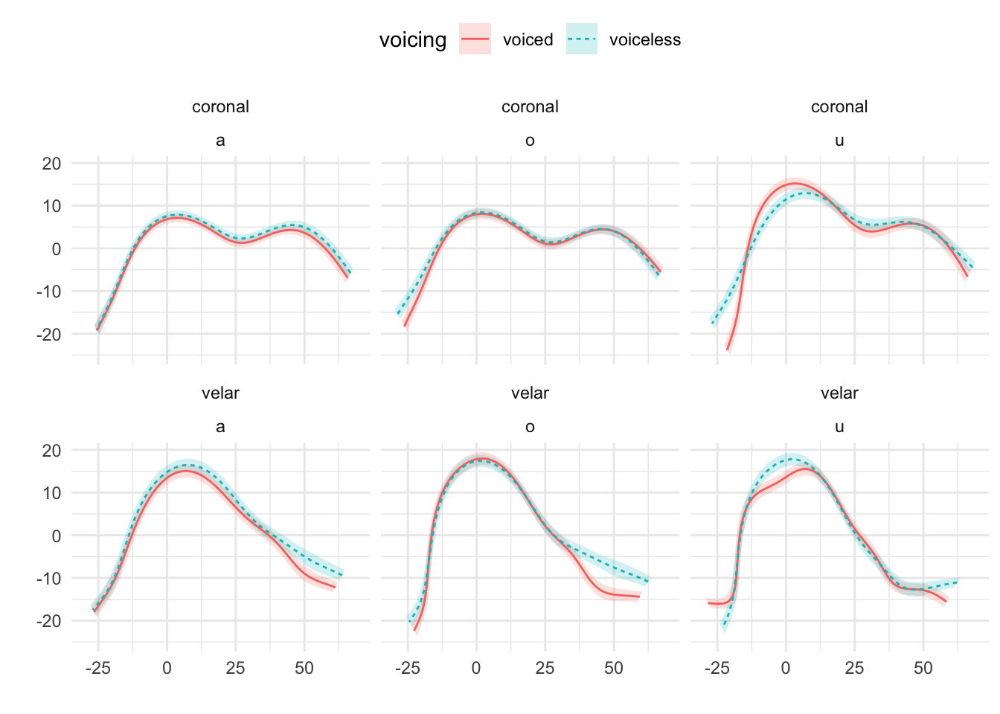
<p class="caption">(\#fig:Figure14)Tongue contours of voiceless and voiced stops in PL03.</p>
</div>

<div class="figure" style="text-align: center">
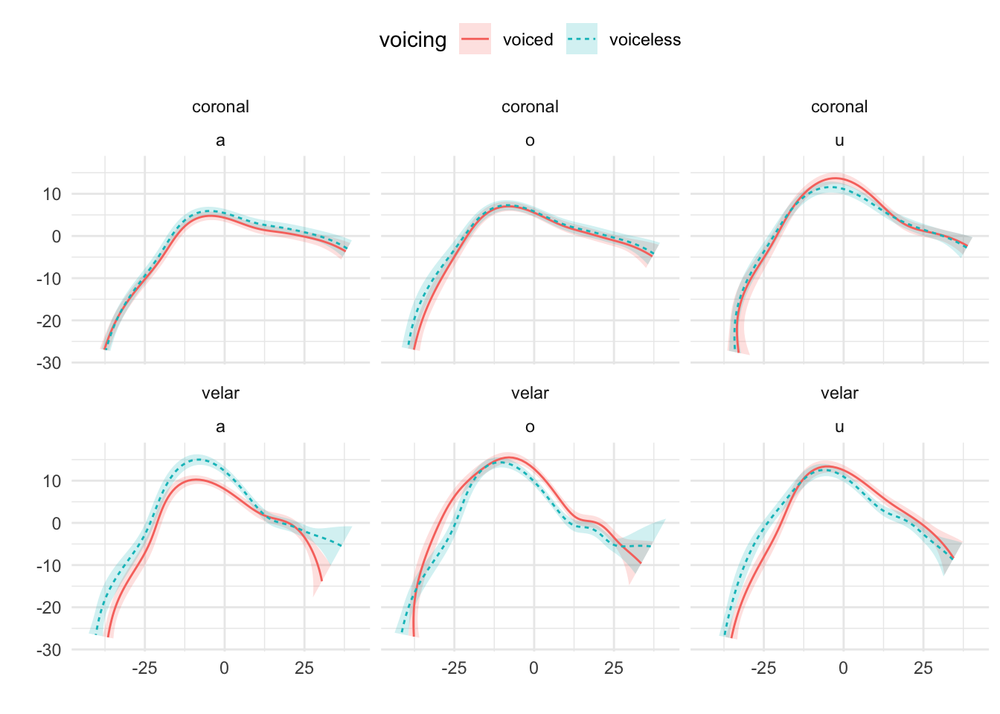
<p class="caption">(\#fig:Figure15)Tongue contours of voiceless and voiced stops in PL04.</p>
</div>

<div class="figure" style="text-align: center">

<p class="caption">(\#fig:Figure16)Tongue contours of voiceless and voiced stops in PL05.</p>
</div>

<div class="figure" style="text-align: center">

<p class="caption">(\#fig:Figure17)Tongue contours of voiceless and voiced stops in PL06.</p>
</div>

<div class="figure" style="text-align: center">
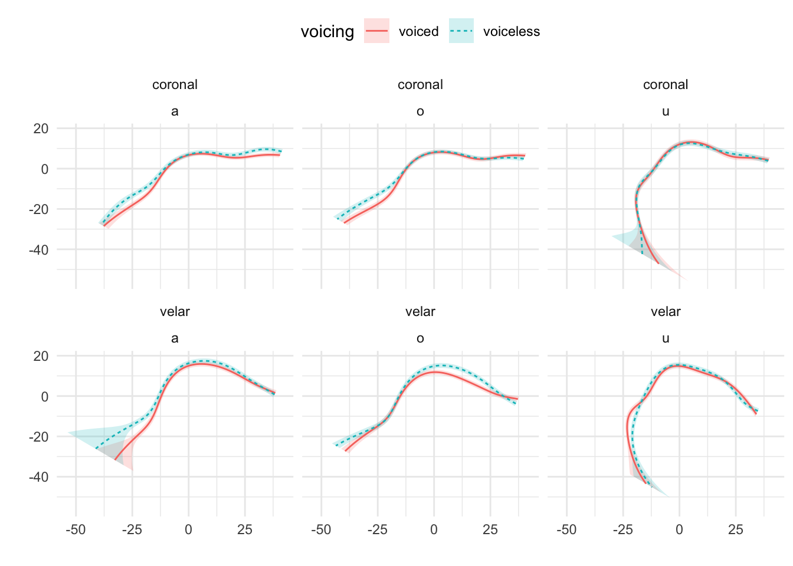
<p class="caption">(\#fig:Figure18)Tongue contours of voiceless and voiced stops in PL07.</p>
</div>
