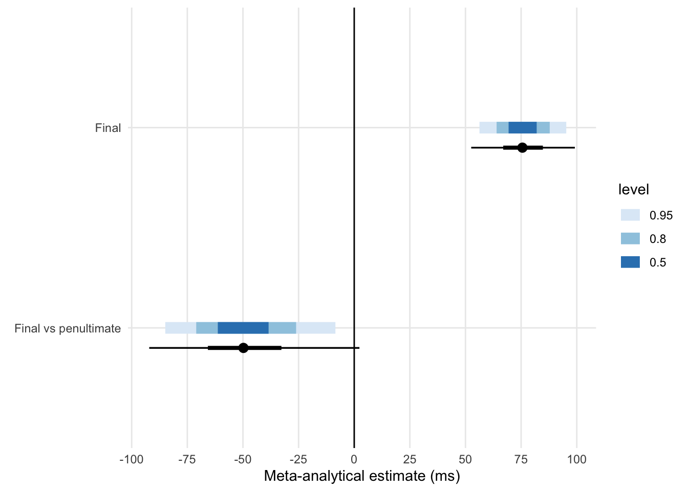
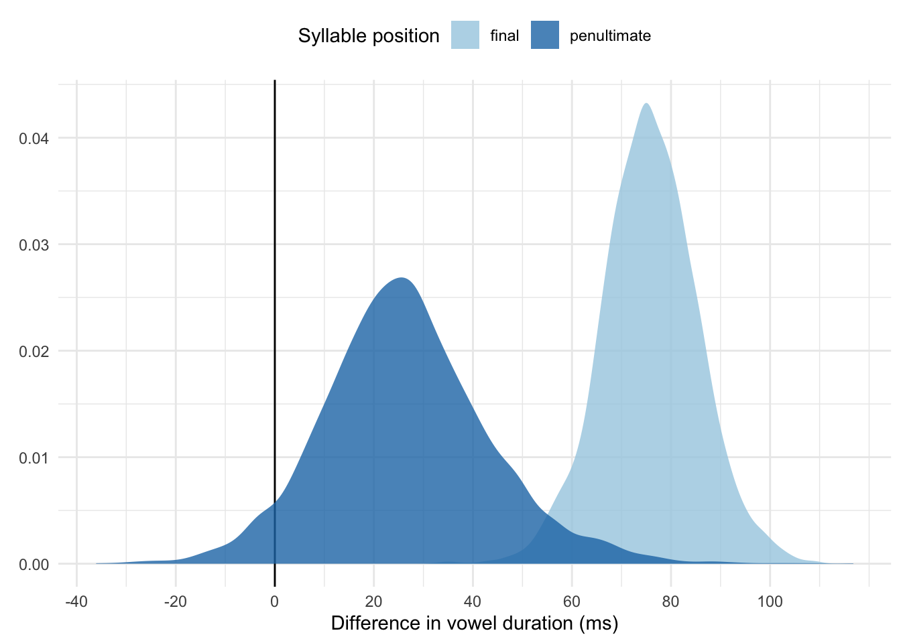
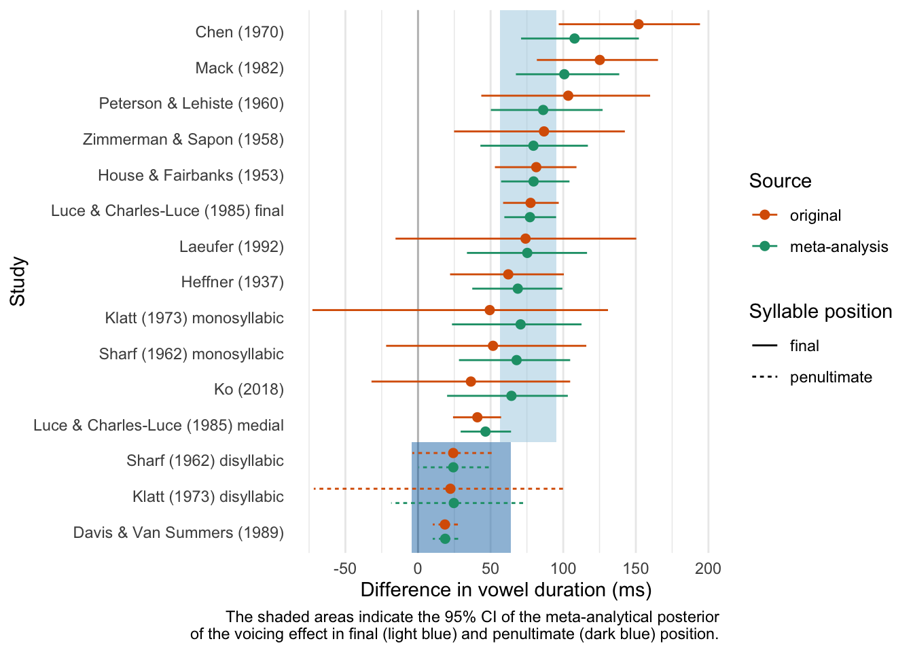
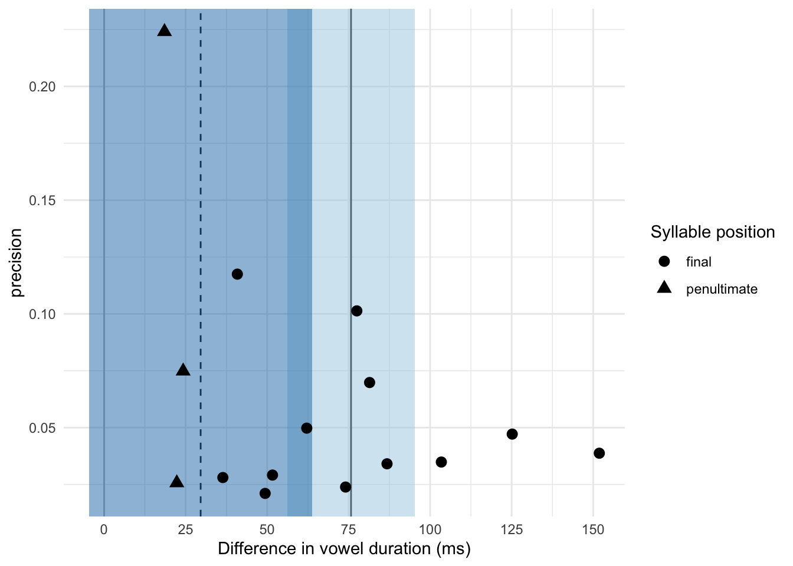

# Bayesian meta-analysis of the voicing effect in English {#a:ve-eng}


A Bayesian meta-analysis of the English voicing effect was run on the basis of 11 estimated posterior distributions extracted from 9 different publications, following the procedures discussed in @nicenboim2018a.
The studies were selected by scraping the first 100 results on Google Scholar with the keywords "vowel duration voicing English."
Other studies which were known to the author but not present among the Google Scholar results were also included. Since two publications [@sharf1962; and @klatt1973] tested both monosyllabic and disyllabic words, two separate posterior distributions were estimated for each word type.
This leads to a total of 11 posterior distribution of the effect of consonant voicing on vowel duration in English (7 estimated posteriors from 7 publications plus 2 each from 2 publications).

<!-- give more details about the contexts of the studies -->

The posterior distributions of each study have been obtained by fitting a Bayesian linear model to the summary data (the means of vowel duration before voiceless and voiced stops) provided by the respective publications.
These models had the mean vowel durations as outcome and consonant voicing (voiceless vs voiced) as the only predictor.
Three studies, @luce1985, @davis1989, and @ko2018, reported measures of dispersion along with the means.
Measurement error models were used to obtain the posterior distributions from these studies.
The measurement error term in such models allows us to include information of the dispersion of the mean vowel durations, and hence of the uncertainty that comes with them.
All the models for estimating the posterior of the individual studies were fitted with the following priors: a normal distribution with mean = 0 ms and SD = 300 for the intercept, and a normal distribution with mean = 0 ms and SD = 100 for the effect of consonant voicing.
The simple models (without an error term) also included a prior for the residual variance as a half Cauchy distribution with location = 0 ms and scale = 25.

A data set with the mean estimates and estimated standard errors from these 11 posterior distributions (Table \@ref(tab:est)) has then been used to fit a further Bayesian measurement error model.
In this model, the mean estimates with the estimated standard errors were included as the outcome, while a by-study random intercept was the only predictor.
The models were fitted in R with brms using Markov Chain Monte Carlo simulations, with 4 chains, 2000 iterations of which 1000 for warm-up.


<table class="table" style="font-size: 8px; margin-left: auto; margin-right: auto;">
<caption style="font-size: initial !important;">(\#tab:est)Bayesian estimates of the voicing effect in indvidual studies.</caption>
 <thead>
  <tr>
   <th style="text-align:left;"> Study </th>
   <th style="text-align:right;"> Estimate </th>
   <th style="text-align:right;"> Est.Error </th>
   <th style="text-align:right;"> Q2.5 </th>
   <th style="text-align:right;"> Q97.5 </th>
   <th style="text-align:left;"> Syllable position </th>
   <th style="text-align:right;"> N. speakers </th>
  </tr>
 </thead>
<tbody>
  <tr>
   <td style="text-align:left;"> Heffner (1937) </td>
   <td style="text-align:right;"> 62.15 </td>
   <td style="text-align:right;"> 20.09 </td>
   <td style="text-align:right;"> 22.08 </td>
   <td style="text-align:right;"> 100.42 </td>
   <td style="text-align:left;"> final </td>
   <td style="text-align:right;"> 1 </td>
  </tr>
  <tr>
   <td style="text-align:left;"> House &amp; Fairbanks (1953) </td>
   <td style="text-align:right;"> 81.43 </td>
   <td style="text-align:right;"> 14.32 </td>
   <td style="text-align:right;"> 52.96 </td>
   <td style="text-align:right;"> 109.12 </td>
   <td style="text-align:left;"> final </td>
   <td style="text-align:right;"> 10 </td>
  </tr>
  <tr>
   <td style="text-align:left;"> Zimmerman &amp; Sapon (1958) </td>
   <td style="text-align:right;"> 86.77 </td>
   <td style="text-align:right;"> 29.34 </td>
   <td style="text-align:right;"> 24.84 </td>
   <td style="text-align:right;"> 142.44 </td>
   <td style="text-align:left;"> final </td>
   <td style="text-align:right;"> 2 </td>
  </tr>
  <tr>
   <td style="text-align:left;"> Peterson &amp; Lehiste (1960) </td>
   <td style="text-align:right;"> 103.43 </td>
   <td style="text-align:right;"> 28.68 </td>
   <td style="text-align:right;"> 43.58 </td>
   <td style="text-align:right;"> 159.85 </td>
   <td style="text-align:left;"> final </td>
   <td style="text-align:right;"> 5 </td>
  </tr>
  <tr>
   <td style="text-align:left;"> Sharf (1962) </td>
   <td style="text-align:right;"> 24.25 </td>
   <td style="text-align:right;"> 13.36 </td>
   <td style="text-align:right;"> -3.89 </td>
   <td style="text-align:right;"> 50.70 </td>
   <td style="text-align:left;"> non-final </td>
   <td style="text-align:right;"> 1 </td>
  </tr>
  <tr>
   <td style="text-align:left;"> Sharf (1962) </td>
   <td style="text-align:right;"> 51.65 </td>
   <td style="text-align:right;"> 34.32 </td>
   <td style="text-align:right;"> -21.95 </td>
   <td style="text-align:right;"> 115.89 </td>
   <td style="text-align:left;"> final </td>
   <td style="text-align:right;"> 1 </td>
  </tr>
  <tr>
   <td style="text-align:left;"> Chen (1970) </td>
   <td style="text-align:right;"> 151.89 </td>
   <td style="text-align:right;"> 25.81 </td>
   <td style="text-align:right;"> 96.90 </td>
   <td style="text-align:right;"> 194.18 </td>
   <td style="text-align:left;"> final </td>
   <td style="text-align:right;"> 1 </td>
  </tr>
  <tr>
   <td style="text-align:left;"> Klatt (1973) </td>
   <td style="text-align:right;"> 22.30 </td>
   <td style="text-align:right;"> 38.91 </td>
   <td style="text-align:right;"> -71.78 </td>
   <td style="text-align:right;"> 99.85 </td>
   <td style="text-align:left;"> non-final </td>
   <td style="text-align:right;"> 3 </td>
  </tr>
  <tr>
   <td style="text-align:left;"> Klatt (1973) </td>
   <td style="text-align:right;"> 49.39 </td>
   <td style="text-align:right;"> 47.45 </td>
   <td style="text-align:right;"> -72.70 </td>
   <td style="text-align:right;"> 130.84 </td>
   <td style="text-align:left;"> final </td>
   <td style="text-align:right;"> 3 </td>
  </tr>
  <tr>
   <td style="text-align:left;"> Mack (1982) </td>
   <td style="text-align:right;"> 125.18 </td>
   <td style="text-align:right;"> 21.21 </td>
   <td style="text-align:right;"> 81.84 </td>
   <td style="text-align:right;"> 165.28 </td>
   <td style="text-align:left;"> final </td>
   <td style="text-align:right;"> 3 </td>
  </tr>
  <tr>
   <td style="text-align:left;"> Luce &amp; Charles-Luce (1985) final </td>
   <td style="text-align:right;"> 77.51 </td>
   <td style="text-align:right;"> 9.87 </td>
   <td style="text-align:right;"> 58.61 </td>
   <td style="text-align:right;"> 96.92 </td>
   <td style="text-align:left;"> final </td>
   <td style="text-align:right;"> 3 </td>
  </tr>
  <tr>
   <td style="text-align:left;"> Luce &amp; Charles-Luce (1985) medial </td>
   <td style="text-align:right;"> 40.87 </td>
   <td style="text-align:right;"> 8.51 </td>
   <td style="text-align:right;"> 24.12 </td>
   <td style="text-align:right;"> 57.24 </td>
   <td style="text-align:left;"> final </td>
   <td style="text-align:right;"> 3 </td>
  </tr>
  <tr>
   <td style="text-align:left;"> Davis &amp; Van Summers (1989) </td>
   <td style="text-align:right;"> 18.52 </td>
   <td style="text-align:right;"> 4.46 </td>
   <td style="text-align:right;"> 10.16 </td>
   <td style="text-align:right;"> 27.46 </td>
   <td style="text-align:left;"> non-final </td>
   <td style="text-align:right;"> 3 </td>
  </tr>
  <tr>
   <td style="text-align:left;"> Laeufer (1992) </td>
   <td style="text-align:right;"> 74.07 </td>
   <td style="text-align:right;"> 41.90 </td>
   <td style="text-align:right;"> -15.48 </td>
   <td style="text-align:right;"> 150.30 </td>
   <td style="text-align:left;"> final </td>
   <td style="text-align:right;"> 5 </td>
  </tr>
  <tr>
   <td style="text-align:left;"> Ko (2018) </td>
   <td style="text-align:right;"> 36.43 </td>
   <td style="text-align:right;"> 35.66 </td>
   <td style="text-align:right;"> -32.02 </td>
   <td style="text-align:right;"> 104.79 </td>
   <td style="text-align:left;"> final </td>
   <td style="text-align:right;"> 7 </td>
  </tr>
</tbody>
</table>


The following is the summary of the meta-analytical model (as output by `summary()` function).
The population-level effects are the ones of interest.
Figure \@ref(fig:intervals-plot) is a visual aid to the summary, and shows a variety of credible intervals of the estimates from the model.
The blue-coloured bars represent (from darker to lighter blue) the 50%, 80%, and 95% credible intervals (CIs).
The black lines are the 66% (thick) and 98% (thin) CIs.

\footnotesize


```
## Group-Level Effects: 
## ~study (Number of levels: 15) 
##               Estimate Est.Error l-95% CI u-95% CI Rhat Bulk_ESS Tail_ESS
## sd(Intercept)    23.08      8.66     9.54    43.08 1.00     1465     2085
## 
## Population-Level Effects: 
##                  Estimate Est.Error l-95% CI u-95% CI Rhat Bulk_ESS Tail_ESS
## Intercept           75.74      9.68    56.28    95.28 1.00     2088     2258
## syl_posnonMfinal   -49.22     18.67   -84.90    -8.45 1.00     1860     1682
```

 \normalsize


```
## Warning: 'stat_intervalh' is deprecated.
## Use 'stat_interval' instead.
## See help("Deprecated") and help("tidybayes-deprecated").
```

```
## Warning: 'stat_pointintervalh' is deprecated.
## Use 'stat_pointinterval' instead.
## See help("Deprecated") and help("tidybayes-deprecated").
```

<div class="figure" style="text-align: center">

<p class="caption">(\#fig:intervals-plot)Credible intervals of the meta-analytical posterior distributions.</p>
</div>

The 95% credible interval (CI) of the model intercept (which corresponds to the estimated voicing effect in word-final syllables) is between 56.39 and 96.43 ms.
This means that there is a 95% probability that the true effect lies between about 56 and 96 ms.
The mean of the posterior distribution is 75.83 ms (SD = 10.01).
Given the 95% CI of the meta-analytical posterior distribution, it can be inferred that the true effect of voicing in word-final syllables in English is positive and between 50 and 100 ms.
However, note that the meta-analytical estimate might suffer from publication bias (cf. below).

The posterior mean of the coefficient when the target syllable is in penultimate position is -49.14 ms (SD = 19.10, 95% CI = [-85.69, -8.98]).
Note that the estimated error is double compared to that of the intercept, which means the there is greater uncertainty in this than the other estimate.
We can argue that, on average, the mean voicing effect in penultimate syllables is about 50 ms smaller than the mean effect in monosyllabic words in the surveyed studies.
The mean of the voicing effect in disyllabic words can thus be estimated to be around 25 ms (75 - 50 ms).

A visual representation of the meta-analytical distributions is given in Figure \@ref(fig:syl-plot).
The plot shows the full posterior distributions of the voicing effect in the word-final and penultimate contexts.
Note how the posterior distribution in penultimate position is wider than the other.


<div class="figure" style="text-align: center">

<p class="caption">(\#fig:syl-plot)Meta-analytical posterior distributions of the voicing effect in syllable-final and penultimate position.</p>
</div>

Figure \@ref(fig:origin-shrunk-plot) shows the mean estimates (the points) of the voicing effect with 95% CIs (the horizontal segments) for each of the 11 studies.
For each study, the plot gives both the original estimate (as obtained from the raw data summary of the study) and the estimate shrunk by the random effects in the meta-analytical model.
The vertical lines indicate the meta-analytical 95% CI of the voicing effect in final (solid) and penultimate syllable position (dashed).
Original estimates further away from the meta-analytical mean effect and those with greater uncertainty (wider errors) show greater shrinkage to the mean.


<div class="figure" style="text-align: center">

<p class="caption">(\#fig:origin-shrunk-plot)Estimated voicing effect from the original source and from the meta-analysis.</p>
</div>

Figure \@ref(fig:funnel-plot) is a funnel plot, which can be used to visually check whether the sample suffers from publication bias.
In this plot, the x-axis corresponds to the original estimated difference in vowel duration, while the y-axis is a measure of precision (calculated as 1 divided by the estimated error of the difference).
The meta-analytical means are indicated by the thick and dashed vertical lines for syllable-final and penultimate position respectively.
The shaded areas indicate the 95% CI of the meta-analytical posterior of the voicing effect in final (light blue) and penultimate (dark blue) position.
When there is no bias, the points with lower precision should be more spread out and symmetrically placed around the meta-analytical mean, while points with higher precision should cluster around the mean.
This ideal situation is clearly not the case for the final syllable context.
There seems to be a bias towards bigger effects (which also happen to have lower precision).
This indicates that the estimate probably suffers from publication bias (i.e. bias towards publishing positive and significant results) and it is not representative of the true effect.
It is not possible to assess bias with the effect in penultimate syllable position given the low number of studies.

<div class="figure" style="text-align: center">

<p class="caption">(\#fig:funnel-plot)By-study funnel plot showing the estimate against the precision. The vertical thick and dashed lines are the meta-analytical means of the effect in final and penultimate position.</p>
</div>
