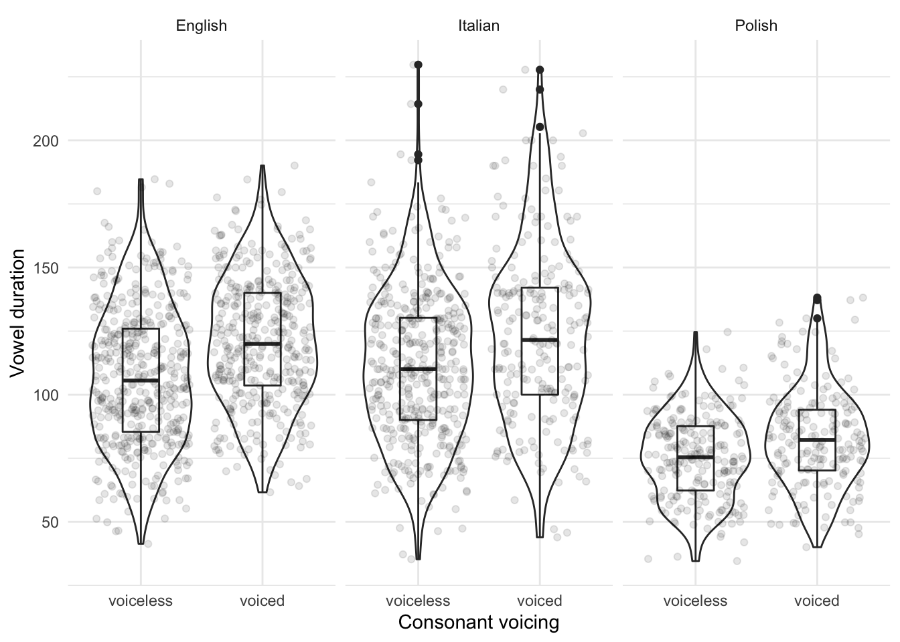
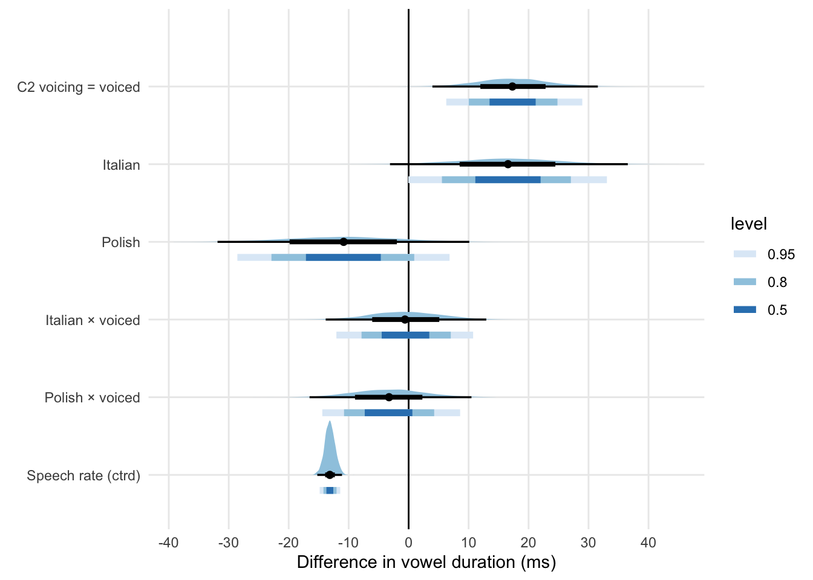
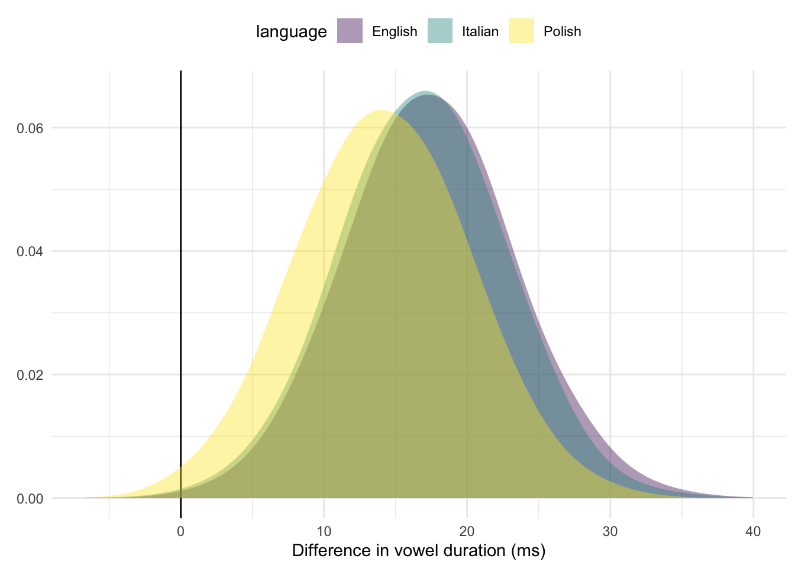

# Cross-linguistic comparison of the voicing effect in English, Italian, and Polish {#a:ve-comp}


A Bayesian analysis was run to statistically test differences in the voicing effect in disyllabic (CV́CV) words of English (Study II), Italian, and Polish (Study I).
Note that the experimental design differs between the two studies (see \@ref(s:methods)), so results should be interpreted with caution.
The following graph shows violin and box plots of the raw vowel duration data, by voicing of C2 and language.
English and Italian have similar vowel durations and a similar effect of voicing, while Polish has generally shorter vowels and a somewhat smaller effect.



A Bayesian mixed-effects regression was fitted to V1 duration with brms [@burkner2017; @burkner2018] in R [@r-core-team2019].
Language, C2 voicing, centred speech rate, and an interaction between language and voicing were included as predictors.
Random intercepts for speaker and word were used, together with by-speaker and by-word random coefficients for voicing.

The following priors were used: for the intercept of vowel duration, a normal distribution with mean 145 and SD 30, for the effect of language a normal distribution with mean 0 and SD 50, for the effect of voicing a normal distribution with mean 25 and SD 10, for the interaction between language and voicing a normal distribution with mean 0 and SD 10, and for centred speech rate a normal distribution with mean -25 and SD 10.


\footnotesize


```
## Group-Level Effects: 
## ~speaker (Number of levels: 32) 
##                              Estimate Est.Error l-95% CI u-95% CI Rhat Bulk_ESS
## sd(Intercept)                   14.95      2.07    11.49    19.53 1.00     1181
## sd(voicingvoiced)                5.27      1.05     3.49     7.59 1.00     1807
## cor(Intercept,voicingvoiced)     0.13      0.21    -0.28     0.54 1.00     2368
##                              Tail_ESS
## sd(Intercept)                    1968
## sd(voicingvoiced)                2547
## cor(Intercept,voicingvoiced)     2599
## 
## ~word (Number of levels: 39) 
##                              Estimate Est.Error l-95% CI u-95% CI Rhat Bulk_ESS
## sd(Intercept)                   14.82      2.24    11.07    19.92 1.00      925
## sd(voicingvoiced)                9.47      7.21     0.46    26.96 1.00      398
## cor(Intercept,voicingvoiced)    -0.06      0.42    -0.78     0.77 1.00      916
##                              Tail_ESS
## sd(Intercept)                    1721
## sd(voicingvoiced)                 822
## cor(Intercept,voicingvoiced)     1194
## 
## Population-Level Effects: 
##                               Estimate Est.Error l-95% CI u-95% CI Rhat
## Intercept                        96.87      6.46    84.68   109.72 1.01
## languageItalian                  16.54      8.38    -0.07    33.07 1.00
## languagePolish                  -10.91      9.19   -28.56     6.83 1.00
```

 \normalsize


```
## Warning: 'geom_halfeyeh' is deprecated.
## Use 'stat_halfeye' instead.
## See help("Deprecated") and help("tidybayes-deprecated").
```

```
## Warning: 'stat_intervalh' is deprecated.
## Use 'stat_interval' instead.
## See help("Deprecated") and help("tidybayes-deprecated").
```



The plot above shows the posterior distributions for the effects of language, voicing, centred speech rate, and language × voicing interaction.
The effect of voicing in English is between 7 and 28.5 ms at 95% probability.
There is weak evidence for longer vowels in Italian and shorter vowels in Polish compared to English, but the credible intervals of these effects are very wide.
Speech rate has a strong and robust negative effect on vowel duration: for each syllable per second unit increase, vowels get 11.5-15 ms shorter.
The posterior distributions for the interaction between language and voicing indicate that probably the effect of voicing in Italian is very similar to that of English, while there is some extremely weak indication for a slightly smaller effect in Polish.
Note, however, that the posterior distributions of the interactions are very wide (more than 20 ms).

In sum, the present data does not offer robust evidence neither for or against cross-linguistic differences in voicing effect.
If there is a difference, it will likely be within the range ±10 ms.


The following plot shows the posterior probability distributions of the effect of voicing marginalised over language.
The great overlap among the distributions is indicative of the high uncertainty regarding the presence vs absence of cross-linguistic differences.


