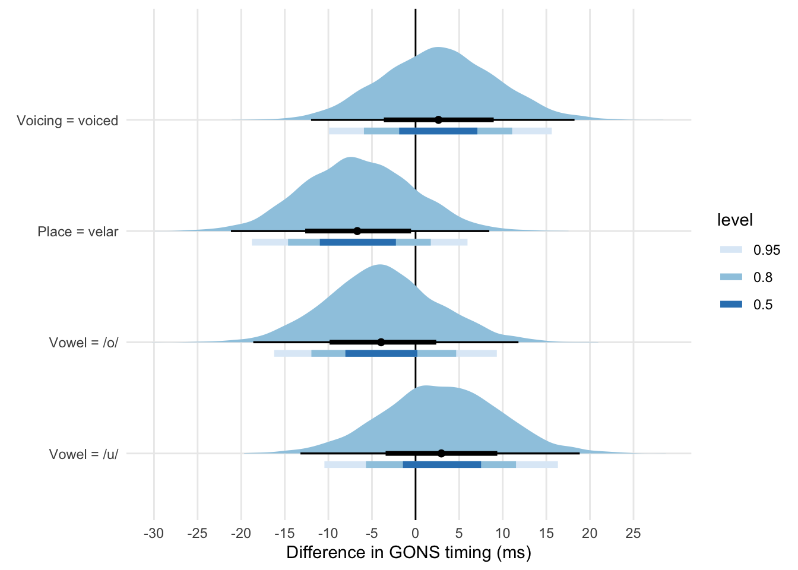

# Gesture onset timing of voiceless and voiced stops in Italian and Polish {#a:gons}


A consequence of the gestural organisation proposed to account for the stability of the release-to-release interval duration in disyllabic words is that the timing of the gestural onset should not be affected by the voicing status of the consonant in disyllabic words.
In other words, the interval between the release of the the consonant preceding the vowel and the onset of the closing gesture of the post-vocalic consonant should be the same whether the consonant is voiceless or voiced.
The difference in vowel duration (and closure duration) would be a consequence of the different velocity of the closing gesture in voiceless vs voiced stops, rather than of a difference in gestural onset.

The ultrasound tongue imaging data from Study I partially suggests that the temporal distance between C1 release and C2 gestural onset is not affected by C2 voicing.
A Bayesian regression was fit to the duration of the C1 release to C2 gesture onset (GONS) interval, with C2 voicing, vowel, C2 place of articulation, interactions between voicing and vowel and voicing and place, and centred speech rate as predictors.
By speaker and by-word random intercepts were also included.
A normal distribution with mean 0 ms and SD 200 was used as prior for the intercept, while a distribution with mean 0 and SD 10 was used for vowel, place and the interactions.
For speech rate, the prior was a normal distribution with mean 0 and SD 50.


\footnotesize


```
## Group-Level Effects: 
## ~item (Number of levels: 24) 
##               Estimate Est.Error l-95% CI u-95% CI Rhat Bulk_ESS Tail_ESS
## sd(Intercept)    13.98      3.43     8.15    21.60 1.00     1760     2442
## 
## ~speaker (Number of levels: 16) 
##               Estimate Est.Error l-95% CI u-95% CI Rhat Bulk_ESS Tail_ESS
## sd(Intercept)    54.55     10.88    37.92    80.60 1.00     1266     1848
## 
## Population-Level Effects: 
##                                  Estimate Est.Error l-95% CI u-95% CI Rhat
## Intercept                           86.31     15.59    55.83   116.78 1.01
## c2_phonationvoiced                   2.67      6.55    -9.95    15.62 1.00
## c2_placevelar                       -6.55      6.37   -18.78     5.96 1.00
## vowelo                              -3.82      6.48   -16.22     9.32 1.00
## vowelu                               2.95      6.75   -10.45    16.33 1.00
## speech_rate_c                      -14.48      5.63   -25.35    -3.40 1.00
## c2_phonationvoiced:c2_placevelar    -1.10      7.10   -14.63    12.97 1.00
## c2_phonationvoiced:vowelo            3.12      7.81   -12.46    18.14 1.00
## c2_phonationvoiced:vowelu           -0.30      7.65   -15.13    14.76 1.00
##                                  Bulk_ESS Tail_ESS
## Intercept                             852     1383
## c2_phonationvoiced                   3507     3006
## c2_placevelar                        3019     2981
```

 \normalsize

The following plot shows the posterior probabilities of the effects of voicing, place of articulation, and vowel on gestural onset timing.
The credible intervals are quite large (> 25 ms).
At 80% probability, the effect of voicing is between −5 and +10 ms, while at 95% probability it is between −10.5 and +15.5.


```
## Warning: 'geom_halfeyeh' is deprecated.
## Use 'stat_halfeye' instead.
## See help("Deprecated") and help("tidybayes-deprecated").
```

```
## Warning: 'stat_intervalh' is deprecated.
## Use 'stat_interval' instead.
## See help("Deprecated") and help("tidybayes-deprecated").
```



The present data does not offer unambiguous support for isochronous timing of C2 gestural onset, but it suggests that the difference is smaller than 15 ms.
The gestural literature does not explicitly posit a lower limit as to what range of values would indicate gestural isochrony.
@hermes2019 measure the lag between the gestures of an onset consonant and the vocalic nucleus and report that, in the standard population, the mean lag is 32 ms (SD 66).
If a 32 ms lag in implementation of two gestures can be interpreted as indicating a relation of synchrony between these gestures, than a difference below 15 ms could be interpreted as suggesting an isochronous production of voiceless and voiced consonantal gestures.
Note that while in @hermes2019 the temporal lag refers to a syntagmatic relation between two gestures, the case of the voiceless/voiced consonants is paradigmatic.
Future work should: (1) identify a minimum theoretical value below which two gestures can be considered to be paradigmatically isochronous, and (2) investigate the temporal relation of gestural onsets in VCV sequences using a bigger sample.
