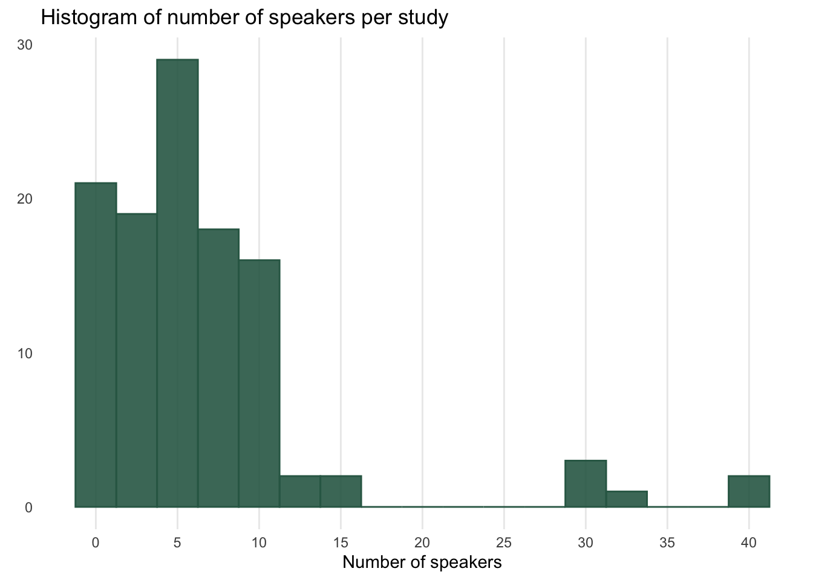
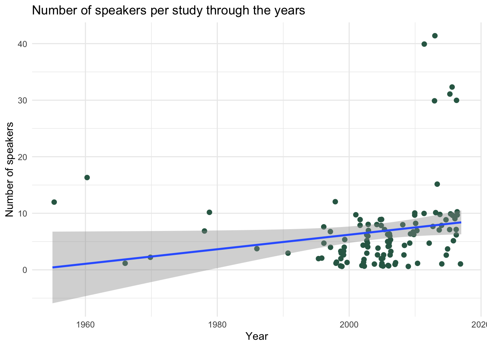
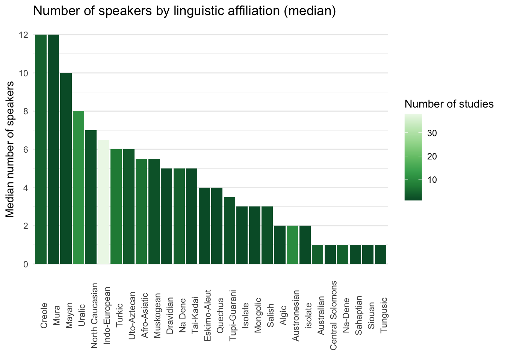
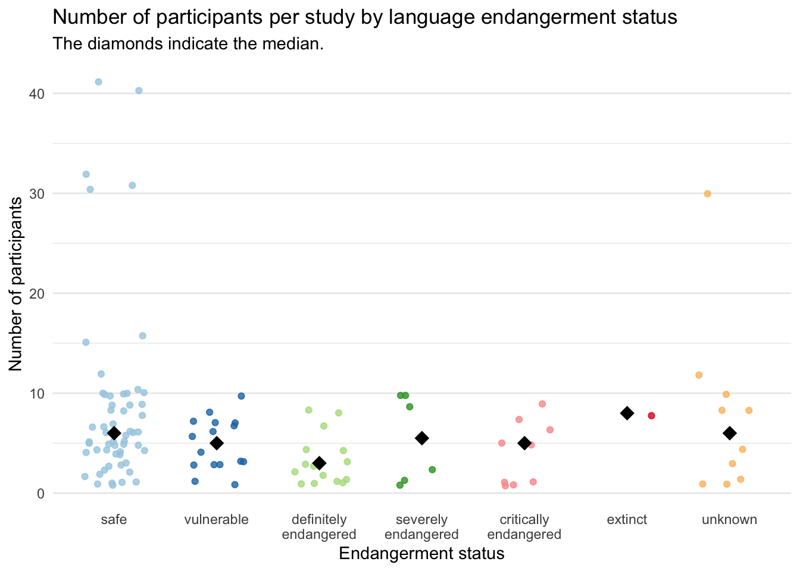

# An informal analysis of number of speakers per phonetic study by year and endangerment status {#a:speakers}


This analysis is based on the dataset used in @roettger2017 and @gordon2017, @gordon2018.^[A previous version of this appendix appeared as a blog post at <https://stefanocoretta.github.io/post/an-estimate-of-number-of-speakers-per-study-in-phonetics/>.]
The dataset contains information on number of participants from 113 studies, published between 1955 and 2017 (the majority of the studies are within the range 1990--2017).

The median number of speakers per study across the entire dataset is 5.
The histogram below shows that most studies have 10 speakers or less, and that there are a few outliers with 30-40 speakers.



The following plot shows the number of speakers across publication year.
There is a tendency for an increase in number of speakers, although the trend is not particularly marked.



The following bar chart shows the median number of speakers in studies grouped by linguistic affiliation.
The colour of the bars indicates the number of studies.
Indo-European languages stand out in terms of number of studies (> 30), but the median number of speakers in this family does not fare much better than other less-reachable families.


```
## `summarise()` ungrouping output (override with `.groups` argument)
```



Information on the endangerment status of the languages in the dataset was obtained from GlottoLog.^[<https://glottolog.org/meta/downloads>.]
The following strip chart shows the number of speakers for each of the studies (each point) categorised by the endangerment of the target language.
With the caveat that there are more studies on safe languages, there is a trend of decreasing number of speakers from safe, to vulnerable, to definitely endangered languages.
The very low number of studies on languages of greater endangerment status makes it harder to establish patterns.
Note also that the decreasing trend is in fact small (1/2 speakers).



While generalisations based on this cursory analysis would not be wise, there seems to be a tendency for studies to have a very low number of speakers (median 5 speakers per study).
The majority of studies analysed data from 10 speakers or less.
This estimate is independent of publication year and endangerment status of the language enquired.
