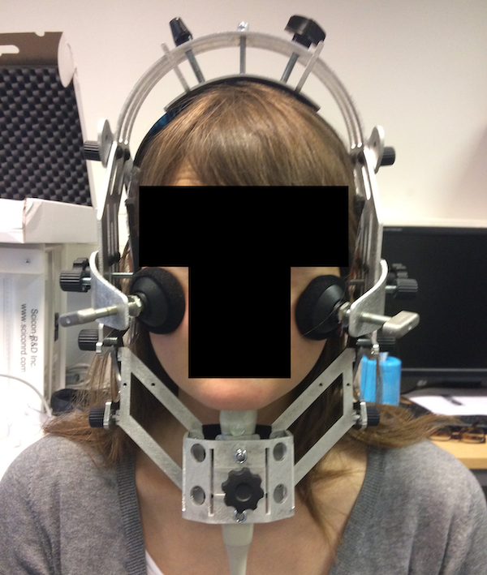

# (PART) Introduction {-}

# Overview

The sounds of a language form an incredibly complex system of relations and dependencies, both at a physical and a more abstract level.
A topic that masterfully exemplifies the complexities of such a system and that has generated great interest over the decades is the somewhat elusive connection between vowel duration and consonant voicing.
According to a robust cross-linguistic tendency, vowels are shorter when followed by a voiceless consonant and longer when the following consonant is voiced \citep{meyer1903, heffner1937, house1953, lisker1957, peterson1960}.
This so-called 'voicing effect' interacts with a variety of linguistic factors, and scholars have sought its origins in properties of speech production, from aerodynamic to timing aspects, and of speech perception \citep{belasco1953, zimmerman1958, sharf1962, lindblom1967, halle1967a, javkin1976, kluender1988}.
While much progress has been made in understanding this link, after more than a century there is still disagreement as to what contributes to the emergence of this phenomenon, as evidenced by the numerous accounts put forward.

Given the plurality of views concerning less understood aspects of the voicing effect, this thesis set out to tackle this phenomenon by employing a diverse set of techniques and sources of data.
To keep this type of enquiry manageable, it was decided to undertake this endeavour from a speech production outlook, areas which have fuelled a great deal of debate within the voicing effect literature, while keeping an open eye on possible elements of perception.
Moreover, stops were chosen as the type of segments to be investigated, given that more ... is available on them than on other types.
In particular, the thesis poses the question of what aspects of the articulation of vowel-consonant sequences can inform us on the association between vowel duration and consonant voicing.
In the attempt to answer this question, a combination of acoustic, ultrasound tongue imaging, and electroglottographic data was collected as part of two studies on Italian, Polish, and English.
These languages were chosen in that they constitute a methodological window into the complex variation of the voicing effect as seen both across and within languages.

The results of the investigation of acoustic segment durations, tongue root position, and glottal adjustments suggest a composite production account of the voicing effect which synthesises previous independent and seemingly contrasting accounts.
It is demonstrated that the duration of the speech interval between the releases of the consonants flanking the stressed vowel in disyllabic words of Italian, Polish, and English is not affected by the voicing status of the post-vocalic consonant.
By capitalising on known articulatory properties of vocalic and consonantal sequences \citep{ohman1967a, fowler1983, odell2008, saltzman2008}, the temporal stability of the release-to-release interval is proposed to be a consequence of the isochrony of two consecutive vocalic gestures and of the phasing of the consonantal gestures relative to former.
As a side effect of the release-to-release temporal stability, the timing of the VC boundary within such interval determines the respective durations of the vowel and the following consonant closure, the latter of which is known to be generally longer for voiceless than for voiced stops \citep{lisker1957, van-summers1987, davis1989, de-jong1991}.
It follows that shorter vowels are followed by the longer closures of voiceless stops, while longer vowels are followed by the shorter closure of voiced stops.

The results of English monosyllabic words, on the other hand, show that in this context the release-to-release interval is longer when the post-vocalic consonant is voiced.
The absence of release-to-release temporal stability in monosyllabic words is argued to be related to the absence of vowel-to-vowel isochrony, which in turn is a consequence of the lack of a second vowel functioning as a temporal anchor.
The respective durations of vowel and closure can thus be modified independently, fact that can be exploited by speakers to enhance the voicing contrast by manipulating the ration between the duration of the vowel and of the closure without being constrained by the release-to-release stability as in disyllabic words.
The presence of the voicing effect in monosyllabic words is conjectured to have been emerged either because of inheritance from earlier diachronic stages or as a consequence of mechanisms affecting the timing of the consonant closure onset.

The timing of the VC boundary is shown to be modulated, among other known factors, by the position of the tongue root, as evidenced by tongue imaging data, and by the interaction of glottal spreading and oral closure, as suggested by an electroglottographic study of vocal folds activity.
Tongue root advancement was observed during the closure of voiced stops in some but not all speakers of both Italian and Polish.
Moreover, it was found that tongue root advancement is initiated during the production of the preceding vowel and that the degree of advancement at stop closure onset is positively correlated with preceding vowel duration, such that longer vowels correspond to greater tongue root advancement.
Together with the shorter duration of the closure of voiced stops, this pattern fits with the known role of tongue root advancement in the maintenance of voicing during stop closure \citep{kent1969, perkell1969, westbury1983}.

Furthermore, the analysis of vocal fold activity during the production of vowels shows that the latter portion of vowels followed by voiceless stops is produced with greater glottal spread in Italian than in Polish.
This difference is taken as evidence for a language-specific implementation of the timing of glottal spreading.
Increased glottal spread before voiceless stops is understood as the precursor of pre-aspiration, the presence of which has been reported in Italian \citep{ni-chasaide1993, stevens2004a, stevens2004, stevens2010, stevens2010b, stevens2014a}.
By combining previous work on pre-aspiration \citep{lisker1974, nichasaide1985, stevens2014}, two alternative path-ways are proposed: either pre-aspiration is enhanced by shortening the closure of the stop, or it is reduced or prevented by producing an earlier stop closure, which would mask the acoustic effects of glottal spreading and result in a longer closure duration, other things being equal.

The thesis is organised as follows. The following three chapters constitute the introductory part, and they present, in turn, a review of literature on the voicing effect (\Cref{s:ve}), an overview of the studies conducted (\Cref{s:studies}), and a discussion of the principles of the Open Science movement (\Cref{s:openscience}), which has had a deep impact on the shaping of this project.
The second part is a collection of original manuscripts in the form of standalone papers (...), which report and discuss the methodological and conceptual contributions of the present work.
Papers ... and ... deal with the duration of the release-to-release interval in the three investigated languages.
Papers ... deals with the results on tongue root advancement and vowel duration in Italian and Polish.
Paper ... and ... introduce two methods to analyse tongue contours and electroglottographic data using generalised additive modelling, and discuss cross-linguistic and speaker-level similarities and differences concerning tongue root advancement and glottal spreading in Italian and Polish.
Finally, ... summarises the results of this investigation by providing an overarching synthesis, and concludes with a discussion of limitations and future avenues of research.

# The voicing effect and beyond
\label{s:ve}

A long-recognised property of vowels is that their duration is influenced by the voicing of the consonant following them.
Across a wide variety of languages, vowels tend to be shorter when followed by voiceless consonants, and longer when followed by voiced ones.
This tendency has been called the 'voicing effect' \citep{mitleb1982}.
Remarkably, as far as we can tell, no language has been reported to have the opposite effect, namely longer vowel durations before voiceless than before voiced consonants.
Possibly, the voicing effect is one of the most robust effects found in the phonetic literature (together with, for example, the effect of vowel height).
Among the earliest traceable mentions to the voicing effect there are \citet{meyer1903} for English (cited in \citealt{lindblom1967}), \citet{meyer1904} for German, \citet{meyer1909} for Hungarian, and \citet{gregoire1911} for French (all cited in \citealt{maddieson1976}).
After these, a plethora of studies confirmed the effect in these languages and reported it in other ones.

English is by far the language that received the most attention (\citealt{heffner1937, house1953, lisker1957, zimmerman1958, peterson1960, house1961, sharf1962, sharf1964, lindblom1967, halle1967, halle1967a, slis1969a, slis1969, chen1970, klatt1973, lisker1974, raphael1975, umeda1975, javkin1976, port1982, mack1982, luce1985, van-summers1987, kluender1988, de-jong1991, laeufer1992, fowler1992, de-jong2004, warren2005, ko2018, glewwe2018, sanker2019}, among others).
The existence of the voicing effect has been further corroborated in French by \citet{belasco1953}, \citet{chen1970}, and \citet{laeufer1992}, in Hungarian by \citet{soskuthy2013}, and German (in the context of word-final voicing neutralisation, see \citealt{nicenboim2018a} and references therein).
Other voicing-effect languages are Arabic (\citealt{hussein1994}, but cf. \citealt{mitleb1982}), Assamese, Bengali, Dutch, Georgian \citep{begus2017}, Hindi \citet{maddieson1976, ohala1992a, lampp2004, durvasula2012, sanker2018}, Italian \citep{caldognetto1979, farnetani1986, esposito2002}, Icelandic, Japanese \citep{port1987}, Korean, Lithuanian \citep{campos-astorkiza2007}, Norwegian, Swedish, Spanish, Telugu \citep{sanker2018}, and Russian [add references].\footnote{From a typological perspective, the sample is strongly biased towards Indo-European languages.
Moreover, the five non-Indo-European languages are well-studied languages.
This notwithstanding, the voicing effect is generally regarded as a very common and widespread phenomenon.}

While the existence of the voicing effect is unquestionable, a commonly shared stance is that it is not an absolute universal, and that the magnitude of the effect varies across languages that have it.
Czech and Polish are generally reputed to be languages in which the duration of the vowel does not significantly differ before voiceless and voiced stops.
In fact, the results concerning the effect in these languages suggest both absence and presence of voicing-induced vowel duration differences.
\citet{keating1984} examined the duration of vowels in 3 Czech speakers.
Vowels are 193.7 ms long when followed by /t/ and 204.2 ms when followed by /d/.
This corresponds to a raw difference of 10.5 ms, which the author reports not to be significant (*t*(30) = -0.37, p > 0.2).
Given the low number of speakers and the relative high standard error of the effect (about 28 ms, calculated as the mean difference over the *t*-value, \citealt{nicenboim2018a}), it is possible that the null result is due to low statistical power.
\citet{machac2007} analyse 638 VCV sequences recorded from 53 speakers of Czech and found partial evidence for an effect of voicing in the language.

As for Polish, \citet{slowiaczek1985} measured the duration of vowels in word-final syllables from 5 speakers, and vowels followed by an underlyingly voiced stop are 10--15 ms longer.
@nowak2006 investigates several properties of vowel duration in 4 speakers, and finds that vowels followed by voiced stops in 4 speakers (from different parts of Poland) are 4.5 ms longer (a significant difference).
<!-- I should read about what stats he did -->
@malisz2008 analyse data from 40 speakers of 'Standard Polish', and while they don't report estimates from the whole dataset, the means from 4 speakers suggest a difference in vowel duration before voiceless vs. voiced stops of about 3.5 ms.
On the other hand, an equal number of studies argue that voicing does not significantly affect vowel duration.
\citet{jassem1989} could not replicate the results in \citet{slowiaczek1985}.
\citet{keating1984} reports a non-significant difference of 2 ms in the word pair /rata/ (167.4) and /rada/ (169.5 ms), based on data from 24 speakers in Wrocław.
Finally, \citet{strycharczuk2012a} reports a non-significant effect in 6 Warsaw speakers in pre-sonorant word-final position.
To summarise, the evidence concerning the presence or absence of the voicing effect in Czech and Polish is mixed and it is not possible to draw certain conclusions.
<!-- maybe add a footnote about meta-analysis -->

The second common stance about the voicing effect is that its magnitude differs across languages, and that English generally shows the greatest effect.
The latter statement led to the idea that the voicing effect is phonologised in English \citet{de-jong1991, sole2007, sanker2018}.
The argument for the phonologisation of the effect rests, among other things, on the alleged stability of the ratio of the effect across speaking rates and prosodic contexts differing in strength.
\citet{port1982} suggest that the ratio of the consonant and vowel durations is stable at faster and slower speaking tempos, and that the CV ratio proves to be the primary acoustic correlate of voicing in word-final position.
\citet{luce1985}, on the other hand, claim that vowel duration is a more robust cue to voicing across speaking rates, when compared to the CV ratio and the duration of the stop closure (which fared as the worst among the three indices).
Finally, \citet{ko2018} compares CV ratio values in three speaking styles (normal, faster, and slower) and finds that the ratio changes as a function of speaking style.
Moreover, the rate-driven differences in CV ratio differ in the voiceless and voiced condition.
In sum, while this would not be an argument against phonologisation of the voicing effect in English, there is contrasting evidence as to whether the relative magnitude of the effect is stable across speaking tempos.

The alleged phonologisation of the effect in English is usually argued to be responsible for the greater effect in this language compared to others.
The reported effect of voicing in word-final syllables in English varies between 35 and 150 ms \citep{heffner1937, house1953, zimmerman1958, peterson1960, sharf1962, chen1970, klatt1973, mack1982, luce1985, laeufer1992, ko2018}.
When looking at non-final syllables, the effect is smaller, with values between 18 and 35 ms \citep{sharf1962, klatt1973, davis1989}.
Taking the first vowel in Italian disyllabic words for comparison, the difference in vowel duration before voiceless vs. voiced stops is 22 in \citet{farnetani1986} and 24 ms in \citet{esposito2002}.
These values are within the range of the non-final effect in English.
It is thus possible that, once controlling for contextual factors, the apparent cross-linguistic differences in magnitude get at least reduced.
A similar conclusion is proposed by \citet{laeufer1992}, who compared French and English with carefully designed material to ensure comparison.
When the duration of vowel is similar across languages, the magnitude of the effect is also comparable.
To conclude, there is mixed evidence as to whether there exist cross-linguistic differences in magnitude of the voicing effect, and arguments based on phonologisation of the effect as derived from stability across speaking rates should be made with caution.

Language is not the only source of variation, and the voicing effect interacts with several other phonological and phonetic factors.
For example, \citet{umeda1975} reports that the difference in vowel duration before voiceless vs. voiced stops is greater when the test word is pre-pausal.
The effect of voicing also seems to be more robust in stressed than in unstressed vowels \citep{davis1989}.
There is also indication that the effect is modulated by the syllabic affiliation of the post-vocalic consonant in English, so that vowels followed by a coda show a greater effect than vowels followed by an onset (\citealt{sharf1962, klatt1973, davis1989}, but \citealt{abdelli-beruh2004} doesn't find a significant difference across these contexts in French).
\citet{port1981} further argues that the effect in the word-initial stressed vowel is smaller along the hierarchy monosyllabic > disyllabic > trisyllabic words, which also reflects that of decreasing vowel durations.
\citet{laeufer1992} discusses the voicing effect as a function of vowel height, and shows that the effect is greater in low (intrinsically longer) vowels than in high (intrinsically shorter) vowels.
\citet{house1953} also report that there is a greater durational difference before fricatives than before stops.
<!-- not replicated in Tanner 2019 -->
Post-vocalic nasals have been argued either to behave like voiced stops \citep{lisker1974, peterson1960} or to excercise an effect intermediate between that of voiceless and voiced stops \citep{house1953, zimmerman1958}.
Finally, \citet{sharf1964} shows that the effect persists even in whispered (unvoiced) speech.

## Whence the voicing effect
\label{s:accounts}

Over a century of research on the voicing effect has without doubt increased our knowledge of this complex phenomenon.
However, to date no single proposal as to why this phenomenon exists has reached unanimous consensus.
The period between the 50s and the 70s generated a series of accounts about the source of the voicing effect, with subsequent decades focussing on testing or extending these hypotheses.
Two major 'factions' have opposing views regarding whether the effect originally emerged due to perceptual biases or physical properties of the production system.
At present, there is no ultimate answer as to which of the two sides best accounts for all of the aspects of the voicing effect, and rather both point of views partially contribute to the overall picture.
The following paragraphs will review the major perception and production accounts, with greater attention given to the latter, which are the focus of this dissertation.
<!-- this is not an in-depth nor exhaustive review -->
<!-- as in papers, doesn't exclude perception -->

<!-- Perception -->

One of the perception-based accounts states that the voicing effect emerges as a consequence of the difficulty in the perceptual identification of the vowel-consonant boundary in the context of voiced stops, and of the misinterpretation of the voicing during closure \citep{javkin1976}.
According to this account, speakers misperceive the periodic vibration of the vocal folds (voicing) during the closure of a voiced stop as part of the preceding vowel.
In the absence of contextual correction, this misperception can lead to the creation of a new production norm where the vowel is long.
If this new lexical representation is created, the listener, now turned speaker, will subsequently produce longer vowel durations when followed by voiced stops \citet{ohala1989}.
Although \citet{javkin1976} does not directly test the hypothesis that closure voicing is reinterpreted as part of the preceding vowel, the results indicate that listeners perceive vowels to be longer when followed by voiced than when followed by voiceless stops, other things being equal.
On the other hand, \citet{sanker2019} finds that vowels rather elicit less 'long' responses when the consonant following the vowel is voiced, while they elicit more 'long' responses in stimuli where the following consonant is spliced out.
While there is potential for a perceptual bias driving some aspects of the voicing effect, production mechanisms of voiced stops affecting acoustic aspects of vowels could be at the root of perceptual biases, which could be responsible for the enhancement of the effect in some speakers/languages \citep{begus2017, sanker2019}.

To provide a rationale for the language-specificity of the voicing effect, \citet{kluender1988} propose that different languages can exploit the perceptual bias behind the effect at different degrees.
The ratio of the duration of the closure and that of the vowel is one of the perceptual cues to voicing \citet{port1982, lisker1986}.
Listeners associate smaller values of the consonant-to-vowel ratio to voiced stops, and, vice versa, greater values to voiceless stops.
\citet{kluender1988} argue that speakers can actively manipulate vowel durations to proportionally increase the difference in ratio between the two voicing categories, so that the ratio would be even smaller in the voiced context and even greater in the voiceless one.
As a consequence, the perceptual distance between the voicing categories would be enhanced, thus facilitating discrimination \citet{stevens1989, kingston1994}.
According to this view, listeners should show a contrast effect, by which longer closure durations elicit more 'short vowel' responses and shorter closures more 'long vowel' responses.
However, \citet{fowler1992} shows that listeners judge vowels to be longer when the stop closure duration is increased, and that, similarly, stop closure is perceived to be longer when vowel duration is increased.
These results indicate a mechanism of perceptual assimilation of the respective durations of vowels and stop closures, rather than a contrast effect which can be exploited in the enhancement of the voicing distinction.

<!-- Production -->

While individual production accounts differ in the details, two broad categories can be identified.
Two accounts ascribe the source of the voicing effect to some mechanisms of compensation within a certain property of speech (either duration or articulatory force), while two others relate the emergence of the effect to timing aspects of gestures related to the articulation of stops (either laryngeal or oral).

The compensatory temporal adjustment account \citep{lindblom1967, slis1969a, slis1969, lehiste1970, lehiste1970a} states that the relative durations of a vowel and consonant in a VC sequence are statistically correlated.
A well-known fact about stop closure is that it is longer in voiceless stops and shorter in voiced stops \citep{lisker1957, van-summers1987, davis1989, de-jong1991}.
As a consequence, vowels are shorter when followed by the longer closure of voiceless stops, and they are longer when followed by the shorter closure of voiced stops.
This compensatory pattern would be the consequence of maintaining a particular speech interval at a fixed temporal duration, while the duration of the closure changes depending on the voicing status of the stop.
Proponents of the compensatory account have argued that compensation is implemented either at the level of the syllable (or of the VC sequence, \citealt{lindblom1967, farnetani1986}), or at the level of the word \citep{slis1969a, slis1969, lehiste1970, lehiste1970a}.
This formulation of the account, however, faces empirical and logical challenges.
The duration of both the syllable and the word is affected by the voicing of the stop \citet{chen1970, jacewicz2009}, and it is not clear why compensation within a word should target the pre-consonantal vowel necessarily and not other segments (these issues will be discussed in more details in [...]).

A second proposal attributes the voicing-driven differential duration of vowels to articulatory energy expenditure, rather than temporal aspects.
\citet{meyer1903} and similarly \citet{belasco1953} propose that the articulatory force required to produce a syllable is constant, and thus it is distributed across segments according to their energy requirements.
According to this hypothesis, voiceless stops are produced with more force than voiced stops, and hence some force is subtracted from the production of the preceding vowel to maintaining the overall force constant.
However, the concept of 'articulatory force' lacks an empirically solid definition, and experimental results mentioned in \citet{zimmerman1958} rather point to the absence of a relation between energy expenditure and vowel duration.

While the compensatory temporal adjustment and the energy expenditure accounts rely on compensatory mechanisms of duration or articulatory force, two other proposals concern aspects of gestural timing of the larynx and the consonant closing gesture.
The laryngeal adjustment account \citet{halle1967, halle1967a, chomsky1968} is based on the idea that voicing during a stop closure requires precise adjustments of the glottis in order to comply with aerodynamic constraints \citep{ohala2011}.
Such a precision requires greater time to be achieved during articulation than the production of closure voicelessness, which requires a less precise control over glottal opening.
Because of these properties of laryngeal articulation, full closure can be achieved relatively faster in the context of voiceless stops, while a delay of closure onset in voiced stops ensures enough time to produce the suitable glottal configuration.
The preliminary electromiographic data of glottal muscular activity discussed in \citet{chen1970}, however, suggests that the expected early activity of laryngeal muscles during the production of vowels followed by voiced stops compared to vowels followed by voiceless stops is not found.
Further articulatory evidence shows that there is rather a general increase of activity of certain laryngeal muscles (mainly the posterior crycoarytenoid and the crycothyroid) during the production of voiceless sounds \citep{hirose1972, kagaya1975, hirose1977, lofqvist1989}.
No conclusive evidence can thus be adduced in support of the laryngeal adjustment hypothesis, although other laryngeal mechanisms cannot be ultimately excluded.

<!-- I think I need to read more about this -->

The last production account surveyed here is based on the rate of closure transition \citep{ohman1967a, chen1970}.
Voiceless stops are articulated with greater glottal opening relative to voiced stops (and vowels), so that a greater volume of air is admitted into the oral cavity.
@ohman1967a argues that the production of the closure of voiceless stops would then require more muscular effort to counteract the increased intra-oral pressure generated by the greater airflow.
As a consequence, the rate of the closing gesture of voiceless stops is higher than that of voiced stops.
In other words, full closure will be achieved earlier when the stop is voiceless than when it is voiced relative to the onset of the preceding vowel.
Hence, vowels will be shorter when followed by voiceless stops than when followed by voiced stops.
\citet{chen1970} observes from articulatory data of lip movements that the difference in labial closure rate accounted for 20% of the difference in vowel duration.
Subsequent work by \citet{warren2005} further shows that the percentage of difference accounted for rises to 80% when considering the movements of both the lips and the jaw.

<!-- to sum up -->

## Beyond voicing effects

Two phonation modes other than voicing are known to affect preceding vowel duration: aspiration and ejection.
While this project focusses on the voicing effect, the closely related aspiration and ejection effects have consequences of theoretical importance for the voicing effect.
The results concerning the aspiration effect are mixed.
\citet{maddieson1976}, \citet{durvasula2012}, and \citet{lampp2004} report longer vowels in aspirated than in unaspirated stops in Hindi, and \citet{maddieson1976a} a simlar trend in Assamese, Bengali, and Marathi.
\citet{ohala1992a}, on the other hand, shows that vowels have the same duration before unaspirated and aspirated stops in his sample of Hindi speakers.
\citet{sanker2018} observes an effect in Hindi long but not in short vowels, while the effect is reversed in Telugu long vowels (vowels are shorter before aspirated than unaspirated stops), with no appreciable difference in short vowels.
Note that these studies don't easily lend themselves to comparison, since the material and contexts used differ (vowel type, vowel phonological length, number of syllables, context following the test word).

The trend of vowels being longer when followed by aspirated stops challenges some of the accounts presented in \Cref{s:accounts}, as noted in \citet{maddieson1976}.
The articulatory force expenditure hypothesis predicts vowels to be shorter before aspirated than before unaspirated stops since it is likely that aspirated stops require greater force than unaspirated ones.
According to the laryngeal adjustment account, the duration of the vowels should not differ in voiceless unaspirated and aspirated stops since they both require glottal opening, rather than the precise adjustments characteristic of voiced stops.
Since closure rate is determined by airflow, the rate of closure account expects vowels followed by aspirated stops to be shorter than or equal to vowels followed by unaspirated stops, since the former should be characterised by greater airflow and higher closure rates due to the spread glottis.
While \citet{maddieson1976} argue against a compensatory effect between vowel and consonant duration, the data in \citet{durvasula2012} are compatible with it (see [...] for details).
The results in \citet{sanker2018} on Hindi, but not Telugu, are also compatible with a compensatory mechanism.
Closure duration is longer in unaspirated stops and shorter in aspirated stops in both languages, but the effect of aspiration on vowel duration has opposite directions, as discussed above.

An investigation of the effect of ejection in Georgian \citep{begus2017} shows that vowels are shortest when followed by aspirated stops, longer when followed by ejectives, and longest when followed by voiced stops (Georgian contrasts aspirated voiceless, ejective, and voiced unaspirated stops).
The negative correlation between closure and vowel duration has a greater magnitude in the context of voiced compared to those of aspirated and ejective stops.
Moreover, the author shows that the closure effect on vowel duration coexists with a 'laryngeal features' effect (both effects, when entered as predictors in a single regression model, lead to significant *p*-values).
In other words, the variance in vowel duration is account for in part by the duration of the stop closure and in part by the voicing category of the post-vocalic stop.
As discussed in \citep{begus2017}, these patterns are compatible with accounts of compensatory temporal adjustments, laryngeal adjustments, and rate of closure.

## Summary
<!-- TODO: voicing effect summary -->

# Studies overview
\label{s:studies}

The end of \Cref{s:ve} stressed the variety of proposals as to what the source of the voicing effect could be.
Moreover, the accounts reviewed in the previous chapter all find partial support and face challenges in one way or the other.
Possibly, accounts based on perceptual biases are somewhat weaker than production accounts.
Given the complexity of the various production accounts and their interactions, this thesis focusses on articulatory aspects of the voicing effect.
Since over the years evidence has accumulated for at least three of these accounts, the compensatory temporal adjustment, the laryngeal adjustment, and the rate of closure account, this thesis set out to collect acoustic and articulatory that would enable a free exploration of the hypothesis space.
This is where the first of the two studies that form part of this thesis stands.
An exploratory study of several aspects of the influence of voicing on vowel duration sought to provide data without constraining the experimental design in light of a particular hypothesis.
The results of this study suggested a promising venue for a further investigation of the compensatory temporal adjustment account.
A second study was thus planned to test the hypotheses generated in the previous exploration.

This chapter offers an overview of these studies, which are discussed in turn.
For each study, information will be given on experimental materials and procedures, and data processing.
While specific details will be presented in the individual papers, this chapter offers to the readers a kind of road map to aid them in navigating the second part of the thesis.
Data and code is available on the Open Science Framework and GitHub (see \Cref{s:repro})
Ethics clearance was obtained from the University research ethics committee (UREC) of the University of Manchester (REF 2016-009976).

## Exploratory study of the voicing effect in Italian and Polish (Study I)

<!-- three aspects: exploratory, acoustics + articulatory, and Italian Polish -->

Since the voicing effect in English is thought to be phonologised, if one wants to unearth mechanic properties, it is more convenient to investigate the effect in language where the effect is not phonologised and thus potential not under the control of the speaker.
<!-- but could still be, cf with Rothenberg -->
Moreover, contrasting two languages that differ in the magnitude or presence vs. absence of the effect is a desideratum.
Italian and Polish are two good candidates since they satisfy both the requirement of the effect not being phonologised, and the requirement of showing the effect at different degrees.
Moreover, their phonological systems share some properties that makes comparison easier.
Note that, when talking about voiceless vs. voiced stops throughout the dissertation, I refer to the phonemic (lexical) contrast defined at an abstract level, rather than to the actual phonetic implementation of such contrast.
This is generally helpful in light of the distinction between aspirating vs. true voicing languages \citep{beckman2013}, and in the case of English (Study II) in particular \citet{docherty1992}.

Since the accounts cover aspects of segmental duration, oral articulators, and laryngeal gestures, data was obtained from three sources: (1) acoustics, (2) ultrasound tongue imaging, a non-invasive technique to image the shape of the tongue using ultrasonic equipment, and (3) electroglottography, a indirect and safe method to gather information on vocal fold activity.
<!-- say that since the papers talk about different aspects of the study and its methods, here I report an over-all overview of the methods and data of Study I -->

<!-- Participants: to be moved -->
A total of 17 participants were recruited in Manchester (UK) and in Verbania (Italy).
Eleven participants were native speakers of Italian, and six of Polish.
Recordings were made in a sound-attenuated room at the Phonetics Laboratory of the University of Manchester, and in a quiet room at a field location in Verbania.
Due to technical issues or poor signal quality, ultrasonic data of /u/ from two speakers and electroglottographic data from two others are missing.
\Cref{t:speakers-data} gives the recording location and possible missing data for each participant.
Basic sociolinguistic data is given in [...].
The participants read an information sheet prior to the experiment and signed a consent form

\ctable[caption = ...,
label = t:speakers-data,
width=\textwidth,
star,
doinside = \scriptsize
]{lll}{}{
\FL
Speaker & Location   & Missing data    \ML
IT01    & Manchester &                 \NN
IT02    & Manchester &                 \NN
IT03    & Verbania   &                 \NN
IT04    & Verbania   & missing EGG     \NN
IT05    & Verbania   & missing EGG     \NN
IT07    & Verbania   & missing /u/ UTI \NN
IT09    & Manchester &                 \NN
IT11    & Manchester &                 \NN
IT12    & Manchester &                 \NN
IT13    & Manchester &                 \NN
IT14    & Manchester &                 \NN
PL02    & Manchester &                 \NN
PL03    & Manchester &                 \NN
PL04    & Manchester &                 \NN
PL05    & Manchester & missing /u/ UTI \NN
PL06    & Manchester &                 \NN
PL07    & Manchester &                 \LL
}

2D Ultrasound tongue imaging (UTI) uses ultrasonography for charting the movements of the tongue into a two-dimensional image \citet{gick2002, stone2005, lulich2018}.
In medical sonography, ultrasonic waves (sound waves at high frequencies, ranging between 2 and 14 MHz) are emitted from a probe in a fan-like manner, and travel through organic tissue (such as skin and muscles).
When the surface of a material with different density is hit, the ultrasound waves are partially reflected, and such 'echo' is registered by the probe.
These echoes can then be plotted on a two-dimensional graph, where different densities are represented by different shades (higher densities are brighter, while lower densities are darker).
The graph, or ultrasound image, sows high density surfaces as very bright lines, surrounded by darker areas.
By positioning the ultrasound probe in contact with the sub-mental triangle (the surface below the chin), sagittally oriented, it is possible to infer the cross-sectional profile of the tongue, which appears as a bright line in the resulting ultrasound image.

Electroglottography \citep{fabre1957, childers1985, scherer1987, rothenberg1988} is a technique that measures the size of contact between the vocal folds (the Vocal Folds Contact Area, VFCA).
A high frequency low voltage electrical current is sent through two electrodes which are in contact with the surface of the neck, one on each side of the thyroid cartilage.
The impedance of the current is directly correlated with VFCA, while its amplitude is inversely correlated with it \citep{titze1990}.
Impedance increases with lower VFCA and decreases with higher VFCA.
Conversely, amplitude decreases when the VFCA increases and it increases when the VFCA decreases.
The EGG unit registers changes in impedance and it converts it into amplitude values.
The unit outputs a synchronised stereo recording which contains the EGG signal from the electrodes in one channel and the audio signal from the microphone in the other.

{ width=80% }

\Cref{f:setup} shows the equipment set-up employed in the study.
The left part of the figure shows the ultrasonic components \citep{articulate2011}, while the EGG components (Glottal Enterprises) are shown on the right.
Two separate Hewlett-Packard ProBook 6750b laptops with Microsoft Windows 7 were used for the acquisition of the UTI and EGG recordings.
The main ultrasonic component was a TELEMED Echo Blaster 128 unit with a TELEMED C3.5/20/128Z-3 ultrasonic transducer (20mm radius, 2-4 MHz), plugged into one laptop via a USB cable.
A P-Stretch unit (used for signal synchronisation) and was connected to the ultrasound unit via a custom modification \citep{articulate2011}.
The P-Stretch unit and a Movo LV4-O2 Lavalier microphone fed into a FocusRight Scarlett Solo pre-amplifier, which was plugged into the ultrasound laptop via USB.
A second Movo microphone and the electrodes were connected to a Glottal Enterprises EG2-PCX2 unit, which was plugged into the second laptop (the audio signals from the UTI and the EGG units were used for synchronisation, see below).
The subject wore a metallic headset produced by \citet{articulate2008} (\Cref{f:headset}), which holds the ultrasound probe in position (allowing free head movement), and the velcro strap with the EGG electrodes around their neck.
The electrodes were located on each side of the thyroid cartilage, at the level of the glottis.
The microphones were clipped to the headset on either side, at identical height.
Before the reading task, the participant’s occlusal plane was obtained using a bite plate \citet{scobbie2011}.
The tongue data was rotated such that each speaker's occlusal plane is horizontal.
This procedure enables the comparison of tongue movements across subjects.

{ width=80% }

The participants read sentences containing test words presented on the screen via AAA.
The test words were C\textsubscript{1}V\textsubscript{1}C\textsubscript{2}V\textsubscript{2} words, where C\textsubscript{1} = /p/, V\textsubscript{1} = /a, o, u/, C\textsubscript{2} = /t, d, k, g/, and V\textsubscript{2} = V\textsubscript{1}.
The choice of the segmental make-up of the test words was constrained by the use of ultrasound tongue imaging.
Paper [...] provides more details on the rationale behind the material design.

The UTI+audio and EGG+audio signals were acquired and recorded by means of Articulate Assistant Advanced (AAA, \citealt{articulate2011}) and Praat \citep{boersma2016} respectively.
Since the signals from the ultrasonic machine and the electroglottograph are recorded simultaneously but separately, data from both sources were synchronised after acquisition.
Synchronisation was achieved using the cross-correlation of the audio signals from both sources \citep{grimaldi2008}.
The interval between the start of the cross-correlated signal and the time of the signal maximum amplitude is equal to the lag between the two original sounds (\Cref{f:cross-correlation}).
Synchronisation of the original sound files was achieved by trimming the beginning of the longer sound by the lag obtained from cross-correlation.
A Praat script was written to automate the synchronisation process (`sync-egg.praat` in \citealt{coretta2018m}).

{ width=80% }

A time-aligned transcript of the recordings was obtained with a force-alignment procedure.
Since the audio recorded with the EGG system presented more hardware-generated noise than that recorded with the UTI system, the latter was used in all subsequent acoustic-based analyses.
The SPeech Phonetisation Alignment and Syllabification (SPPAS) software was used \citet{bigi2015}.
SPPAS is a language-agnostic system, and it comes pre-packaged for a variety of languages, among which Italian, Polish, and English.
The output of the force-alignment is a Praat TextGrid with time-aligned interval tiers of the intonational phrase units (utterances), word-level, and phone-level annotations.
The automatic annotation was then manually checked and corrected if necessary by the author.
The placement of the phone boundaries followed the suggestions in \citet{machac2009}.
See [...] for details.

Detection of the release of C1 and C2 was accomplished through the algorithmic procedure described in \citet{ananthapadmanabha2014}.
An implementation of the procedure has been written by the author in Praat (`release-detection-c1.praat` and `burst-detection.praat` in \citealt{coretta2018m}).
The output of the automatic detection was manually checked and corrected.
The times of the following landmarks were extracted via a custom Praat script (`get.duration.praat` in \citealt{coretta2018m}): sentence onset and offset, target word onset and offset, C1 release, V1 onset, V1 offset/C2 closure onset, C2 release, V2 onset.

UTI data processing was performed in AAA \citep{articulate2011}.
Spline curves were fitted to the tongue surface images using a built-in automatic batch procedure, within a search area defined by the interval between the onset of the syllable preceding the target word and the offset of the syllable following the target word.
A search area TextGrid was created in Praat (with `search-area.praat` in \citealt{coretta2018m}) and imported in AAA for the batch procedure.
The automatic fitting procedure was monitored by the author and manual correction of the fitted splines was applied if necessary.

Subsequent data processing followed the method described in \citet{strycharczuk2015}.
See [...] and [...] for details.
The Cartesian coordinates of the fitted splines, together with tongue displacement, tangential velocity, and absolute velocity of the tongue root, dorsum and tip, were obtained from the following landmarks (\Cref{f:kine}): C2 closure onset, tongue maximum displacement during C2 closure (MAX), peak absolute velocity before (PEAK_1) and after (PEAK_2) tongue maximum displacement, tongue closing gesture onset (GONS), closure gesture nucleus onset (NONS) and offset (NOFF).
GONS, NONS, and NOFF were defined as the times where absolute velocity reaches 20% of the peak absolute velocity before PEAK_1, between PEAK_1 and MAX, and between MAX and PEAK_2 respectively \citep{kroos1997, gafos2010a}.
Tongue displacement, tangential and absolute velocity of the tongue root, dorsum, and tip were also extracted as time-series along the duration of V1.

{ width=80% }

Finally, wavegram data was extracted from the EGG data, following the method proposed by \citet{herbst2010}.
In brief, a wavegram is a spectrogram-like representation of the EGG signal, where individual glottal cycles are sequentially placed on the *x*-axis, the normalised time of the samples taken from within each glottal cycle is the *y*-axis, and the third dimension, represented by colours of different shading, is the normalised amplitude of the EGG signal.
See [...] for details.
Wavegram data was obtained from the entire duration of V1.

## Compensatory aspects of the effect of voicing on vowel duration in English (Study II)

A second study was designed to assess the generalisability of the results from Study I to English, and to investigate differences between disyllabic and monosyllabic words.
Fifteen university students were recorded in a sound attenuated room in the Phonetics Laboratory of the University of Manchester while reading sentence stimuli containing test words, presented on a computer screen with PsychoPy \citep{peirce2009}.
The participants were native speakers of British English, aged between 20 and 29, born and raised within Greater Manchester.
The test words were built according to the following structure: C\textsubscript{1}V́\textsubscript{1}C\textsubscript{2}(VC), where C\textsubscript{1} = /t/, V\textsubscript{1} = /iː, ɜː, ɑː/, C\textsubscript{2} = /p, b, k, g/, and (VC) = /əs/.
The test words were embedded in sentence-medial position within frame sentences, so that each speaker would read a total of 120 stimuli (24 words × 5 frames).
The audio recordings were force-aligned and the times of acoustic landmarks were extracted according to the same procedure as in Study I (with `make-textgrid.praat` and `get-measurements.praat` in \citealt{coretta2019g}).
Further details are given in Paper [...].

# Open Science
\label{s:openscience}

Open Science is a movement that proposes a series of research principles and warns from common (unintentional) misconceptions and questionable practices in order to build a more honest and transparent scientific environment.
The term Open Science as a whole refers to the fundamental concepts of 'openness, transparency, rigour, reproducibility, replicability, and accumulation of knowledge' \citep[3]{cruwell2018}.
Knowledge accumulation is sound only when replicability and reproducibility, proxies to the first three concepts above, can be met.
While reproducibility and replicability are generally used interchangeably, they refer to two different ideas.
A study is *replicable* when researchers can independently run the study on new subjects/with new data and obtain the same results (in brief, same analysis, different data/researchers).
The *reproducibility* of a study is, instead, related to the ability of independent researchers to run the original analysis on the original data and obtain the same results as those presented by the original authors, pending enough information on the analysis procedures is given (in brief, same analysis, same data).

The need for Open Science, which is increasingly expanding to several disciplines and enterprises, emerged primarily from the ongoing 'replication crisis' \citep{pashler2012, schooler2014}, most focus of which has been give to the medical and the psychological sciences.
Recent attempts to replicate the results from high-impact studies in psychology have demonstrated an alarming high rate of failure to replicate.
For example, in a replication attempt of 100 psychology studies, only 39% of the original results were rated to have been replicated \citep{open-science-collaboration2015}.
Failure to replicate previous results have been claimed to be a consequence of low statistical power \citep{button2013}, and of the so-called questionable research and measurement practices \citep{simmons2011, morin2015, flake2019}.

## ``With great power comes great replicability''

Other issues that can affect statistical analysis are related to errors in rejecting the null hypothesis.\footnote{Teh quote in the title is from a 2016 twitter status by Nathan C. Hall (\url{https://twitter.com/prof_nch/status/790744443313852417?s=20}).}
A researcher could falsely reject the null hypothesis when in fact is correct (Type I errors, an effect is found when there is no effect), or they could falsely fail to reject the null hypothesis when in fact it should have been rejected (Type II errors, an effect is not found when there is one).
Type I and Type II errors have generally accepted rates, i.e. $\alpha$ = 0.05 and $\beta$ = 0.2.
This means that, in an imaginary multiple replication of a study, 5% of the times the null hypothesis will be falsely rejected, and 20% of the times will falsely be not rejected.
Related to Type II errors is statistical power, which is the probability of correctly rejecting the null hypothesis when it is false ($B = 1 - \beta$).
In other words, power is the probability of detecting an effect equal or greater than a specified effect size.
Given the standard $\beta = 0.2$, an accepted (minimum) power threshold is 80% (which means that an effect equal or greater than a chosen size will be detected 80% of the times).
<!-- NHST vs Bayesian power? -->

Two other types of statistical errors are the Type S (sign) and Type M (magnitude) errors \citep{gelman2000, gelman2014}.
Type S errors refer to the probability of the estimated effect having the wrong sign (for example, finding a positive effect when in reality the effect is negative), while Type M errors correspond to the exaggeration ratio (the ratio between the estimated and the real effect).
When the statistical power of a study is low (below 50%), \citet{gelman2014} show that the exaggeration ratio (Type M error) is particularly high (from 2.5 up to 10 times the true effect size).
Type S errors (wrong sign) are more common at lower power levels (below 10%), although these can easily arise due to small sample sizes and high variance.

Several researchers have shown that the average statistical power of studies in different disciplines is very low (35% or below) and that the last 50 years did not see an improvement.
\citet{bakker2012} show that the median power in psychology is 35%, while \citet{button2013} reports a median of 21% obtained from 48 neuroscience meta-analyses.
In \citet{dumas-mallet2017}, half of the surveyed biomedical studies (N = 660) have power below 20%, while the median ranges between 9% and 30% depending on the subfield.
\citet{rossi1990} and \citet{marszalek2011} show that from the 70s there hasn't been a recommended increase in power and sample sizes.
Estimation of the prospective statistical power has been suggested
\citet{tressoldi2015} also find that only 2.9% of 853 studies in psychology report a prospective power analysis for sample size determination, i.e. the estimation of the smallest sample size necessary to obtain a certain power level before the experiment is run.

## The dark side of research

Questionable research and measurement practices are practices that negatively affect the scientific enterprise, but that are employed (most of the time unintentionally) by a surprisingly high number of researchers \citep{john2012}.
\citet{silberzahn2018} asked 29 teams (61 analysts) to answer the same research question given the same data set, and showed that data analysis can be highly subjective.
A total of 21 unique combinations of predictors were used across the 29 teams, leading to diverging results (20 teams obtained a significant result, while 9 did not).
At various stages of the research timeline, a research can employ the so-called 'researchers' degrees of freedom' to obtain a significant result \citep{simmons2011}.
The researchers' degrees of freedom create a 'garden of forking paths' \citep{gelman2013}, that the researcher can explore until the results are satisfactory (i.e., they are the results expected by the researchers, or they are high-impact and novel).

*P*-hacking is a general term that refers to the process of choosing and reporting those analyses that transform a non-significant *p*-value to a significant one \citep{simmons2011, wagenmakers2007, motulsky2014}.
*P*-hacking can be achieved by several means, for example by trying different dependent variables, including and/or excluding predictors, selective inclusion/exclusion of subjects and observations, or sequential testing (collecting data until the results are significant).
Another common practice is to back-engineer a hypothesis after unexpected results, also known as Hypothesising After the Results are Known (HARKing, \citealt{kerr1998}).
\citet{lieber2009} warns against 'double dipping', or the use of the same data to generate a hypothesis and to test it.
\citet{morin2015} and \citet{flake2019} more specifically discuss questionable practices related to how research variables are measured and operationalised.
The literature reviewd in \citet{flake2019} suggests that a very high percentage of published papers contains measures that are created for the reported study but that lack any reference to reliability tests.
Researchers have also been found to manipulate validated scales to obtain desired results \citep{}.

Cognitive biases and statistical misconceptions can also have a negative impact on research conduct.
\citet{wagenmakers2012} discuss the effects of the confirmation bias (the tendency to look for facts and interpretations thereof that confirm one's prior conviction, \citealt{nickerson1998}) and the hindsight bias (the tendency to find an event less surprising after it has occurred, \citealt{roese2012}).
\citet{greenland2017} defines further common distortions pertaining to methodological approaches, like statistical reification (interpreting statistical results as reflections of an actual physical reality).
Finally, \citet{wagenmakers2007} and \citet{motulsky2014} examine mistaken beliefs about the meaning of *p*-values and statistical significance (like interpreting *p*-values as an index to statistical evidence or the idea that *p*-values inform us about the likelihood of the null-hypothesis given the data).

A bias in the observed effects can also arise at the publication stage.
A publication bias has been observed in that significant and novel results are generally favoured over null or replicated results \citep{easterbrook1991, ioannidis2005, song2010, kicinski2013, nissen2016}.
\citet{rosenthal1979} called the bias agains publishing null results the 'file drawer' problem.
Studies that don't lead to a significant result are stored in the file drawer and forgotten.
This practice not only can bias meta-analytical effect sizes, but also allows for waste of resources when studies with undisclosed null results are repeatedly performed.
The questionable research and measurement practices described above, together with publication bias, conspire to unduly increase confidence in our research outcomes.
A final exculpatory note is due, though, in that these practices are not necessarily intentional or fraudulent, and in some cases lie within a 'grey area' of accepted standard procedures.

## Where we stand and where we are heading

Given the similarities in methods between the psychological sciences and phonetics/phonology, it is reasonable to assume that the situation does not fare better in the latter.
As mentioned above, sample size can have a big impact on statistical power, coupled with the effects of increased variance due to between-subject designs.
\citet{kirby2018} suggests that the number of participants in phonetic studies is low, and that even with nominally high-powered sample sizes estimation of small effect sizes is subject to the power-related issues discussed above (especially Type S/M errors).
\citet{nicenboim2018a} further show how low statistical power has adverse effects on phonetic phenomena characterised by small effect sizes, like incomplete neutralisation.
\citet{winter2015} further argues that the common practice of using few items (e.g. word types) and a high number of repetitions increases statistical certainty of the estimates of idiosyncratic differences between items rather than those of sought effects.
\citet{roettger2019} discusses how the inherently multidimensional nature of speech favours exploration of the researcher's degrees of freedom, by allowing the researcher to navigate through a variety of choices of phonetic correlates and their operationalisation.

In a review of 113 studies of acoustic correlates of word stress in a variety of languages published between 1955 and 2017, \citet{roettger2017} show that the majority of studies include 1 to 10 speakers (mode = 1), 1 to 40 lexical items, and 1 to 6 repetitions.
A follow-up analysis conducted by the author of this dissertation on the same data \citep{gordon2018} indicates that the median number of participants per study is 5 (see Appendix [...]).
A few recent studies (2010 onwards) constitute a clear exception by having more than 30 participants.
However, no apparent trend of increasing average number of speakers can be observed, so the situation has been fairly stable over the years.
Finally, the language endangerment status has a small but negligible negative effect on participants' number in vulnerable and definitely endangered languages, but not so much in severely and critically endangered ones.
It is reasonable to say that, based on this limited sample, sample size (in terms of participants) is generally very low, independent from publication year and endangerment status.

As a partial remedy to the issues discussed so far, researchers have proposed two solutions: pre-registrations and Registered Reports.
Pre-registration of a study consists in the researchers' commitment to an experimental and analytical protocol before collecting (if applicable) and seeing the data \citet{wagenmakers2012, veer2016}.
Pre-registering a study allows a clear separation between confirmatory (hypothesis testing) analyses and exploratory (hypothesis generating) research.
While both types of research are essential to scientific progress \citep{tukey1980}, presenting exploratory analyses as confirmatory is detrimental.
Pre-registrations ensure researchers comply to such demarcation, while leaving space to generate new hypotheses via exploratory research.
A more recent initiative proposes Registered Reports as a publication format that can counteract questionable research practices and the exploitation of the researcher's degrees of freedom \citep{chambers2015}.
At the time of writing, no journal specialised in phonetics/phonology offers this article format, although it is currently under implementation at the Journal of the Association for Laboratory Phonology and a few other more general linguistic journals.\footnote{\url{https://docs.google.com/spreadsheets/d/17dLaqKXcjyWk1thG8y5C3_fHXXNEqQMcGWDY62BOc0Q/edit?usp=sharing}}

Another incentive to developing a transparent research attitude comes from aspects of reproducibility.
As discussed above, a research analysis is reproducible when different researchers obtain the same results as in the published study by running the same analysis on the same data.
Ensuring full reproducibility also means ensuring computational reproducibility, or in other words enabling researchers to perform the original analysis on the original data in an identical computational environment \citep{schwab2000, fomel2009}.
\citet{peng2009} mentions exposed cases of fraudulent data manipulation and unintentional analysis errors, that calls for policies of reproducibility to ensure accountability of published results.
Our field is not immune to these issues (see the 'Yokuts vowels' case, \citealt{weigel2002, weigel2005, blevins2004}), and the idea of reproducibility is not new to linguistics in general \citep{bird2003, thieberger2004, maxwell2005, maxwell2013, cysouw2015,  gawne2017} and to phonetics/phonology specifically \citep{abari2012, roettger2018a}.
The objective of making research accountable can be achieved by publicly sharing data (barring ethics restrictions), analysis code, and detailed information on the software that produced the results \citep{sandve2013}.

<!-- TODO: literate programming? -->

## Putting this into practice
\label{s:repro}

<!-- maybe refer here to the Papers so don't need other section? -->

The project of this dissertation has been carried out with principles of Open Science in mind.
The reader might notice, however, a certain arc of development in putting these concepts into practice, since, for some of these, full command has been obtained only after careful consideration, the timeline of which extended into later stages of the project.
This last section of the Introduction discusses how the principles and methods expounded in the above sections were applied.

Study I was not pre-registered, since the absence of a specific hypothesis did not allow for the formulation of a corresponding analysis.
Sample size was determined on the basis of practical considerations concerning the time required for processing ultrasound tongue imaging data.
Rather, several different parameters and models have been explored in search of relevant patterns, while only a few of these have been reported in the papers of this study.
The models of Study I were conducted within a Neyman-Pearson (frequentist) framework of statistical inference, while a Bayes factor analysis was performed in those cases that demanded it (Paper III).
To compensate for the asymmetry between the number of models run and those reported, less attention has been given to *p*-values, while greater focus was placed on effect sizes and their hypothesis-generating value.
The design and analyses of Study II have been pre-registered on the Open Science Framework at [...].
Sample size determination followed the method of the Region Of Practical Equivalence.
A full Bayesian analysis was run, and greater emphasis was given on the posterior probability distributions of the effect of interest while discussing the results (see Paper ... for details).

Data, code, and information about software can be found in the research compendium of this project on the Open Science Framework at \url{https://osf.io/w92me/}.
<!-- TODO: use public link -->
This OSF repository acts as a hub of the research compendium of the project as a whole and of the individual papers' compendia.
The data has been packaged and documented using R \citep{marwick2017}.
The data packages are available on GitHub and links to them are given in the OSF repository (see the Data components in the repository).\footnote{The raw ultrasound tongue imaging AAA files were not uploaded given the size (almost 40 GB) and can be obtained from the author.}
Following the recommendations in \citet{berez-kroeker2018}, each data package can be referred to with a full bibliographical citation (provided in the respective Data component on the OSF).

Data processing using Praat scripting followed principles of literate programming \citep{knuth1984}.
Praat code was written in literate markdown (which mixes code and code documentation).
Praat scripts were extracted from the literate source file using the Literate Markdown Tangle software\footnote{\url{https://github.com/driusan/lmt}} and were run with a custom R package, speakr \citep{coretta2019h}.
The documentation of the scripts was generated with Pandoc\footnote{\url{https://pandoc.org}} and a custom Praat syntax highlighting extension (available in speakr).
All analyses and derived figures in this dissertation can be reproduced in R \citep{r-core-team2019} with the scripts found in the papers' respective compendia.

The following software and packages were used: tidyverse \citet{wickham2017}, lme4 \citep{bates2015}, lmerTest \citep{kuznetsova2017}, effects \citep{fox2019}, broom.mixed \citep{bolker2019}, mgcv \citep{wood2017}, itsadug \citep{van-rij2017}, Stan \citep{stan-development-team2017}, brms \citep{burkner2017}, tidybayes \citep{kay2019}.
I further developed two R packages for the visualisation of generalised additive models using tidyverse software (tidymv, \citealt{coretta2019i}) and the analysis of ultrasound tongue imaging data with mgcv (rticulate, \citealt{coretta2018}).
This dissertation was written in R Markdown, and typeset with knitr and bookdown \citep{xie2014, xie2016, xie2018, xie2019}.
